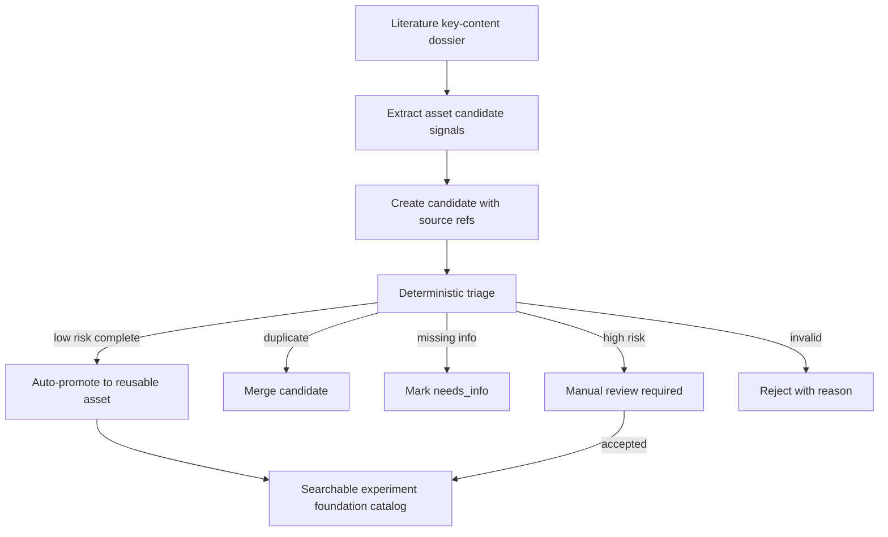
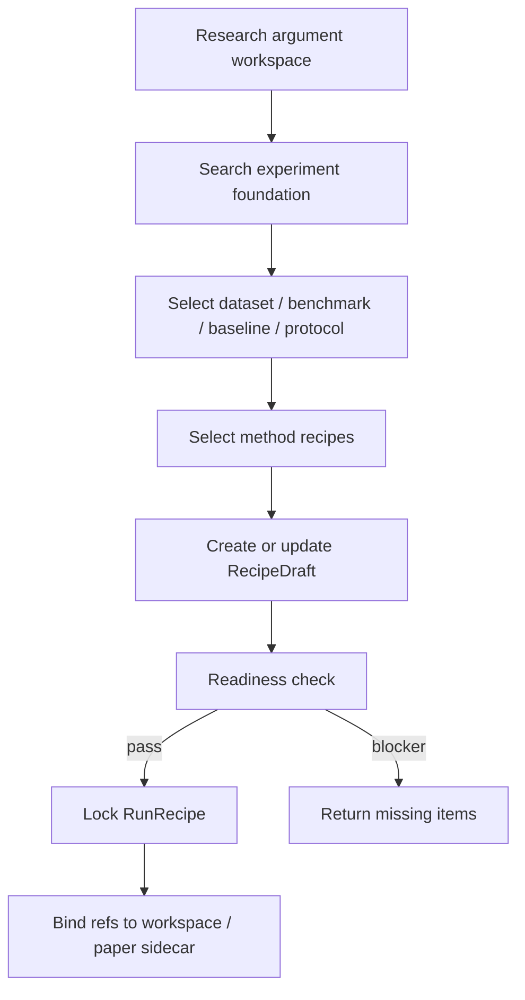
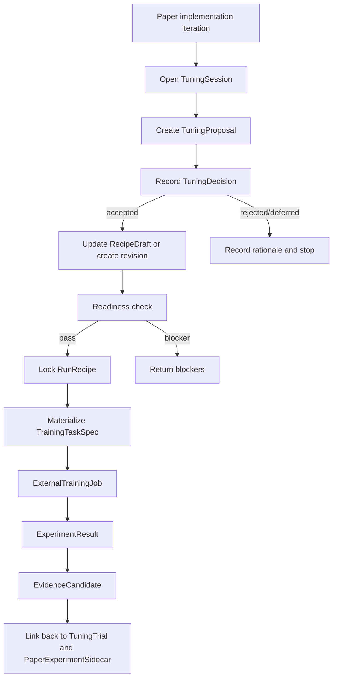
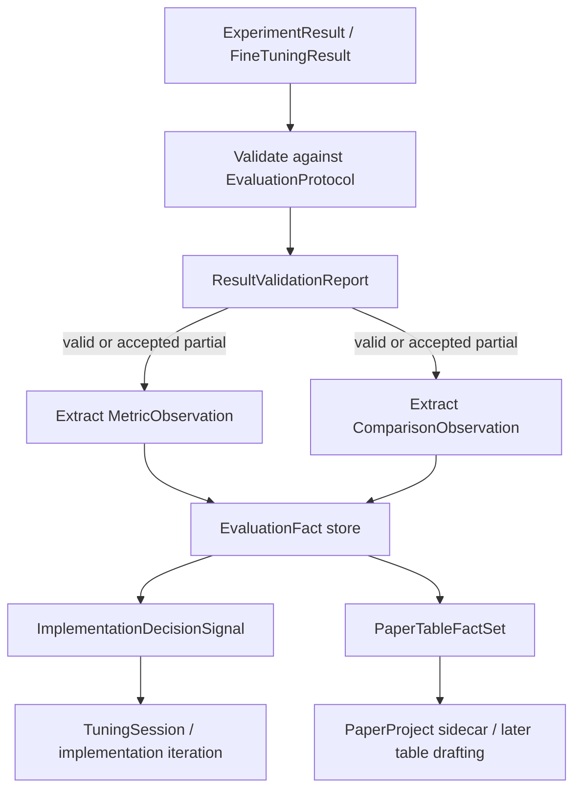
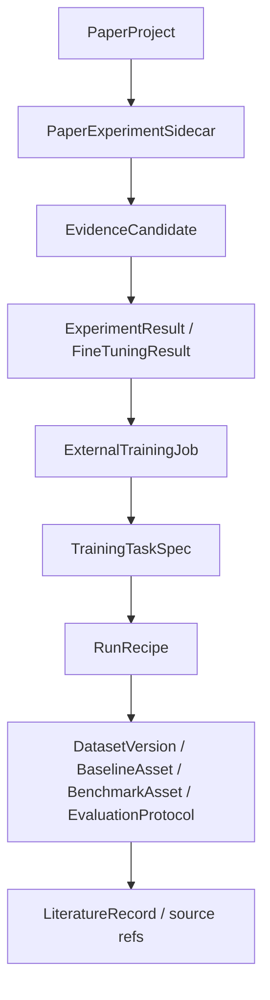
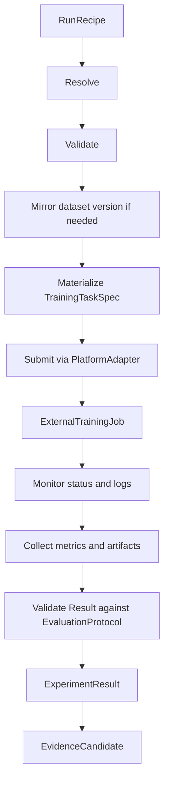
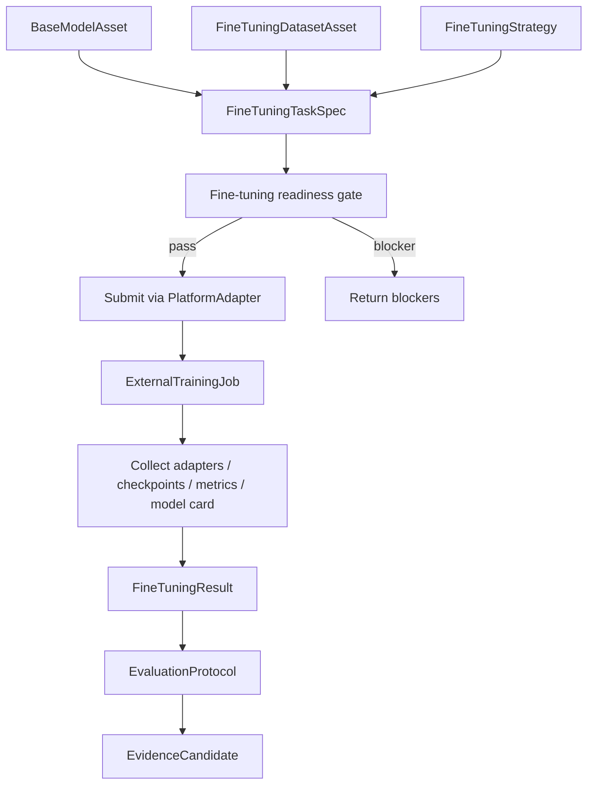
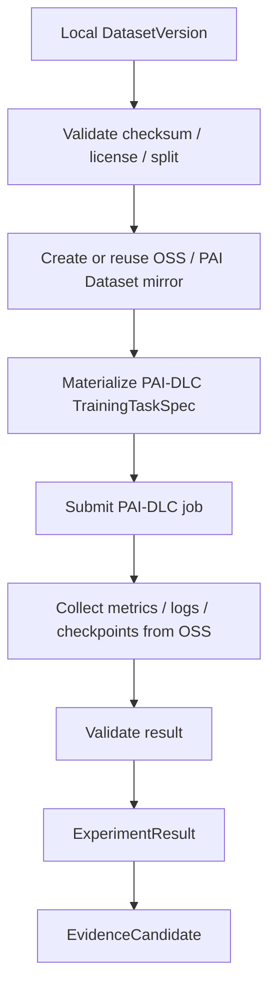

# 02 Architecture

## Ownership split
| Bounded context | Owns | Does not own |
|---|---|---|
| `literature` | papers, metadata, fulltext assets, key-content extraction, source refs | reusable dataset/baseline catalog lifecycle |
| `experiment-foundation` | reusable dataset, benchmark, baseline, evaluation protocol, run recipe, readiness report, local canonical asset registry, training-platform control pipeline | paper-specific claims, paper writing, raw restricted data distribution, training platform compute runtime |
| `research-argument` | workspace graph, baseline-set selection, protocol/baseline/repro readiness, writing-entry readiness | canonical asset metadata storage |
| `paper-project` | downstream lifecycle container, version spine, writing package, release/review gates | reusable asset catalog ownership |
| Cloud/object storage mirror | execution input/output objects such as OSS paths or PAI Dataset refs | canonical dataset metadata, local data policy, claim-evidence semantics |
| External training platform | resource scheduling, container/runtime execution, GPU allocation, low-level retry, platform-native logs | experiment asset catalog, paper evidence semantics, claim-evidence validation, canonical dataset metadata |

## Core model
## Layered capability model
```text
experiment-foundation
  = reusable asset layer
  + method recipe layer
  + evaluation layer
  + external execution control layer
```

### Layer 1 - Reusable asset layer
- Fixed assets can be searched, selected, and directly referenced.
- Examples:
  - dataset versions
  - dataset locations and mirrors
  - checksum manifests
  - split protocols
  - data policies
  - benchmark definitions
  - baseline implementations
  - base models
  - fine-tuning datasets
  - reproduction recipes
  - model artifacts
  - data processing recipes

### Layer 2 - Method recipe layer
- Method recipe objects are not final results.
- They are parameterized components that help generate `RunRecipe`.
- Examples:
  - training strategy
  - inference strategy
  - optimizer preset
  - architecture template
  - experiment hypothesis
  - hyperparameter space
  - ablation plan
  - fine-tuning strategy

### Layer 3 - Evaluation layer
- Evaluation objects decide whether results are comparable, valid, and reportable.
- Examples:
  - metric definition
  - evaluation protocol
  - test suite
  - statistical protocol
  - reporting protocol
  - comparison policy

### Layer 4 - External execution control layer
- Execution control objects submit tasks to external training platforms and turn results into evidence candidates.
- The layer owns lifecycle traceability, not compute execution.

## Core objects
### `DatasetAsset`
- Represents a reusable dataset reference.
- Minimum fields:
  - id, name, aliases
  - source refs and source literature refs
  - version, checksum, storage ref
  - license/access status
  - task types and schema summary
  - split protocol refs
  - verification status and last checked timestamp

### `DatasetVersion`
- Represents a canonical version of a dataset in the local registry.
- Minimum fields:
  - id, dataset asset id
  - version label
  - local root ref
  - checksum manifest id
  - split protocol id
  - processing recipe id if applicable
  - license policy id
  - access status

### `DatasetLocation`
- Represents a known location of a dataset version.
- Minimum fields:
  - id, dataset version id
  - location kind: local path, remote URL, object storage, PAI Dataset, custom
  - uri or path ref
  - availability status
  - last checked timestamp

### `DatasetMirror`
- Represents an execution mirror for a dataset version.
- It is not canonical and MUST be validated against the local `ChecksumManifest`.
- Minimum fields:
  - id, dataset version id
  - provider: local, aliyun_oss, pai_dataset, custom
  - uri
  - mirror status: not mirrored, syncing, ready, stale, failed
  - checksum verified
  - created for run recipe id if run-scoped

### `ChecksumManifest`
- Represents file-level or shard-level integrity metadata.
- Minimum fields:
  - id, dataset version id
  - algorithm
  - entries or manifest path
  - generated at

### `SplitProtocol`
- Represents canonical train/validation/test split semantics.
- Minimum fields:
  - id, dataset version id
  - split names and sizes
  - generation method
  - seed if generated
  - leakage/contamination notes

### `DataProcessingRecipe`
- Represents deterministic processing from raw to processed dataset.
- Minimum fields:
  - id, source dataset version id
  - output dataset version id if materialized
  - steps
  - script or config refs
  - processing environment refs

### `DataPolicy`
- Represents access, license, privacy, and mirror rules.
- Minimum fields:
  - id
  - license summary
  - access status
  - allowed use
  - mirror allowed flag
  - approval requirement
  - retention/deletion notes

### `BenchmarkAsset`
- Represents a reusable comparison protocol/testbed, usually binding dataset + task + split + metric + evaluator.
- It answers “怎么比” and MUST NOT be bound to one specific baseline.
- Minimum fields:
  - id, name, dataset asset ids
  - task definition
  - official split/protocol refs
  - metric refs
  - evaluator or evaluation script refs
  - reporting protocol refs
  - comparison policy refs
  - target communities/venues if known
  - known leaderboard or reported baseline refs
  - benchmark verification status and blockers

### `BaselineAsset`
- Represents a reusable comparison method/model/implementation or reproducible baseline recipe.
- It answers “和谁比” and MUST NOT own the full benchmark protocol.
- Minimum fields:
  - id, name, method family
  - source literature ids
  - code repo/ref/commit
  - runtime environment summary
  - entrypoints
  - supported benchmark ids
  - default/recommended parameter refs
  - resource estimate
  - input/output contract
  - baseline verification status and blockers

### Baseline and benchmark usage semantics
| Question | Object | Owns | Must not own |
|---|---|---|---|
| 和谁比？ | `BaselineAsset` | method/model identity, implementation refs, entrypoints, runtime, default params, resource estimate, supported task/benchmark ids | canonical dataset split, metric definition, reporting/comparison policy |
| 怎么比？ | `BenchmarkAsset` | task definition, dataset/split refs, metric refs, evaluator, reporting protocol, comparison policy | one baseline implementation, paper-specific run config, external job lifecycle |
| 怎么跑？ | `RunRecipe` / `TrainingTaskSpec` | selected asset refs, effective config, execution target, output contract | reusable asset canonical metadata |
| 跑出什么？ | `ExperimentResult` / `FineTuningResult` | metrics, artifacts, logs, config snapshot, validation report | paper claim acceptance |
| 能否写进论文？ | `EvidenceCandidate` | validated result refs and evidence provenance | claim finalization without review |

Baseline use cases:
- topic/design stage: identify common comparison methods from literature.
- experiment design stage: select control methods for a paper workspace.
- implementation stage: provide executable inputs for `RunRecipe`.
- ablation stage: represent simple baseline, strong baseline, previous SOTA, or heuristic control.
- paper stage: provide method rows for comparison tables after result validation.

Benchmark use cases:
- experiment design stage: select task, dataset/split, metrics, evaluator, and comparison rules.
- reproduction stage: ensure baselines and new methods run under the same protocol.
- result collection stage: decide whether results are comparable and reportable.
- paper stage: support tables, significance checks, known published result refs, and claim evidence.

Composition rule:
```text
BaselineAsset can be registered without full benchmark reproduction.
BenchmarkAsset can be registered without any specific baseline result.
BaselineAsset + BenchmarkAsset + DatasetAsset + RunRecipe + ExperimentResult create comparable evidence.
```

### `RecipeDraft`
- Represents an editable experiment-planning draft before all refs, params, protocols, and readiness outputs are locked.
- It MAY be incomplete and MUST NOT be submitted to an execution platform.
- Minimum fields:
  - id, source workspace/paper refs
  - selected or candidate dataset asset ids
  - selected or candidate benchmark asset ids
  - selected or candidate baseline asset ids
  - method recipe refs and draft parameter overrides
  - candidate evaluation protocol id
  - missing input list
  - draft validation warnings
  - traceability refs

### `BaseModelAsset`
- Represents a reusable base model for fine-tuning or inference.
- Minimum fields:
  - id, name, provider/source refs
  - model family and parameter scale
  - license and usage policy
  - tokenizer/chat template refs
  - context length
  - model artifact refs or remote model refs
  - supported precision/quantization modes
  - verification status and last checked timestamp

### `FineTuningDatasetAsset`
- Represents a dataset prepared for LLM fine-tuning.
- Minimum fields:
  - id, name, source refs
  - dataset type: instruction, preference, conversation, domain corpus, mixed
  - format contract: SFT, DPO, continued pretraining, RLHF-compatible
  - license/privacy/copyright risk summary
  - tokenizer compatibility notes
  - split refs and checksum
  - contamination risk notes

### `EvaluationProtocol`
- Represents a reusable evaluation rule set.
- Minimum fields:
  - id, name
  - benchmark ids
  - metrics and aggregation
  - seeds/repetition policy
  - budget fairness policy
  - tuning policy
  - statistical reporting policy
  - compatibility hash input fields

### `RunRecipe`
- Represents a paper/workspace-specific locked experiment plan that can be materialized into a platform task.
- It is not a loose static config and not a platform-specific executable script.
- It MUST remain platform-neutral; adapter-private fields belong in adapter metadata during materialization.
- Minimum fields:
  - id, source workspace/paper refs
  - locked dataset asset/version ids
  - locked benchmark asset ids
  - locked baseline asset ids
  - method recipe refs
  - resolved method parameter values
  - evaluation protocol id
  - dataset protocol hash
  - evaluation protocol hash
  - intended execution target kind
  - generated platform-neutral config payload
  - readiness report id
  - traceability refs
  - lock timestamp

### RunRecipe materialization semantics
```text
RecipeDraft = editable and possibly incomplete planning state.
RunRecipe = locked, versioned, platform-neutral experiment plan.
TrainingTaskSpec = platform submission payload materialized from RunRecipe.
```

Rules:
- `RecipeDraft` MAY be saved before readiness passes.
- `RecipeDraft` MUST NOT be submitted to an external platform.
- `RunRecipe` MUST be generated only after required asset refs, versions, method params, evaluation protocol, and readiness result are available.
- `RunRecipe` MUST be deterministic from locked inputs, except for explicitly recorded generated timestamps/ids.
- `RunRecipe` MUST NOT include PAI-DLC, Slurm, Kubernetes, or custom adapter private fields.
- `TrainingTaskSpec` MUST be generated from a valid `RunRecipe` plus selected `ExecutionPlatform`.
- `TrainingTaskSpec` MAY include platform-normalized resource and output-contract fields, but platform-private fields stay in adapter metadata.

### `TrainingStrategy`
- Represents a reusable training approach template.
- Examples: full fine-tune, prompt tuning, distillation, contrastive learning.

### `FineTuningStrategy`
- Represents a reusable LLM fine-tuning approach template.
- Examples: SFT, LoRA, QLoRA, DPO, continued pretraining, instruction tuning, domain adaptation.
- It SHOULD capture tunable fields such as epochs, learning rate, batch size, max sequence length, LoRA rank/alpha, precision, and quantization.

### `InferenceStrategy`
- Represents a reusable inference approach template.
- Examples: greedy decoding, beam search, sampling, rerank, self-consistency, retrieval-augmented inference.

### `OptimizerPreset`
- Represents optimizer and schedule choices.
- Examples: AdamW, SGD, Lion, warmup, cosine schedule, weight decay policy.

### `ArchitectureTemplate`
- Represents a reusable model or system structure.
- Examples: encoder-decoder, decoder-only, retriever-reader, MoE, adapter-based system.

### `ExperimentHypothesis`
- Represents a testable mechanism-level hypothesis.
- It MUST bind expected effect, mechanism, target metric, and falsification condition where possible.

### `HyperparameterSpace`
- Represents tunable search space.
- It SHOULD include allowed values/ranges, default, search strategy, and budget limit.

### `AblationPlan`
- Represents planned switches and variants for mechanism explanation.

### `TuningSession`
- Represents a human/LLM-in-the-loop tuning workflow linked to paper implementation.
- It coordinates proposals, decisions, trials, recipes, results, and evidence candidates.
- It is not an automatic hyperparameter optimizer.
- Minimum fields:
  - id, source workspace/paper refs
  - implementation stage ref
  - objective: metric, constraint, hypothesis, or failure mode being tuned
  - linked recipe draft ids and run recipe ids
  - linked experiment result ids and evidence candidate ids
  - participants: human, llm, system rule
  - status: open, waiting_decision, running_trial, completed, paused, abandoned
  - decision policy: human_required, llm_allowed_with_policy, system_rule_only
  - audit refs and timestamps

### `TuningProposal`
- Represents a proposed parameter, strategy, architecture, inference, or ablation change.
- It MAY be authored by a human, LLM, or system rule.
- It MUST NOT submit training or inference by itself.
- Minimum fields:
  - id, tuning session id
  - proposed by: human, llm, system
  - changed params and target recipe refs
  - rationale
  - source refs: prior result, metric delta, log excerpt, literature ref, reviewer concern, or implementation note
  - expected effect and risk
  - budget/resource estimate
  - constraints and rollback notes

### `TuningDecision`
- Represents the accepted/rejected/deferred decision for a proposal.
- Minimum fields:
  - id, tuning proposal id
  - decision: accepted, rejected, deferred, needs_more_evidence
  - decided by: human, llm_with_policy, system_rule
  - rationale
  - resulting recipe draft id or run recipe id if accepted
  - decision timestamp

### `TuningTrial`
- Represents an executed tuning attempt derived from an accepted decision.
- Minimum fields:
  - id, tuning decision id
  - recipe draft id
  - run recipe id
  - training task spec id
  - experiment result id
  - evidence candidate ids
  - trial status and summary

### `MetricDefinition`
- Represents metric calculation, direction, aggregation, and required output shape.

### `TestSuite`
- Represents grouped evaluation sets such as main, OOD, robustness, efficiency, and ablation tests.

### `StatisticalProtocol`
- Represents seed/repetition/significance/confidence interval rules.

### `ReportingProtocol`
- Represents required tables, plots, failure cases, and disclosure fields.

### `ComparisonPolicy`
- Represents baseline selection, tuning fairness, budget fairness, and comparison constraints.

### `EvaluationFact`
- Represents a structured factual record extracted from validated experiment outputs.
- It is not a paper claim and not a leaderboard entry.
- Minimum fields:
  - id, fact kind
  - source result id and validation report id
  - run recipe id and training task spec id
  - dataset version id, benchmark id, baseline/method id, evaluation protocol id
  - metric id or comparison policy id
  - split, seed, repeat index, scenario, and evaluation subset
  - value payload and unit/direction
  - confidence interval, variance, or aggregation notes when available
  - validation status and warnings
  - provenance refs and generated timestamp

### `MetricObservation`
- Represents a metric value suitable for later table cells or implementation review.
- Minimum fields:
  - evaluation fact id
  - metric id
  - value
  - higher/lower-is-better direction
  - aggregation scope: single_seed, mean, median, best, final, custom
  - dataset split/subset
  - run/result refs

### `ComparisonObservation`
- Represents a structured comparison between a subject run and one or more baselines.
- Minimum fields:
  - evaluation fact id
  - subject result id
  - baseline result ids or reported baseline refs
  - metric id
  - absolute delta and relative delta
  - statistical protocol result if available
  - fairness/comparison policy status
  - interpretation tags: improvement, regression, inconclusive, tradeoff

### `ImplementationDecisionSignal`
- Represents a factual signal for implementation iteration.
- It guides whether a direction is valuable, needs adjustment, needs rerun, or should be abandoned.
- It is not a paper claim.
- Minimum fields:
  - id, tuning session id if applicable
  - source evaluation fact ids
  - signal: continue, adjust, rerun, abandon, needs_more_data
  - rationale
  - affected recipe/proposal/trial refs
  - confidence/risk level
  - next action refs

### `PaperTableFactSet`
- Represents a grouped set of validated facts prepared for later paper table generation.
- It is not a final table renderer and does not rank a leaderboard.
- Minimum fields:
  - id, paper project or workspace refs
  - table intent: main_result, ablation, efficiency, robustness, fine_tuning, error_analysis
  - row dimensions: method, baseline, dataset, benchmark, setting
  - column dimensions: metric, split, scenario, resource, statistic
  - included evaluation fact ids
  - missing cell warnings
  - eligibility status and generated timestamp

### `ExecutionPlatform`
- Represents a configured external training or inference platform.
- Minimum fields:
  - id, name, provider kind
  - endpoint/auth refs without secrets
  - capabilities: gpu, distributed, artifact uri, log streaming, cancel job
  - status: configured, unconfigured, unavailable

### `TrainingTaskSpec`
- Represents the normalized task payload submitted to a platform adapter.
- Minimum fields:
  - id, run recipe id, platform id
  - image or runtime ref
  - command and arguments
  - env refs without secret values
  - input refs and output contract
  - resource request
  - timeout and retry policy requested at the control-plane level

### `FineTuningTaskSpec`
- Represents a specialized `TrainingTaskSpec` profile for LLM fine-tuning.
- It is submitted through the same platform adapter boundary.
- Minimum fields:
  - base model id
  - fine-tuning dataset asset ids
  - fine-tuning strategy id
  - training config
  - output contract: adapter path, checkpoint path, merged model path if applicable, metrics path, logs path, model card path

### `FineTuningResult`
- Represents structured output from a fine-tuning job.
- Minimum fields:
  - external job id and run recipe id
  - base model id and fine-tuning dataset ids
  - adapter/checkpoint/merged-model artifact refs
  - train/eval metrics
  - training curve refs
  - model card ref
  - validation status and blockers

### `ResultArtifact`
- Represents an artifact collected from a training or fine-tuning job.
- Minimum fields:
  - kind: checkpoint, adapter, merged_model, log, table, figure, config, prediction, model_card, other
  - uri
  - checksum if available
  - size if available
  - produced by job id
  - retention policy if available

### `ResultValidationReport`
- Represents validation against `EvaluationProtocol`.
- Minimum fields:
  - validation status: valid, invalid, partial
  - checked metric ids
  - missing required metrics
  - missing required artifacts
  - protocol violations
  - warnings
  - generated at
  - generated evaluation fact ids if extraction succeeded

### `ExternalTrainingJob`
- Represents the external platform job identity and lifecycle snapshot.
- Minimum fields:
  - id, training task spec id, platform id
  - external job id and optional external job URL
  - status: queued, running, succeeded, failed, cancelled, unknown
  - submitted/started/finished/last synced timestamps
  - failure reason and platform metadata

### `ExperimentResult`
- Represents structured results collected from an external job.
- Minimum fields:
  - id, external job id, run recipe id
  - metrics
  - artifacts: checkpoint, adapter, merged model, log, table, figure, config, prediction, model card, other
  - logs
  - config snapshot
  - validation report

## Result collection contract
- `DP-08` is confirmed as:
  - metrics
  - artifacts
  - logs
  - config snapshot
  - validation report
- `metrics` MUST be structured and keyed by `MetricDefinition` where possible.
- `artifacts` MUST include uri and kind; checksum SHOULD be present for reusable or cited artifacts.
- `logs` MAY be full logs or log refs, but MUST include enough refs for failure analysis.
- `config snapshot` MUST capture the effective runtime config, not just the requested config.
- `validation report` MUST state whether the result satisfies `EvaluationProtocol`.
- `EvidenceCandidate` MUST only be created from a valid or explicitly accepted partial result.

### `EvidenceCandidate`
- Represents a result item that may later support a claim.
- It is not a paper claim and MUST NOT bypass claim-evidence review.

### `PaperExperimentSidecar`
- Represents the trace attachment between a paper project and experiment-foundation evidence.
- It is a handoff contract, not a copy of reusable asset metadata.
- Paper-project owns the attachment lifecycle; experiment-foundation remains the canonical owner of reusable assets, recipes, jobs, results, and evidence candidates.
- Minimum fields:
  - id, paper project id
  - run recipe ids
  - experiment result ids
  - fine-tuning result ids if applicable
  - evidence candidate ids
  - readiness report ids
  - external training job ids
  - training task spec ids
  - asset version locks: dataset versions, baseline versions/commits, benchmark versions, evaluation protocol versions
  - hashes: dataset protocol hash, evaluation protocol hash, config snapshot hash, checksum manifest hash
  - provenance refs: literature ids, candidate ids, promotion decisions, manual approval refs if any
  - event log: bound, refreshed, accepted, invalidated, superseded
  - status snapshot: readiness status, validation status, result validity, known blockers
  - created/updated timestamps

Traceability rule:
```text
PaperProject
  -> PaperExperimentSidecar
  -> EvidenceCandidate
  -> ExperimentResult / FineTuningResult
  -> ExternalTrainingJob
  -> TrainingTaskSpec
  -> RunRecipe
  -> DatasetVersion / BaselineAsset / BenchmarkAsset / EvaluationProtocol
  -> LiteratureRecord / source refs
```

## Lifecycle states
### Asset lifecycle
- `candidate`: discovered from literature or manual draft; pending deterministic triage
- `active`: available for reuse after auto-promotion or manual acceptance
- `deprecated`: retained for traceability but hidden from default selection
- `rejected`: explicitly not promoted

### Baseline verification status
- `unknown`: no verification beyond metadata
- `metadata_complete`: baseline name, source refs, license, version, entrypoint, runtime summary, input/output contract, and supported task metadata exist
- `reachable`: code, package, image, model weights, or local refs can be resolved and version locked
- `smoke_verified`: small sample or toy input runs through the baseline entrypoint and produces the expected output shape
- `protocol_compatible`: baseline input/output can connect to a selected benchmark protocol without manual reinterpretation
- `benchmark_verified`: a full benchmark run completed and the result is within an expected or documented range
- `broken`: refs, environment, or entrypoints fail

### Benchmark verification status
- `unknown`: no verification beyond draft metadata
- `protocol_complete`: task definition, dataset/split refs, metrics, evaluator, reporting protocol, and comparison policy exist
- `assets_reachable`: dataset refs, evaluator refs, and metric implementations can be resolved and version locked
- `evaluator_smoke_verified`: evaluator runs on small sample predictions and produces the expected metric shape
- `reproducible_protocol`: fixed seed/split/version rules produce stable comparable outputs
- `comparison_certified`: protocol is strong enough for paper-grade fair comparison, including required disclosure and statistical/reporting rules
- `broken`: refs, environment, or evaluator fails

### Candidate triage status
- `needs_info`
- `auto_promoted`
- `accepted`
- `rejected`
- `merged`
- `manual_review_required`

## Primary flows
### Literature-derived candidate flow


### Implementation-stage reuse flow


### Human/LLM-in-the-loop tuning flow


### Evaluation fact extraction flow


### PaperProject traceability flow


### External training platform control flow


### LLM fine-tuning flow


## Execution boundary
- `experiment-foundation` MUST NOT own GPU scheduling, container orchestration, distributed training, remote machine lifecycle, or low-level platform retries.
- `experiment-foundation` MUST own the control-plane record:
  - what was intended to run
  - which assets and protocols were locked
  - which external platform received the task
  - how job state changed
  - which metrics/artifacts were collected
  - whether the result satisfies the evaluation protocol
  - which evidence candidates were produced
- Platform-specific fields MUST stay in adapter metadata unless promoted into the shared contract by explicit decision.

## Fixed execution pipeline
1. `Resolve`
   - Lock dataset, benchmark, baseline, strategy, protocol, and run recipe versions.
2. `Validate`
   - Check license/access, data reachability, baseline entrypoints, resource request, and evaluation protocol compatibility.
   - For LLM fine-tuning, also check base model license, fine-tuning dataset policy, tokenizer/chat template, context length, contamination risk, and resource estimate.
3. `Mirror`
   - If the selected execution platform cannot access the local dataset, create or reuse a cloud execution mirror such as Aliyun OSS or PAI Dataset.
   - Validate mirror checksums against the local `ChecksumManifest`.
   - Block restricted data mirroring unless `DataPolicy` allows it or an approval reference exists.
4. `Materialize`
   - Generate `TrainingTaskSpec`, configs, input refs, and output contracts.
5. `Submit`
   - Call a `TrainingPlatformAdapter` and persist `ExternalTrainingJob`.
6. `Monitor`
   - Sync status, timestamps, log summaries, and failure reasons.
7. `Collect`
   - Pull or register metrics, artifacts, checkpoints, stdout/log refs, plots, predictions, and config snapshots.
8. `Validate Result`
   - Check collected outputs against `EvaluationProtocol`; produce `ExperimentResult` and `EvidenceCandidate`.

## Storage decision
- `DP-02` is confirmed:
  - local canonical registry
  - local file refs
  - optional cloud execution mirror
- The local registry is the single source of truth for:
  - dataset metadata
  - dataset versions
  - checksums
  - split protocols
  - processing recipes
  - access/license policies
- Raw data MUST NOT be stored in git or database blobs.
- Cloud mirrors MUST be treated as execution inputs/outputs, not canonical metadata.
- Cloud mirrors MAY be reused if checksum validation passes and policy allows reuse.

## Recommended local storage layout
```text
~/.paper-engineering-assistant/
  experiment-foundation/
    datasets/
      raw/
      processed/
      manifests/
      splits/
    models/
      base/
      adapters/
      checkpoints/
    run-recipes/
    results/
    cache/
```

## Aliyun execution mirror flow


## Platform adapter contract
```ts
interface TrainingPlatformAdapter {
  submit(spec: TrainingTaskSpec): Promise<ExternalTrainingJob>;
  getStatus(jobId: string): Promise<ExternalTrainingJob>;
  getLogs(jobId: string): Promise<LogChunk[]>;
  collectResults(jobId: string): Promise<ExperimentResult>;
  cancel(jobId: string): Promise<void>;
}
```

## Adapter strategy
- V1 adapter scope is confirmed by `DP-07`:
  - `LocalScriptAdapter` for smoke and local pipeline validation.
  - `AliyunPaiDlcAdapter` for first real cloud execution.
  - `CustomHttpAdapter` is explicitly out of V1 scope.
- Additional adapters MAY be added later:
  - Custom HTTP training service
  - Slurm
  - Kubernetes
  - cloud training platform
  - vendor-specific managed training service
- Core services MUST depend on `TrainingPlatformAdapter`, not on a concrete platform SDK.

## Adapter responsibilities
### `LocalScriptAdapter`
- Runs a local command or script for smoke validation.
- MUST use local dataset refs and local output paths.
- SHOULD validate the full pipeline without requiring cloud credentials.
- SHOULD be limited to development/smoke usage unless explicitly promoted.

### `AliyunPaiDlcAdapter`
- Submits tasks to Aliyun PAI-DLC.
- MUST consume cloud-accessible `DatasetMirror` refs such as OSS or PAI Dataset.
- MUST keep Alibaba Cloud credentials behind `auth_ref`, never inside `TrainingTaskSpec`.
- MUST collect metrics, logs, checkpoints, adapters, model card refs, and config snapshots through OSS/platform artifacts.
- SHOULD support normal training and LLM fine-tuning profiles through the same adapter boundary.

## Public surfaces (proposal)
### Commands
- `CreateDatasetAssetRequest`
- `CreateBenchmarkAssetRequest`
- `CreateBaselineAssetRequest`
- `CreateEvaluationProtocolRequest`
- `ReviewExperimentAssetCandidateRequest`
- `CreateRecipeDraftRequest`
- `UpdateRecipeDraftRequest`
- `CreateTuningSessionRequest`
- `CreateTuningProposalRequest`
- `RecordTuningDecisionRequest`
- `GenerateEvaluationFactsRequest`
- `CreatePaperTableFactSetRequest`
- `GenerateRunRecipeRequest`
- `MaterializeTrainingTaskSpecRequest`
- `AttachPaperExperimentSidecarRequest`
- `RefreshPaperExperimentSidecarRequest`
- `CheckExperimentFoundationReadinessRequest`

### Queries
- `ListExperimentAssetsQuery`
- `GetDatasetAssetResponse`
- `GetBenchmarkAssetResponse`
- `GetBaselineAssetResponse`
- `GetEvaluationProtocolResponse`
- `ListExperimentAssetCandidatesQuery`
- `GetRecipeDraftResponse`
- `GetTuningSessionResponse`
- `ListEvaluationFactsQuery`
- `GetPaperTableFactSetResponse`
- `ListImplementationDecisionSignalsQuery`
- `GetRunRecipeResponse`
- `GetTrainingTaskSpecResponse`
- `GetPaperExperimentSidecarResponse`

## Integration rules
- Literature may create asset candidates.
- Low-risk complete candidates MAY be auto-promoted by deterministic checks.
- Manual review is an escalation path for high-risk, incomplete, conflicting, restricted, or low-confidence candidates; it is not the default blocking gate.
- `research-argument` may bind asset refs and consume readiness summaries.
- `paper-project` consumes experiment trace through `PaperExperimentSidecar` only in V1; expanding core `CreatePaperProjectRequest` is a separate decision.
- `PaperExperimentSidecar` MUST store frozen refs, version locks, hashes, provenance refs, event log entries, and status snapshots.
- `PaperExperimentSidecar` MUST NOT copy full reusable asset DTOs from experiment foundation.
- `PaperExperimentSidecar` SHOULD allow paper-project to answer which dataset version, baseline commit, benchmark protocol, task spec, external job, result, validation report, and evidence candidate were bound at the time.
- `RunRecipe` is the bridge from reusable catalog to a paper-specific implementation plan.
- `BaselineAsset` may enter the catalog at `metadata_complete + reachable`; it MUST NOT require a full benchmark run for catalog entry.
- `BenchmarkAsset` may enter the catalog at `protocol_complete + assets_reachable`; it MUST NOT require existing baseline results.
- Actual run recipes SHOULD require baseline `smoke_verified` and benchmark `evaluator_smoke_verified`.
- Formal comparison SHOULD require baseline `protocol_compatible` and benchmark `reproducible_protocol`.
- Paper-grade strong evidence SHOULD require baseline `benchmark_verified`, benchmark `comparison_certified`, and a valid `ExperimentResult`.
- `RecipeDraft` is the bridge from interactive selection to a locked recipe; it can be incomplete and editable.
- `TuningSession` is the bridge from paper implementation iteration to controlled tuning changes.
- `TuningProposal` MAY be human-authored, LLM-authored, or system-rule-authored, but it MUST NOT execute directly.
- `TuningDecision` MUST be recorded before a proposal can alter a recipe that reaches execution.
- Accepted tuning decisions update a `RecipeDraft` or create a new recipe revision; readiness checks still apply.
- `RunRecipe` is the locked, deterministic, platform-neutral plan; it is not an adapter request body.
- `TrainingTaskSpec` is the materialized execution payload derived from `RunRecipe` and a selected `ExecutionPlatform`.
- Method recipe objects MUST be instantiated into `RunRecipe`; they are not executable by themselves.
- Evaluation layer objects MUST gate result validity before evidence candidates are created.
- `TrainingTaskSpec` is the bridge from `RunRecipe` to an external training platform.
- `FineTuningTaskSpec` is a specialized training task profile, not a separate platform or bypass.
- `ExperimentResult` is the bridge from external platform output back into experiment foundation.
- `FineTuningResult` is the bridge from LLM fine-tuning output back into experiment foundation.
- `EvaluationFact` is the bridge from validated result packets to table-ready facts and implementation judgement.
- `PaperTableFactSet` supports later paper table creation, but it MUST NOT become a complete leaderboard or final table renderer.
- `ImplementationDecisionSignal` may drive tuning iteration decisions, but it MUST reference structured facts and remain separate from paper claims.
- `EvidenceCandidate` is the bridge from validated result into research evidence workflows.
- Compatibility checks should use stable hashes derived from dataset/evaluation protocol fields.
- A broken/deprecated asset must not be selected by default.

## Storage rules
- Store metadata and references by default in the local registry.
- Store local path refs only when the user registers them.
- Do not copy restricted raw data into shared cache or cloud mirrors by default.
- Do not store raw data in git or database blobs.
- Treat OSS / PAI Dataset / remote object paths as `DatasetMirror` or `DatasetLocation`, not canonical `DatasetVersion`.
- Checksums are for integrity and compatibility, not a substitute for access rights.
- Environment specs should avoid secrets and machine-specific credentials.

## Readiness checks
Minimum blockers:
- missing license/access status
- missing dataset version or checksum when versioning matters
- missing split/evaluation protocol
- missing baseline code ref or entrypoint
- baseline below `smoke_verified` when generating an executable run recipe
- benchmark below `evaluator_smoke_verified` when generating an executable run recipe
- baseline below `protocol_compatible` when entering a formal comparison run
- benchmark below `reproducible_protocol` when entering a formal comparison run
- missing runtime/environment summary
- baseline marked broken/deprecated
- protocol does not match selected benchmark/task
- selected assets lack resolvable provenance
- paper sidecar missing frozen refs, version locks, protocol/config/checksum hashes, provenance refs, or status snapshot
- paper sidecar attempts to store full reusable asset DTOs instead of refs/snapshots
- asset candidate lacks required source refs or policy metadata
- candidate is high-risk and has not passed manual escalation
- dataset mirror is stale or checksum verification failed
- data policy blocks cloud mirroring for the selected dataset version
- missing execution platform when a task is submitted
- attempt to submit `RecipeDraft` directly
- `RunRecipe` missing locked refs, versions, protocol hashes, resolved params, or readiness report
- `RunRecipe` contains adapter-private fields
- `TrainingTaskSpec` was materialized from a stale or invalid `RunRecipe`
- tuning proposal lacks changed params, rationale, source/result refs, resource estimate, or constraints
- tuning proposal attempts direct execution without an accepted decision
- tuning trial lacks links to decision, run recipe, task spec, result, or evidence candidate
- training task output contract does not include required metric/artifact locations
- collected result lacks metrics, artifacts, logs, config snapshot, or validation report
- collected result fails evaluation protocol validation
- evaluation fact lacks result, recipe, asset/protocol version, metric, split/seed/repeat, validation status, or provenance refs
- paper table fact set includes invalid facts or lacks missing-cell warnings
- implementation decision signal lacks source facts or rationale
- fine-tuning base model license or dataset policy is missing
- fine-tuning tokenizer/chat template or max context length is incompatible
- fine-tuning task lacks resource estimate, evaluation protocol, or artifact output contract

## UI architecture notes
- User-facing UI label MUST be “实验基座”.
- UI entry should be placed below “文献管理”.
- The route/workbench should still be named around `experiment-foundation`.
- New desktop UI work must use data-ui/token contract path.
- Do not add dependencies on `apps/desktop/src/renderer/styles/**`.

## Data migration posture
- If persisted fields/tables are added, use repo Prisma SSOT:
  - update `prisma/schema.prisma`
  - create migration through the repo workflow
  - refresh `docs/context/db/schema.json` if context awareness requires it
- Business services must not import Prisma directly; repositories return domain DTOs.

## Out of scope for V1
- full experiment runner
- full leaderboard/ranking service
- GPU/resource scheduler
- container build pipeline
- training platform implementation
- `CustomHttpAdapter` in V1
- platform-owned retry and autoscaling logic
- remote dataset mirroring
- automatic leaderboard scraping
- automatic hyperparameter optimization/search
- final paper table rendering/generation
- paper writing generation
- automatic claim creation from run outputs
- automatic RLHF pipeline
- automatic model merge/release/deployment
