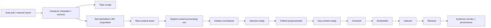

# 02 Architecture

## Current Full Chain

## Boundary Rules
- Collection writes metadata, source records, dedup signals, and scope associations.
- Collection MUST NOT enqueue expensive content-processing stages.
- Fulltext acquisition writes raw assets and provenance, then marks downstream readiness as available/stale according to existing stage rules.
- Content-processing runs remain explicit and ordered.
- Retrieve reads active indexed versions and reports stale/degraded conditions.

## Upgrade Architecture Targets

## Implemented Foundation Pass - 2026-05-08

- Added `fulltext-acquisition` as a separate durable job surface from content-processing backfill.
- Kept single-paper `content-assets/download` for explicit manual downloads, with stronger URL, redirect, MIME/PDF, size, and timeout safety gates.
- Added `/settings/literature-acquisition` for Unpaywall, downloader, source throttle, and quality-scorer profile settings.
- Added Prisma persistence for fulltext acquisition jobs/items and per-source runtime state; content-processing backfill remains separate.
- Preserved provenance through acquisition candidates, resolver source kind, final URL, redirect chain, checksum, byte size, and content asset metadata.
- Bound fulltext acquisition items to registered content assets with a nullable FK so later asset cleanup cannot leave silent dangling references.
- Applied acquisition source throttle/cooldown state inside the fulltext acquisition worker; broader auto-pull source pacing remains a separate roadmap item.
- Retrieval now excludes stale active index versions by default; diagnostics can request `include_stale`.
- Chunk metadata now advertises the shadow `section-aware-key-content-v2` profile while retaining `flat-classified-v1` as the previous profile.

### Source Acquisition
- Source fetchers should expose source-specific diagnostics, rate-limit state, and retry eligibility.
- Run summaries should distinguish:
  - fetched
  - parse rejected
  - incomplete
  - duplicate
  - signal rejected
  - scorer rejected
  - selected
  - imported new/existing

### Scoring
- Quality scoring should be a typed profile with:
  - provider
  - model/endpoint
  - timeout
  - retry policy
  - score schema
  - provenance
  - budget controls

### Fulltext Acquisition
- Remote download should be treated as an acquisition operation, not just a file fetch.
- Safety gates must run before and during fetch.
- The resulting raw asset remains local-path-backed so downstream processing does not need a second source-kind model.

### Parser
- Parser diagnostics should remain stage-local but operator-visible.
- GROBID remains external.
- OCR is either an explicit child task or remains a clear blocker.

### Retrieval Evaluation
- Evaluation data should be separated from product fixtures.
- Retrieval quality should be measured at literature, chunk, and provenance levels.

## Possible DB Changes
- Source cooldown/rate-limit state has additive persistence in `LiteratureSourceRuntimeState`.
- Download/acquisition history has additive persistence in `LiteratureFulltextAcquisitionJob` and `LiteratureFulltextAcquisitionItem`.
- Scorer provenance may require structured run-attempt metadata.
- Any persisted schema changes MUST use DB SSOT (`prisma/schema.prisma`) and refresh `docs/context/db/schema.json`.

## Risk Areas
- SSRF/unsafe redirects in URL acquisition.
- Provider rate limits and accidental retry storms.
- Hidden drift between OpenAPI/API index/shared contracts.
- Batch backfill duplicating outputs or activating partial indexes.
- Retrieval metrics that pass trivial smoke tests but fail realistic evidence queries.
