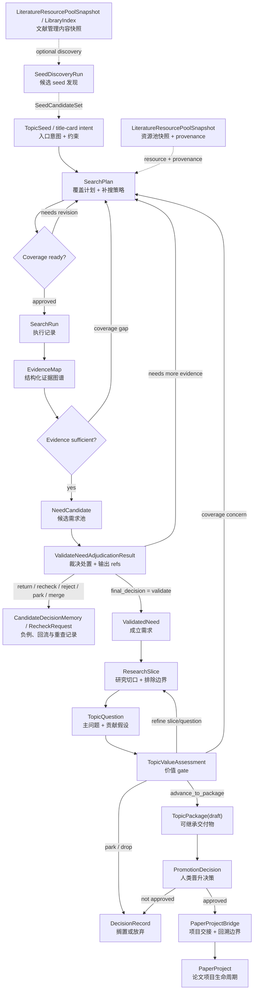

# 06 设计说明 - 鲁棒选题决策链路

## 工作假设
本模块不承诺完成全自动选题。它应提供一条 **LLM 主导、人在关键节点参与确认的选题决策链路**。

目标是把模糊想法与文献证据逐步转化为可追溯的 `TopicPackage`，并支持审查、修订、搁置、放弃或晋升。

## 设计重心变化

### 从
```text
自动化选题
```

### 调整为
```text
LLM 主导的选题决策链路，人负责关键判断
```

这保留原设计中最有价值的原则：
- evidence first
- falsification before commitment
- 题目后置
- value assessment 是独立 gate
- promotion 是显式动作
- 下游论文工程继承结构化对象

同时改变一个核心假设：
- 系统不需要独立完成选题。
- 系统要让高质量的人类判断更快、更清晰、更可审计。

## 工程复杂度控制
完整链路是目标架构，不等于 v1 实现范围。当前设计刻意保留完整对象边界，是为了避免后续在证据、决策、回溯和人机权限上混淆；实现时不能一次性铺满所有对象、状态机、UI 和 agent orchestration。

目标架构对象可以先有稳定 identity、snapshot ref 或 artifact ref，但这不等于 v1 gate 依赖，也不等于 v1 必须完整表化。实施范围必须按质量假设切分。

### v1a / v1b / v1c 切分

v1a 应优先验证核心价值：
```text
TopicSeed
  -> SearchPlan
  -> SearchRun
  -> EvidenceMap / EvidenceUnit
  -> NeedCandidate
  -> ValidatedNeed
```

该阶段要回答的问题是：系统是否能从文献证据中更稳定地识别真实 unmet need，并挡住伪 gap、已解决 gap、弱证据 gap 和 coverage bias。

v1b 再扩展到：
```text
ValidatedNeed
  -> ResearchSlice
  -> TopicQuestion
  -> TopicValueAssessment
  -> TopicPackage(draft)
```

v1b 的质量假设是：系统能否把已验证需求收束成边界明确、可回答、价值可辩护的研究问题和 draft handoff。

v1c 再扩展到：
```text
TopicPackage(draft)
  -> PromotionDecision
  -> PaperProjectBridge
```

v1c 的质量假设是：系统能否把选题决策以人类授权、可追溯、带条件和风险的方式交接给论文项目管理。

复杂度控制原则：
- 先打通 evidence-to-need 质量闭环，再扩展到 ResearchSlice、TopicQuestion、ValueAssessment、Package 和 Promotion。
- v1a 的终点是 `ValidatedNeed`；不要提前把 `ResearchSlice` 作为 v1a 的必经 active gate，否则会把“需求是否真实”和“如何做成题”混在一起。
- v1a 必须包含 human confirmation，因为 `ValidatedNeed` 是第一个强研究判断节点。
- v1a 不只是一个 evidence-to-need 功能切片；它必须建立全链路复用的 control-plane foundation。v1b/v1c 只能扩展 workflow policy 和业务对象，不能重新定义上下文准入、状态转移、artifact 语义或 human gate 规则。
- P0/P1 对象优先支持 identity、version、trace、gate 和最小 UI；目标架构中的后续对象先用 thin record / artifact-compatible contract 保留。
- UI 优先做 reviewer cards、gate blockers、trace drilldown 和 recheck queue，不做全图式复杂工作台。
- recheck v1 先支持局部、手动或半自动触发，不默认全链 storm propagation。
- multi-agent review 只在高风险、高不确定性、强分歧、rerun instability 或 high-impact gate 中触发。
- 每次实现拆分都必须能独立验证一个质量假设，而不是只增加对象数量。

### v1a 实施分层

v1a authority tables：
- `TopicSeed`
- `LiteratureResourcePoolSnapshot`
- `SearchPlan`
- coverage child records: `CoverageRowIntent`、`CoverageExecutionObservation`、`CoverageEvidenceBinding`、`CoverageAssessment`、`CoverageRiskAcceptance`
- `SearchRun`
- `EvidenceMap`
- `EvidenceUnit`
- `NeedCandidate`
- `CandidateDecisionMemory`
- `ValidationDecisionSupportPacket`
- `ValidateNeedAdjudicationResult`
- `ValidatedNeed`
- `ContextPolicyVersion`
- `InputSnapshot`
- `ReadinessGateResult`
- `LLMWorkflowRun`
- `ArtifactRef`
- `QualitySignal`
- `TransitionPolicyVersion`
- `ChainTransitionAttempt`
- `HumanConfirmedDecision`
- `AcceptedRisk` 的最小版本

这些对象需要支撑正式 gate、状态轴、版本引用、UI 查询、上下文准入、防语义污染和审计。
`SearchPlanCoverageMatrix` 是这些 child records 的 reviewer-facing 聚合视图，不是独立 authority table。

v1a offline evaluation / replay support records：
- `OfflineEvaluationDataset`
- `OfflineEvaluationCase`
- `OfflineEvaluationRun`
- `OfflineEvaluationCaseResult`
- `OfflineEvaluationMetricResult`
- `ReplayDiff`

这些对象不参与生产链路状态转移，不替代 `QualitySignal`，也不直接改写 `ValidatedNeed` 或 runtime gate。它们用于固定快照回放、prompt/model/workflow/policy 校准和质量基线跟踪。

v1a thin persisted records：
- `SeedDiscoveryRun`
- `SeedCandidate`
- `EvidenceStrengthAssessment`
- `SearchPlanRecheckRequest`
- `RecheckEvent`
- `RecheckImpact`
- `HumanOverride`
- `AgentReviewSession`

这些对象需要稳定 ID、关键状态、refs、payload 和 artifact refs，但不必在 v1a 完整拆表或成为所有 gate 的强依赖。

v1a 暂缓 active gate / 完整实现：
- `ResearchSlice`
- `ResearchSliceOptionSet`
- `SliceSelectionDecision`
- `TopicQuestion`
- `TopicQuestionContract`
- `TopicValueAssessment`
- `ValueDispositionDecision`
- `TopicPackage`
- `PromotionDecision`
- `PaperProjectBridge`

这些对象保留目标合同和可追溯设计，但不作为 v1a 的主要 UI、自动推进对象或必经 gate。

### v1a 最小产品形态

v1a 的产品形态是 `Title-card reviewer workbench`，不是“自动选题入口”。

用户承诺：
```text
从一个模糊 title-card / TopicSeed 出发，
经过文献资源池、SearchPlan、SearchRun、EvidenceMap 和 NeedCandidate 审查，
得到一个 human-confirmed、可追溯、可反驳的 ValidatedNeed。
```

v1a 的成功出口只有一个：
```text
ValidatedNeed(human_confirmed)
```

这意味着：
- v1a 不承诺生成最终题目。
- v1a 不承诺生成 ResearchSlice、TopicQuestion、TopicValueAssessment 或 TopicPackage。
- v1a 的主要价值是证明某个 unmet need 是否值得继续进入 v1b。
- v1a 的界面和流程应围绕研究判断、证据回溯、反证审查、blocker 和 required action，而不是围绕自动推进。

最小主流程：
```text
Open TopicSeed / TitleCard
  -> review or create LiteratureResourcePoolSnapshot
  -> generate or revise SearchPlan
  -> run SearchPlan
  -> build EvidenceMap / EvidenceUnit
  -> generate NeedCandidates
  -> assess Candidate readiness
  -> ValidateNeedAdjudication
  -> human confirms ValidatedNeed
```

主流程不是线性自动推进。v1a 必须支持回流：
- `NeedCandidate -> ProposeSearchPlanRevision`
- `Validation blocked -> SearchPlan revision`
- `Evidence conflict -> EvidenceMap recheck`
- `pseudo_gap / already_solved -> reject + CandidateDecisionMemory`
- `coverage gap -> SearchRun refresh or AcceptedRisk`

v1a 用户可见的核心表面：

| Surface | 作用 | 主要动作 |
|---|---|---|
| `Seed Overview` | 展示 title-card intent、scope、当前阶段、资源池快照、open blockers、recheck 状态 | 打开工作台、查看当前阻断、进入 review |
| `SearchPlan Panel` | 展示 coverage intent、must-check areas、exclusion rules、source pool scope、已知盲区 | 接受/编辑关键约束、要求补 coverage、触发 run |
| `EvidenceMap / Evidence Drilldown` | 以 EvidenceUnit 而不是 paper list 为主视角展示支持/反证/baseline/resource | 展开 source locator、标记 source health、查看 claim-level evidence |
| `NeedCandidate Review Cards` | 展示 candidate statement、unmet mechanism、support/challenge、already-solved risk、coverage gaps | reject、revise、request search revision、send to readiness |
| `ValidatedNeed Decision Surface` | 承载 v1a 最重要的人审判断 | human confirm、accept risk、block、loop back、park/drop |

强人审点：
- `ValidatedNeed` 创建必须 human-confirmed。
- 高影响 `SearchPlan` scope change 需要 human confirmation 或至少 explicit review，例如 coverage 范围大幅改变、资源池来源不清、must-check baseline 未覆盖、或会显著影响 downstream need 判断。

默认 agent-actionable：
- 生成 SearchPlan 草案。
- 执行 SearchRun。
- 构建 EvidenceMap / EvidenceUnit。
- 生成 NeedCandidate。
- 执行 readiness assessment。
- 提出 `ProposeSearchPlanRevision`。
- 生成 validation support packet。

主界面可见对象：
- `TopicSeed`
- `LiteratureResourcePoolSnapshot`
- `SearchPlan`
- `SearchRun` summary
- `EvidenceMap`
- `EvidenceUnit`
- `NeedCandidate`
- `ValidationDecisionSupportPacket`
- `ValidatedNeed`
- blockers、accepted risks、recheck queue

只作为 trace/audit 展开，不作为日常主操作对象：
- `ContextPolicyVersion`
- `InputSnapshot`
- `LLMWorkflowRun`
- `AgentReviewSession`
- `ArtifactRef`
- `QualitySignal`
- `ChainTransitionAttempt`

v1a 成功产物至少应包含：

```yaml
ValidatedNeed:
  human_confirmed: true
  source_seed_ref: FunctionalRef
  search_plan_version: string
  search_run_refs: FunctionalRef[]
  evidence_map_version: string
  supporting_evidence_units: EvidenceRef[]
  challenge_evidence_units: EvidenceRef[]
  accepted_risk_refs: string[]
  unresolved_gaps: string[]
  recheck_policy_ref: string
  validation_decision_support_packet_ref: FunctionalRef
  validate_need_adjudication_result_ref: FunctionalRef
  human_decision_ref: FunctionalRef
```

v1a 完成后，v1b 消费的是这个 human-confirmed `ValidatedNeed` 及其 refs、snapshot、risk、gap 和 trace；v1b 不重新证明 need 是否存在。

### v1b 实施分层

v1b 名称：Need-to-Draft-Topic。

v1b 入口：
- `ValidatedNeed` 已 human-confirmed。
- 相关 `EvidenceMap/SearchPlan/SearchRun` 版本可追溯。
- 无未处理 high-priority recheck，或已有显式 `AcceptedRisk`。
- 存在 `ResearchConstraintProfile`，可先是轻量版本。

v1b 主链：
```text
ValidatedNeed
  -> PlanResearchSlice
  -> ResearchSliceOptionSet
  -> SliceSelectionDecision
  -> ResearchSlice
  -> FormTopicQuestion
  -> TopicQuestionCandidateSet
  -> TopicQuestionSelectionDecision
  -> TopicQuestion / QuestionContract
  -> TopicValueAssessment
  -> ValueDispositionDecision
  -> TopicPackage(draft)
```

v1b 成功出口是 `TopicPackage(draft)`。非成功出口包括 `refine_slice`、`refine_question`、`recheck_evidence_or_search`、`park` 和 `drop`。

v1b authority / gate objects：
- `ResearchSlice`
- `SliceSelectionDecision`
- `TopicQuestion`
- `TopicQuestionContract`
- `TopicValueAssessment`
- `ValueDispositionDecision`
- `TopicPackage(draft)`
- `InputSnapshot`
- `ReadinessGateResult`
- `ChainTransitionAttempt`
- `AcceptedRisk`

v1b workflow/support objects：
- `PlanResearchSliceRun`
- `ResearchSliceOptionSet`
- `ResearchSliceOption`
- `SliceSelectionReviewSession`
- `FormTopicQuestionRun`
- `TopicQuestionCandidateSet`
- `TopicQuestionCandidate`
- `TopicQuestionSelectionDecision`
- `QuestionFormationReviewSession`
- `ValueReasoningMemo`

v1b 暂缓：
- `PromotionDecision`
- `PaperProjectBridge`
- writing / research argument workspace
- 完整 project planning
- 全自动多节点推进

### v1c 实施分层

v1c 名称：DraftPackage-to-PaperProjectBridge。

v1c 核心问题：
```text
我们是否愿意基于当前 package、边界和风险，正式创建或连接一个 PaperProject？
```

v1c 不是继续评估 topic value，也不是开始执行论文项目；它是从选题管理到论文项目管理的授权桥接层。

v1c 入口：
- `TopicPackage(draft)` trace/boundary check 通过。
- source `TopicQuestion`、`TopicQuestionContract`、`ResearchSlice`、`ValidatedNeed` 和 selected evidence refs 可追溯。
- package narrative 与 `QuestionContract`、`ValueReasoningMemo`、`ResearchSlice` 不冲突。
- `AcceptedRisk`、unresolved blockers、promotion conditions 对人类 reviewer 可见。
- open `RecheckImpact` 已关闭、降级、明确阻断，或通过 `AcceptedRisk` 带条件进入 promotion review。
- current `ResearchConstraintProfile` 与 package evaluation plan stub 不冲突。
- 必须运行 `ArgumentReadinessMiniCheck`；它是 `PromotionGateCheck` 的必跑子检查，不是新的主链节点，也不替代完整 research-argument workspace readiness。

v1c 主链：
```text
TopicPackage(draft)
  -> PromotionDecisionSupport
  -> PromotionGateCheck
  -> HumanPromotionDecision
  -> PromotionDecision
  -> PromotionCommitmentProfile
  -> PaperProjectBridge
```

v1c 出口：
- `promote`
- `promote_with_conditions`
- `merge_packages`
- `refine_package`
- `reassess_value`
- `revise_question`
- `revise_slice`
- `recheck_evidence_or_search`
- `park`
- `drop`

只有 `PromotionDecision.decision = promote | promote_with_conditions` 才创建或连接 `PaperProjectBridge`。

v1c authority / gate objects：
- `PromotionDecision`
- `PromotionCommitmentProfile`
- `PaperProjectBridge`
- `InputSnapshot`
- `HumanConfirmedDecision`
- `AcceptedRisk`
- `ReadinessGateResult`
- `ChainTransitionAttempt`

v1c workflow/support objects：
- `PromotionDecisionSupport`
- `PromotionDossier`
- `PromotionGateCheck`
- `ArgumentReadinessMiniCheck`
- `PackageTraceBoundaryCheck`

v1c 验收标准：
- `PromotionDecision` 必须是 human-confirmed。
- 只有 `PromotionDecision.decision = promote | promote_with_conditions` 才能创建或连接 `PaperProjectBridge`。
- `PromotionGateCheck` 必须检查 trace completeness、boundary consistency、open blocker、accepted risk、recheck impact 和 package narrative consistency。
- `PromotionCommitmentProfile` 必须冻结 scope、claim ceiling、non-negotiable boundaries、accepted risks、required early checks、allowed refinements 和 stop/reopen conditions。
- `PaperProjectBridge` 必须保留 upstream refs、snapshot hash、working-copy payload hash 和 artifact refs。
- 下游 `PaperProject` 只接收 working copy；不得反向覆盖 upstream authority。
- downstream 后续发现问题只能创建 feedback/recheck event、新版本或 human-confirmed follow-up。

v1c 暂缓：
- 完整 PaperProject execution plan
- 写作 agent
- 实验执行计划自动化
- research argument workspace 的完整实现

v1c 主要风险边界：
- 不把 `TopicPackage(draft)` 当成 promotion-ready。
- 不允许 LLM 自动 promote。
- 不把 `PromotionDecision` 和 `TopicValueAssessment` 混成同一个价值判断节点。
- 不让 PaperProject 创建后反向修改 `ValidatedNeed`、`ResearchSlice`、`TopicQuestion` 或 `TopicPackage`。
- promotion conditions 必须落成 PaperProject early checks 或 kickoff risks，不能只停留在 narrative。
- `AcceptedRisk` 进入 bridge 后仍是风险可见状态，不表示风险已解决。

### 综合覆盖判断

v1a/v1b/v1c 综合起来覆盖当前选题管理的主需求：
- 从文献资源和 seed 出发，形成可审计 SearchPlan/SearchRun/EvidenceMap。
- 从证据中提炼、质疑、裁决并人类确认 `ValidatedNeed`。
- 将真实需求收束为 ResearchSlice、TopicQuestion、ValueAssessment 和 `TopicPackage(draft)`。
- 通过 human-confirmed `PromotionDecision` 把 draft package 交接给 `PaperProjectBridge`。
- 全程保留 refs、snapshots、state axes、gate results、accepted risks、recheck events 和 workflow artifacts。

它不覆盖完整论文项目执行、写作 agent、实验自动化或全自动 runtime。这些属于 PaperProject / writing / research-argument 模块，应通过 bridge、refs、working copy 和 feedback/recheck events 与选题模块衔接。

因此，三段切分足以覆盖当前“选题链路”和“论文管理回溯选题管理”的功能目标；但在进入实现前，仍需要继续收口若干横向合同，例如 CoverageMatrix 分层、AcceptedRisk、LiteratureResourcePoolSnapshot、EvidenceStrengthAssessment 触发策略、recheck storm 防护、人审 UI 防 rubber-stamp、negative memory 复用和 offline evaluation / replay harness。

### 现有 TitleCard 模型兼容迁移

当前项目已经存在可运行的 title-card 管理骨架，不应推倒重建。新链路应采用 adapter / sidecar 方式渐进增强现有模型。

兼容策略：
```text
existing title-card model
  -> semantic adapter / read model
  -> sidecar authority objects
  -> phased migration
```

现有对象映射：
| 当前对象 | 新设计语义 | 迁移策略 |
|---|---|---|
| `TitleCard` | `TopicSeed` / title-card intent 容器 | 保留，补充 seed/intent 语义和约束 refs |
| `TitleCardEvidenceSelection` | evidence basket / resource-pool 输入 | 不等于 EvidenceMap；后续生成 `LiteratureResourcePoolSnapshot` 和 EvidenceMap |
| `TitleCardResearchRecord` | 过渡期 research decision envelope | 继续作为兼容 envelope，承载 lineage、evidence refs、payload、blocking issues |
| `TitleCardNeedReview` | 旧版 `NeedCandidate + ValidatedNeed` 混合体 | v1a 新增 NeedCandidate/ValidatedNeed 后作为 legacy import / read model，不作为唯一权威 |
| `TitleCardResearchQuestion` | 旧版 `TopicQuestion` | v1b 补 `ResearchSlice`、`TopicQuestionContract` sidecar |
| `TitleCardValueAssessment` | 旧版 value 判断 | `verdict=promote` 仅作为 legacy `advance_to_package` 兼容含义 |
| `TitleCardPackage` | `TopicPackage(draft)` | 可继续演进，补 source refs、snapshot hash、value reasoning refs 和 boundary refs |
| `TitleCardPromotionDecision` | `PromotionDecision` | v1c 加 human-confirmed、conditions、commitment profile 和 bridge refs |
| `/promote-to-paper-project` | 现有 bridge 入口 | 收紧为 confirmed promotion 后的 bridge action |

关键语义修正：
```text
legacy TitleCardValueAssessment.verdict = promote
  = advance_to_package compatibility meaning
  != PaperProject promotion authorization
```

正式 promotion 授权只能来自 `PromotionDecision.decision = promote | promote_with_conditions`，且必须 human-confirmed。

迁移阶段：
- v1a：保留现有 title-card UI/API；新增 `SearchPlan`、`SearchRun`、`EvidenceMap`、`EvidenceUnit`、`NeedCandidate`、`ValidatedNeed` 等 sidecar authority objects。`TitleCardNeedReview` 可导入或展示为 legacy read model，但不作为新链路唯一权威。
- v1b：保留 `TitleCardResearchQuestion` / `TitleCardPackage` 的兼容展示；新增或 sidecar 化 `ResearchSlice`、`TopicQuestionContract`、`ValueDispositionDecision`、`ResearchConstraintProfile`。旧 question/package 逐步变成新对象的展示兼容层。
- v1c：保留现有 promotion API 入口，但新增 `PromotionGateCheck`、`PromotionCommitmentProfile`、`PaperProjectBridge`。只有 confirmed promotion 可创建或连接 PaperProject。

迁移边界：
- 不做破坏性迁移，不一次性重命名旧表。
- 新权威对象必须能保存 `FunctionalRef`、`TraceSnapshot`、`legacy_ref` 或 source record refs。
- 新旧对象并存期间，UI 应优先读取新 authority object；缺失时通过 adapter 回退到 legacy read model。
- 旧对象中的 JSON payload 可以短期保留，但 query/gate/recheck 需要的字段应逐步列化。
- `TitleCardResearchRecord` 的 `lineage`、`sourceRecordIds`、`evidenceRefs`、`blockingIssues`、`missingInformation` 和 `payload` 可作为过渡 envelope，但不能替代长期权威表。

## 与旧版设计的关系
新版整体流程可以参考旧版 `automated_topic_notes.md` 的主线，但不能照搬成线性 pipeline。

旧版主线仍然成立：
```text
idea / seed
  -> evidence
  -> need
  -> slice
  -> question
  -> value
  -> package
  -> promotion
```

新版要强化的是每个关键节点的鲁棒性：
- 每个关键节点都要有明确输入、输出、状态、审查记录和失败路径。
- 关键判断必须能回溯到 evidence、counter-evidence、LLM inference 和 human judgment。
- 节点失败时不应只“终止”，而应能回到合适的上游节点修订。
- 被拒绝、被挑战、被搁置的对象必须保留为负例和决策历史。
- 题目候选仍然后置，不允许反向绑架 need/question/value 判断。

因此，新版不是推翻旧版，而是把旧版从“顺序生成流程”升级为“带回路的研究决策系统”。

## 目标链路
```text
TopicSeed
  -> SearchPlan
  -> SearchRun
  -> EvidenceMap
  -> NeedCandidate
  -> ValidatedNeed
  -> ResearchSlice
  -> TopicQuestion
  -> TopicValueAssessment
  -> TopicPackage
  -> PromotionDecision
  -> PaperProject
```

定位说明：
- `TopicSeed` / `title-card intent` 是入口，记录“我想探索什么”和基本约束。
- `SearchPlan` 是选题决策链路的第一步，也是第一个需要被审查的正式决策对象。
- 文献导入、auto-pull、本地库检索属于上游文献供给链路，不是选题决策链路本身。
- 因此从“选题链路”角度看，第一步可以说是 `SearchPlan`；从“用户发起探索”角度看，入口仍是 `TopicSeed` 或 title-card。

相比原设计，本版显式补强两个对象：
- `SearchPlan`：让检索边界、查询策略、遗漏风险可审查，避免 EvidenceMap 被一次偏置检索污染。
- `NeedCandidate`：让弱 gap、伪 gap、边缘 gap、已解决 gap 有中间状态，避免从 EvidenceMap 直接跳到 ValidatedNeed。

链路原则：
- 主链表达推荐推进顺序，但真实执行允许回跳。
- `SearchPlan`、`ValidatedNeed`、`ResearchSlice`、`TopicQuestion`、`TopicValueAssessment`、`PromotionDecision` 是主要决策节点。
- `SearchRun` 是执行记录，`EvidenceMap` 是证据结构，`NeedCandidate` 是候选缓冲层，三者支撑决策但不应替代决策。
- 任一后续节点发现 coverage concern，应能回到 `SearchPlan`。
- 任一后续节点发现 need 不成立，应保留 rejected/challenged record，而不是静默删除。

## 关键节点

### 入口：TopicSeed / title-card intent
- 职责：把原始 title-card brief 规范化为可审计的意图合同，表达用户想探索什么、为什么探索、受什么约束、什么算跑偏。
- 产出：versioned `TopicSeed` / `TitleCardIntentProfile`，足够让系统生成并审查 `SearchPlan`。
- 注意：它是入口和约束来源，不是完整选题判断，不表达 validated need、research slice 或 topic value。

推荐 workflow：
```text
TitleCard(raw working_title + brief)
  -> NormalizeAndReviewSeed
  -> TopicSeed(versioned intent contract)
  -> SearchPlan
```

可选自动发现 workflow：
```text
LiteratureResourcePool / LibraryIndex / UserResearchProfile
  -> SeedDiscoveryRun
  -> SeedCandidateSet
  -> NormalizeAndReviewSeed
  -> TopicSeedDraft
  -> human confirm/edit
  -> TopicSeed(ready_for_search_plan)
```

核心设计：
- `TitleCard` 继续作为 UI/聚合对象；`TopicSeed` 是其下的 versioned intent object，不直接等同于 `TitleCard`。
- `TopicSeed` 保存 raw intent、normalized intent、source type、problem area、target community、constraints、scope、search hints、open questions 和 human confirmation 状态。
- `SearchPlan` 必须绑定 `TopicSeed.version`；seed 修改后不能静默影响旧 SearchPlan，应创建新 seed version 或 supersede 旧 version。
- 后续节点可以要求 seed clarify、split、revise、park、close 或 reopen，但不得直接覆盖历史 seed。
- `TopicSeed` 只表达 intent、constraints、scope 和 search hints；不承载 need validation、research slice、topic value 或 promotion 判断。
- `SeedDiscoveryRun` 是文献管理到选题入口之间的可选自动发现层，消费文献库、全文索引、导入/auto-pull 候选、标签/聚类、citation/embedding 线索和用户研究画像，产出 `SeedCandidateSet`。
- `SeedCandidate` 只是候选方向，不是正式 `TopicSeed`；它不能被 `SearchPlan` 直接消费，也不能把 LLM 推断出的偏好/约束当成人类确认。

### 1. SearchPlan
- 职责：决定如何消费已有文献资源池、如何补搜、覆盖风险在哪里。
- 产出：query bundles、inclusion/exclusion rules、must-check list、coverage risk notes、resource pool selection policy。
- 关键判断：当前覆盖是否足以进入 EvidenceMap 构建。
- `SearchPlanCoverageMatrix` 是 `SearchPlan.version` 下的一等覆盖聚合视图，用于审查必须覆盖什么、实际执行覆盖到什么、哪些缺口被评估或接受为风险；权威写入由分层 child records 承载。

### 2. SearchRun
- 职责：执行 `SearchPlan` 的一次补搜或资源池筛选。
- 产出：命中文献、失败来源、去重结果、执行元数据、plan version。
- 注意：它是执行记录，不是研究判断对象。
- 边界：它不是 `SearchPlan` 产生的 LLM 推理结果；LLM 推理结果应作为 SearchPlan 的 artifact/ref 保存。`SearchRun` 记录的是按某个 SearchPlan version 实际筛选、补搜或查询后的执行 provenance。

数据来源：
- `SearchPlan.version`：query bundles、inclusion/exclusion rules、must-check list、resource pool selection policy、one-off search hints。
- `LiteratureResourcePoolSnapshot`：已有本地文献、auto-pull/import 形成的候选文献、人工导入文献、resource provenance、source health 和 dedup/canonical map 版本。
- 本地检索能力：全文索引、metadata search、embedding/vector search、citation/cluster 线索。
- 外部 one-off search source：arXiv、Crossref、Semantic Scholar、Zotero 等可用来源。
- 执行时 LLM 辅助：relevance classification、rerank、摘要/标签生成；这些是 run artifacts，不改变 SearchRun 的执行记录语义。
- 用户/系统参数：本次执行的预算、limit、时间窗、source availability、rate limit、manual override。

主要消费方：
- `EvidenceMap builder`：消费命中/筛选后的文献集合和 provenance，构建 evidence units 与 support/challenge links。
- `SearchPlan reviewer`：查看哪些 must-check 已命中、哪些失败、哪些 coverage gap 仍存在。
- `NeedCandidate generator`：基于 run 结果生成候选需求，避免从未覆盖区域直接推断 unmet need。
- `ValidatedNeed falsification`：用 run 结果验证是否存在 already-solved 或 strong baseline 反证。
- `TopicValueAssessment`：消费 coverage confidence、未覆盖风险和 source bias，评估 novelty / unresolved / publishability。
- `Audit/re-run`：比较不同 SearchPlan version 或 SearchRun 的结果差异。
- UI/workbench：展示本次执行命中、排除、失败、缺口和可重跑入口。

不应由谁直接消费：
- `auto-pull` 不消费 SearchRun；auto-pull 是上游供给机制。
- `PromotionDecision` 不应只看 SearchRun 直接晋升，必须经过 EvidenceMap、Need、Question、Value。

如何让 SearchRun 更鲁棒：
- Reproducibility: 必须记录 `SearchPlan.version`、执行时间、执行者、source、query/rule snapshot、resource pool snapshot/ref、limits、filters、model/tool versions。
- Result accounting: 必须区分 fetched、selected、excluded、deduplicated、failed、unavailable，并记录数量和原因。
- Exclusion rationale: 被排除的文献不能只消失；至少要记录排除规则、排除原因、可复查样本或完整 excluded refs。
- Dedup provenance: 去重必须记录 canonical literature id、duplicate ids、匹配依据，例如 DOI、title similarity、arXiv id、Zotero key。
- Source health: 外部源失败、rate limit、timeout、partial result、permission issue 必须进入 run status，而不是被当作“无结果”。
- Must-check accounting: 每个 must-check baseline/survey/benchmark/tool 必须有 `hit | not_found | source_failed | deferred` 状态。
- Coverage delta: run 结束时应输出它相对 SearchPlan 填补了哪些 coverage gap，仍留下哪些 gap。
- Deterministic snapshots: query/rule/resource-pool selection 应保存 snapshot 或 hash，避免后续资源池变化导致不可复现。
- LLM execution artifact: 如果 run 中使用 LLM 做 relevance/rerank/summary，必须保存模型、prompt/template version、structured output、confidence、抽样审查结果。
- Quality sampling: 对 selected 和 excluded 都应支持抽样复查，避免 LLM/ranker 系统性漏掉反证文献。
- Re-run semantics: 同一 SearchPlan.version 可有多次 SearchRun；run 之间应能比较新增、缺失、失败恢复和 selection drift。
- Failure state: failed/partial run 不应进入 EvidenceMap ready，除非 SearchPlan reviewer 显式接受风险。

最低状态：
- `queued`
- `running`
- `completed`
- `partial`
- `failed`
- `cancelled`

最低输出：
- selected literature refs
- excluded literature refs or exclusion summary with sample refs
- failed sources / failed queries
- dedup map
- must-check status
- coverage delta
- execution artifacts refs
- readiness recommendation for EvidenceMap builder

### 3. EvidenceMap
- 职责：把文献转成结构化证据图谱，而不是文献列表。
- 产出：problem patterns、solution families、limitation/unresolved patterns、support/challenge links。
- 关键判断：证据是否足够支撑候选需求生成。

EvidenceMap 结构：
- v1 采用“结构化列表 + typed links + clusters”的形式，不引入复杂图数据库。
- `EvidenceUnit` 是最小单元。
- `Cluster` 用来归并同义问题、相邻任务、方法族、baseline family、limitation pattern。
- `TypedLink` 用来表达 support、challenge、same_as、contradicts、extends、solves、fails_under、requires 等关系。
- `MapSummary` 用来为 LLM 和 UI 提供可消费的高层视图，但不能替代底层 EvidenceUnit。

EvidenceUnit / claim 与 EvidenceMap 的关系：
- v1 中 EvidenceUnit/claim 跟随 EvidenceMap 存在，属于 title-card 下的 evidence workspace。
- EvidenceUnit 的 source/provenance/claim payload 应保持稳定，不应因聚类、筛选、晋升而反复改写。
- 频繁变化的是 relationship layer：cluster membership、typed links、target_object_refs、review_status、challenge state、quality flags、promotion selection。
- 如果需要修正 claim 本体，应创建新 EvidenceUnit version 或 supersede 旧 unit，而不是原地覆盖。
- 一个 EvidenceUnit 可以被多个下游对象引用，例如 NeedCandidate、ValidatedNeed、TopicQuestion、TopicValueAssessment、TopicPackage。
- Promotion 不移动或删除 EvidenceUnit；Promotion 只把 selected evidence refs 冻结到 TopicPackage / downstream bridge。

是否会被频繁操作：
- 会，但操作对象主要是 EvidenceUnit 的状态和关系，而不是 claim 原文。
- 常见操作包括：聚合到 cluster、从 cluster 移除、标记 challenge/rejected、链接到 NeedCandidate、作为 counter evidence、加入 TopicPackage selected refs、进入 recheck_required。
- 丢弃不应物理删除；应标记 `rejected` / `out_of_scope` / `superseded` 并保留原因。
- 晋升不应复制整份 EvidenceMap；应保存 selected EvidenceUnit refs、map version 和必要快照。

推荐结构：
```yaml
EvidenceMap:
  identity:
    evidence_map_id: string
    title_card_id: string
    search_plan_version: string
    search_run_ids: string[]

  scope:
    problem_space: string
    included_boundaries: string[]
    excluded_boundaries: string[]
    coverage_confidence: low | medium | high
    unresolved_coverage_gaps: string[]

  units:
    evidence_unit_ids: string[]

  clusters:
    problem_clusters:
      - cluster_id: string
        canonical_label: string
        aliases: string[]
        evidence_unit_ids: string[]
    solution_clusters:
      - cluster_id: string
        canonical_label: string
        method_family: string | null
        evidence_unit_ids: string[]
    limitation_clusters:
      - cluster_id: string
        canonical_label: string
        evidence_unit_ids: string[]
    baseline_clusters:
      - cluster_id: string
        canonical_label: string
        evidence_unit_ids: string[]

  links:
    - link_id: string
      source_ref: string
      target_ref: string
      link_type: support | challenge | same_as | contradicts | extends | solves | fails_under | requires | boundary_of
      evidence_unit_ids: string[]
      confidence: low | medium | high

  patterns:
    solved_patterns:
      - pattern_id: string
        description: string
        evidence_unit_ids: string[]
    unresolved_patterns:
      - pattern_id: string
        description: string
        support_unit_ids: string[]
        challenge_unit_ids: string[]
    conflict_sets:
      - conflict_id: string
        description: string
        side_a_unit_ids: string[]
        side_b_unit_ids: string[]

  summary:
    map_card: string
    strongest_support: string[]
    strongest_challenges: string[]
    gaps_to_check_next: string[]

  quality:
    source_diversity: low | medium | high
    baseline_coverage: low | medium | high
    extraction_review_coverage: low | medium | high
    coverage_confidence: low | medium | high
    conflict_level: low | medium | high
    evidence_sufficiency: insufficient | partial | sufficient_for_need_generation
    contamination_flags: string[]

  lifecycle:
    lifecycle_status: draft | active | archived
    review_status: unreviewed | needs_review | reviewed
    freshness_status: fresh | stale | recheck_required
    freeze_status: mutable | frozen
    created_at: string
    updated_at: string
    artifact_refs: string[]
```

防污染机制：
- Source separation: paper 明确声称、作者 limitation、LLM 推断、人工判断、反证必须分开保存。
- No abstract-only evidence: abstract-only unit 默认低置信，不能单独支撑 ValidatedNeed。
- Claim-level dedup: 重复 paper、相同 claim、同义任务要合并或链接，避免证据数量虚高。
- Challenge preservation: 反证、negative result、failed baseline、已解决证据必须进入 map，不能只保留 support。
- Scope guard: 每个 cluster 和 pattern 必须带 scope，防止 narrow result 支撑 broad need。
- Baseline guard: 必须标记 strong baseline / survey / benchmark 覆盖状态，缺失时进入 contamination_flags。
- Source quality guard: 低质量来源、非同行评审、过时来源要降权或标记。
- Sampling review: 对 selected、excluded、LLM-inferred units 做抽样审查，发现系统性错误时回到 SearchPlan/SearchRun。
- Conflict sets: 相互冲突的 claims 不要提前合并成单一结论，应保留 conflict set 供 Need validation 使用。
- Staleness: SearchPlan 新版本、SearchRun 新结果、强 baseline 出现、ValueAssessment coverage concern 都可使 EvidenceMap 进入 `recheck_required`。

EvidenceMap 不做什么：
- 不直接产出 ValidatedNeed。
- 不把 unresolved pattern 自动等同于真实需求。
- 不按 paper 数量衡量证据强度。
- 不把 summary/map_card 当作权威证据。
- 不直接产出 topic quality / topic value 判断；它只产出 evidence quality 和 coverage quality 信号，供 Need validation 和 TopicValueAssessment 消费。

EvidenceMap 可以产出的 quality：
- `evidence_quality`：证据强度、来源质量、claim 抽取置信度、人工审查覆盖率。
- `coverage_quality`：source diversity、baseline/survey/benchmark 覆盖、时间窗覆盖、社区/术语覆盖。
- `map_quality`：dedup 情况、cluster 置信度、typed link 置信度、conflict level、contamination flags。
- `readiness_signal`：是否足以生成 NeedCandidate，是否需要回到 SearchPlan/SearchRun。

EvidenceStrengthAssessment：
- `EvidenceStrengthAssessment` 不是 paper quality score，也不是 EvidenceMap 总分；它评估某个 EvidenceUnit 或 evidence cluster 对某个目标判断的可用强度。
- 同一 EvidenceUnit 对不同目标可以有不同强度。例如它可能强支撑“问题存在”，但只能弱支撑“问题未被解决”；也可能作为 baseline 反证挑战 NeedCandidate。
- 它不产生新事实，只评估既有 EvidenceUnit / TypedLink / Cluster 在当前 target 下是否可用于 gate、裁决或价值论证。
- 它是 target-specific，但必须 demand-driven；不能对所有 EvidenceUnit 与所有未来对象预计算笛卡尔积。
- v1a 优先采用 bundle-level assessment，v1b 扩展到 slice/question/value contract-level bundle，v1c 默认消费已有 assessment，只在 blocker 或人审质疑时 focused reassessment。

最低结构：
```yaml
EvidenceStrengthAssessment:
  assessment_id: string
  evidence_map_id: string
  target_ref:
    object_type: NeedCandidate | ValidationDecisionSupportPacket | ValidatedNeed | ResearchSlice | TopicQuestion | TopicQuestionContract | TopicValueAssessment | ValueDispositionDecision | TopicPackage | PromotionDecision | PromotionGateCheck
    object_id: string
    object_version: string | null
  evidence_unit_refs: string[]
  cluster_refs: string[]
  role: support | challenge | baseline | context | limitation
  strength: strong | moderate | weak | unusable
  directness: direct | indirect | speculative
  locator_quality: exact_locator | section_level | abstract_only | missing
  independence: independent | same_group_or_dataset | derived_or_secondary | unknown
  scope_fit: in_scope | partial | out_of_scope | unclear
  conflict_level: none | minor | material | blocking
  usable_for_gate: boolean
  warnings: string[]
  rationale_refs: string[]
  confidence: low | medium | high
  assessed_by_workflow_run_id: string | null
```

推荐增加的 v1 字段：
```yaml
  assessment_granularity: unit | cluster | bundle | contract_bundle | package_focus
  assessment_purpose: readiness | validation | boundary | answerability | claim_strength | value_sanity | promotion_check | human_review
  evidence_bundle_ref: string | null
  evidence_bundle_hash: string | null
  target_contract_ref: string | null
  assessment_cache_key: string
  policy_version_id: string
  stale_status: fresh | stale | recheck_required
  superseded_by_assessment_id: string | null
```

触发与赋值：
- `EvidenceMap builder` 可以生成初始 extraction/source quality signals，但不应单独决定 target-specific strength。
- `AssessEvidenceStrength` reviewer workflow 负责生成正式 `EvidenceStrengthAssessment`，输入必须包含 target object snapshot、EvidenceUnit refs、locator/source provenance、TypedLink/conflict context 和 CoverageMatrix 摘要。
- human reviewer 可以确认、修正或覆盖 strength assessment，但覆盖必须保留 override / rationale / refs。
- 当 EvidenceUnit 被 challenged、superseded、source locator 失效、CoverageMatrix high-priority row 变化或 target object version 变化时，相关 assessment 进入 stale 或 recheck_required。

触发策略：
- `readiness_trigger`：`NeedCandidate.ready_for_validation` 前，必须对 candidate 的 support、challenge、baseline/already-solved bundle 做 bundle-level assessment。
- `adjudication_trigger`：`ValidateNeedAdjudication` 前，必须复用或生成 `ValidationDecisionSupportPacket` 目标的 support/challenge/baseline assessment。
- `challenge_trigger`：出现 strong challenge、material conflict、strong baseline、abstract-only support、same-team/same-dataset independence risk 或 source-health blocker 时触发 focused assessment。
- `contract_trigger`：v1b 只对 selected/admitted `ResearchSlice`、`TopicQuestionContract` 或 `TopicValueAssessment` input snapshot 触发 contract-level bundle assessment。
- `promotion_trigger`：v1c 默认复用已有 assessment；只有 promotion blocker、人审质疑、package narrative 冲突、assessment stale/recheck_required 或 accepted-risk expiry 才做 package-focus reassessment。
- `human_review_trigger`：人类 reviewer 可请求 targeted reassessment，但请求必须绑定 target、purpose、evidence bundle 和 expected decision use。
- `recheck_trigger`：上游 recheck impact 命中 evidence bundle、target version、locator/source health、coverage boundary 或 baseline/counter-evidence 时，相关 assessment 进入 stale/recheck_required，再由 gate 决定是否重跑。

非触发：
- `SearchRun.completed` 本身不触发全量 strength assessment；只有新增结果影响 candidate、coverage blocker、baseline/counter-evidence 或 selected bundle 时才触发。
- 新增普通 EvidenceUnit 不触发对所有 target 的重算；必须先进入 selected bundle、conflict set、baseline cluster 或 gate-critical refs。
- 未准入候选、低优先级 coverage row、非关键 context evidence 和仅用于 UI browsing 的相关论文不触发正式 assessment。

复用与缓存：
- `assessment_cache_key` 应由 target object type/id/version、assessment purpose、granularity、evidence bundle hash、EvidenceMap version、SearchPlan/SearchRun refs、policy version 和 assessment workflow version 共同决定。
- key 相同且 `stale_status=fresh` 时可以复用；key 变化、target version 变化、bundle membership 变化或 policy/workflow 语义变化时必须新建 assessment 或标记旧 assessment superseded。
- bundle-level assessment 优先复用 cluster/bundle summaries；只有 blocker、人审质疑、claim strength 冲突或 locator 风险需要解释时，才下钻到 unit-level。
- 缓存不能跨 target 语义复用。例如同一 evidence bundle 对 `NeedCandidate` 的 support strength，不能自动复用为 `TopicValueAssessment` 的 claim strength。
- 复用结果必须保留 `assessed_by_workflow_run_id`、policy version、bundle hash 和 artifact refs，便于 replay 和 recheck 解释。

失效规则：
- EvidenceUnit claim、locator、source health、rights class、dedup/canonical mapping 或 extraction version 变化。
- target object version、QuestionContract、ResearchSlice boundary、ValueAssessment input snapshot 或 package narrative 的关键 claim 变化。
- 新 strong baseline、counter-evidence、conflict set、same-team duplicate claim 或 terminology coverage gap 出现。
- `CoverageAssessment` high-priority row 或 `CoverageRiskAcceptance` 变化影响当前 target。
- assessment workflow/prompt/model bug 被确认会影响历史输出。
- human reviewer 明确 challenge assessment rationale、strength、scope fit 或 independence 判断。

跨阶段策略：

| 阶段 | 风险 | 推荐粒度 | 触发器 |
|---|---|---|---|
| v1a | 若没有证据强度评估，`ValidatedNeed` 容易被弱证据、伪 gap 或漏 baseline 支撑；若全量评估又会组合爆炸。 | `bundle-level`，围绕 NeedCandidate / validation packet 的 support、challenge、baseline bundle。 | `NeedCandidate.ready_for_validation`、`ValidateNeedAdjudication`、high-priority CoverageAssessment gap/blocker、strong challenge/conflict set、人审请求。 |
| v1b | target 类型增多，ResearchSlice、QuestionContract、ValueAssessment 都可能要求证据强度，若逐条全算会膨胀。 | `contract-level bundle`，围绕 ResearchSlice、TopicQuestionContract、TopicValueAssessment input snapshot 的 selected evidence bundle。 | slice boundary check、answerability check、claim strength check、value evidence sanity、question contract version 变化。 |
| v1c | promotion 阶段不应重做完整证据判断，但需要展示和复查关键弱点。 | 消费已有 assessment；必要时 `package_focus` reassessment。 | PromotionGate blocker、人类 reviewer 质疑、assessment stale/recheck_required、accepted risk expiry、package narrative 与 evidence strength 冲突。 |

v1a 规则：
- 只在 gate 需要时生成 `EvidenceStrengthAssessment`，不做全 EvidenceUnit 预计算。
- target 优先是 `NeedCandidate`、`ValidationDecisionSupportPacket` 或 `ValidatedNeed` 创建流程。
- bundle 必须至少区分 support、challenge、baseline/already-solved 和 context；不能把 context 当 support。
- abstract-only、same-dataset/same-author-group、scope partial 或 indirect evidence 应降低 usable_for_gate 或触发 warning。

v1b 规则：
- 只有 admitted/selected 的 slice、question contract 或 value assessment input 才触发正式 assessment；未准入候选默认不全量评估。
- assessment 应检查 selected evidence bundle 是否支撑 boundary、answerability、claim strength 和 value sanity。
- 如果 claim strength 超过 evidence strength，应回流 question/slice 或降低 claim，不应靠 package narrative 放大。

v1c 规则：
- promotion dossier 默认汇总已有 assessment、stale status、weak evidence 和 accepted risks。
- 只有出现 blocker、人审质疑、assessment 过期或 package narrative 冲突时，才触发 focused reassessment。
- v1c reassessment 不应创造新的 need、slice 或 question；它只能支持 promote/refine/reassess/recheck/park/drop 决策。

主要消费：
- `NeedCandidate.ready_for_validation`：防止弱证据堆数量、abstract-only support 或 speculative inference 进入裁决。
- `ValidateNeedAdjudication`：区分 strongest support、strongest challenge、baseline/solved evidence 和 weak context。
- `PlanResearchSlice` / `ResearchSlice`：判断 slice 边界是否由足够强的 evidence 支撑，避免只选择证据薄弱的边缘场景。
- `FormTopicQuestion` / `SelectTopicQuestion`：判断问题是否有 answerability 和 resource trace 基础。
- `TopicValueAssessment`：判断价值论证是否建立在可靠 support/challenge/baseline evidence 上。

边界：
- 不按 paper 数量累加为强证据。
- 不把高引用、高 venue 或高相关性自动等同于 strong evidence。
- 不替代 `CoverageMatrix`；覆盖充分性和单条证据强度是两种不同判断。
- 不替代 `ValidatedNeed`；证据强只表示可用于裁决，不表示 need 已成立。
- 不默认全量预计算所有 EvidenceUnit 对所有 target 的强度；没有 gate、contract 或人审需求时不运行。
- 不把 v1c 的 promotion-focused reassessment 反向改写 v1a/v1b 的历史判断；只能触发 recheck 或新版本。

EvidenceMap 不应产出的 quality：
- `topic_value`
- `publishability`
- `contribution_strength`
- `worth_investing`
- `promotion_decision`

这些属于 `TopicValueAssessment` 或 `PromotionDecision`。EvidenceMap 只能提供输入信号，例如：
```text
EvidenceMap.quality.baseline_coverage = low
EvidenceMap.patterns.unresolved_patterns = [...]
EvidenceMap.patterns.conflict_sets = [...]
=> TopicValueAssessment 判断 novelty / unresolved / risk 时消费这些信号
```

EvidenceMap 的消费方：

直接消费方：
- `NeedCandidate generator`：消费 unresolved_patterns、solved_patterns、conflict_sets、support/challenge units，生成候选需求和伪 gap 风险。
- `ValidatedNeed falsification`：消费 challenge links、solved_patterns、baseline_clusters、conflict_sets，判断 need 是否已被解决或证据不足。
- `ResearchSlice planner`：消费 problem_clusters、solution_clusters、boundary links，帮助选择研究切口和排除边界。
- `TopicQuestion generator`：消费 validated need 相关 units、problem/solution clusters 和 answerability signals，生成主问题与子问题。
- `TopicValueAssessment`：消费 evidence/coverage/map quality signals、conflict_level、baseline_coverage、source_diversity、strongest_support/challenges。
- `TopicPackage builder`：消费 map summary、selected units、risks、objections seed、related-work grouping。
- UI/workbench：消费 clusters、links、conflict sets、quality flags、review status，用于审查和编辑。

间接消费方：
- `PromotionDecision`：不直接用 EvidenceMap 做晋升，但应能看到其 quality/readiness 摘要和 unresolved risks。
- `ResearchArgumentWorkspace`：晋升后消费 selected EvidenceUnits、support/challenge links 和 conflict sets 作为论证输入。
- `PaperProject`：通过 TopicPackage 间接继承核心 evidence refs，不直接依赖完整 EvidenceMap。

不应直接消费 EvidenceMap 的场景：
- 不应用 EvidenceMap 直接创建 `PaperProject`。
- 不应用 unresolved_patterns 直接创建 `ValidatedNeed`，必须经过 Need validation。
- 不应用 map summary 直接生成论文 claim，必须回到 EvidenceUnit。

Refresh / recheck 触发：

上游覆盖变化：
- `SearchPlan` 新版本改变 problem_space、boundaries、must-check list 或 source policy。
- 新的 `SearchRun` 增加关键文献、strong baseline、survey、benchmark 或 counter evidence。
- `LiteratureResourcePool` 出现高相关新文献，且命中当前 SearchPlan coverage gap。

证据质量变化：
- EvidenceUnit 被人工 challenge/reject。
- 抽样审查发现系统性 extraction/rerank 错误。
- source quality、publication status、duplicate/canonical mapping 发生变化。
- LLM extraction prompt/template 版本升级，需要重抽或抽样校验。

下游挑战：
- Need validation 发现 already-solved evidence 缺失。
- ResearchSlice 发现 scope 过宽/过窄，需要重聚类。
- TopicValueAssessment 出现 coverage concern、baseline concern 或 reviewer objection。
- TopicPackage 准备 promotion 前发现核心 evidence refs 不足。

人工操作：
- owner/reviewer 手动标记 `needs_refresh` 或 `recheck_required`。
- 用户修改 title-card intent、目标 venue、资源边界或方法禁区。
- 用户手动加入关键文献或排除污染文献。

状态语义：
- `stale`：上游资源或计划变化，EvidenceMap 可能过期，但尚未证明影响核心结论。
- `recheck_required`：变化或挑战可能影响 Need/Question/Value 判断，必须复核后才能继续推进。
- `frozen`：用于已晋升/归档的审计快照；新证据应创建新版本或新 map，不覆盖旧 map。

Refresh / recheck 结果：
- `no_change`：复核后不影响 clusters/patterns/quality。
- `updated`：EvidenceUnits、links、clusters 或 quality signals 有更新。
- `invalidates_downstream`：影响 ValidatedNeed、TopicQuestion 或 TopicValueAssessment，应将相关对象标记 `recheck_required`。

最小单元：
- EvidenceMap 的最小单元应是 `EvidenceUnit`。
- `EvidenceUnit` 不是一篇 paper，也不是一段摘要，而是一个可定位、可归因、可审查、可用于支持或挑战后续判断的证据原子。
- 推荐粒度：`one source + one claim/signal + one role + one locator`。
- 一篇 paper 可以产生多个 EvidenceUnit；一个段落如果同时包含 problem、solution、limitation、evaluation result，应拆成多个 EvidenceUnit。

为什么不是 paper：
- 一篇 paper 可能同时提供支持证据、反证证据、baseline、limitation、evaluation result。
- paper-level 粒度无法说明后续 NeedCandidate 到底被哪条证据支持或挑战。
- paper-level 粒度容易把“相关文献”误当成“有效证据”。
- 选题链路的目标是判断 topic 是否有价值，而不是管理 paper；paper 是证据来源容器，不是价值判断单元。

为什么不是 sentence/chunk：
- sentence/chunk 太细，容易产生大量噪声。
- 最小单元应围绕研究判断组织，而不是围绕文本切分组织。
- locator 可以指向 sentence/paragraph/chunk，但 EvidenceUnit 本身应是规范化后的 claim/signal。

EvidenceUnit 类型：
- `problem_signal`
- `solution_claim`
- `limitation_claim`
- `evaluation_result`
- `baseline_comparison`
- `dataset_or_resource`
- `assumption`
- `negative_result`
- `survey_taxonomy`
- `counter_evidence`

EvidenceUnit role：
- `support`
- `challenge`
- `context`
- `baseline`
- `boundary`

最低字段：
- `evidence_unit_id`
- `literature_id` / `source_id`
- `search_run_id`
- `search_plan_version`
- `source_locator`：section/page/chunk/paragraph/figure/table 等定位信息
- `unit_type`
- `role`
- `source_statement`：来源中的原始声称或短摘录
- `normalized_statement`：面向选题链路的规范化表述
- `target_object_refs`：可选，指向 NeedCandidate / ValidatedNeed / TopicQuestion 等
- `source_claim_type`：`source_claim | llm_inference | human_judgment | counter_evidence`
- `evidence_strength`：`weak | medium | strong`
- `extraction_confidence`：`low | medium | high`
- `review_status`：`unreviewed | reviewed | challenged | rejected`
- `artifact_refs`：LLM extraction / review artifacts

字段分组建议：
```yaml
EvidenceUnit:
  identity:
    evidence_unit_id: string
    evidence_map_id: string
    title_card_id: string

  provenance:
    literature_id: string | null
    source_id: string
    source_type: paper | preprint | survey | benchmark | dataset | code | web | note
    search_plan_version: string
    search_run_id: string
    source_locator: string
    bibliographic_snapshot:
      title: string
      authors: string[]
      year: number | null
      venue: string | null
      doi_or_arxiv: string | null

  claim:
    # see claim payload below

  topic_linkage:
    target_object_refs:
      need_candidate_ids: string[]
      validated_need_ids: string[]
      topic_question_ids: string[]
      value_assessment_ids: string[]
    supports_dimensions: string[]
    challenges_dimensions: string[]

  quality:
    evidence_strength: weak | medium | strong
    extraction_confidence: low | medium | high
    source_quality: low | medium | high | unknown
    recency: current | recent | older | unknown

  review:
    status: unreviewed | reviewed | challenged | rejected
    reviewer: string | null
    reviewed_at: string | null
    challenge_reason: string | null
    human_note: string | null

  lifecycle:
    created_by: llm | human | system
    created_at: string
    updated_at: string
    superseded_by: string | null
    artifact_refs: string[]
```

数据来源已经定义为：
- `SearchRun` 的 selected/excluded/candidate literature refs。
- `LiteratureResourcePool` 中的 source/bibliographic/provenance 信息。
- source locator 指向的高价值内容，例如 paper section、paragraph、table、figure、benchmark record、dataset description。
- LLM extraction artifacts 和人工 review notes。

需要额外记录的内容主要是：
- identity：EvidenceUnit 属于哪个 EvidenceMap/title-card。
- provenance：从哪个来源、哪个 locator、哪个 SearchRun/SearchPlan version 来。
- topic linkage：它支持或挑战哪些下游对象和价值维度。
- quality：证据强度、抽取置信度、source quality、recency。
- review：人工/LLM 审查状态与 challenge reason。
- lifecycle：创建者、时间、supersession、artifact refs。

Claim payload 结构：
- v1 中 claim 不单独作为顶层对象，而是作为 `EvidenceUnit.claim` payload。
- 只有当同一 claim 需要跨多个 EvidenceMap 复用、版本化或多人审查时，再考虑提升为独立 `EvidenceClaim` 对象。

推荐结构：
```yaml
claim:
  claim_id: string
  claim_kind: problem_signal | solution_claim | limitation_claim | evaluation_result | baseline_comparison | dataset_or_resource | assumption | negative_result | survey_taxonomy | counter_evidence
  claim_origin: source_claim | llm_inference | human_judgment | counter_evidence
  polarity: positive | negative | mixed | neutral
  role: support | challenge | context | baseline | boundary

  source_statement: string
  normalized_statement: string
  interpretation_note: string | null

  narrative:
    source_basis: string            # high-value source content basis, with locator-backed extraction
    claim_card: string              # LLM-facing compact prose derived from structured fields
    evidence_summary: string        # what the source contributes to the topic decision
    caution_note: string | null     # uncertainty, overgeneralization risk, missing context
    prompt_snippet: string | null   # optional compressed form for downstream LLM prompts

  scope:
    task: string | null
    domain: string | null
    population_or_setting: string | null
    method_family: string | null
    dataset_or_benchmark: string | null
    metric: string | null
    time_or_version: string | null

  qualifier:
    certainty: low | medium | high
    generality: narrow | moderate | broad
    evidence_strength: weak | medium | strong
    extraction_confidence: low | medium | high

  comparison:
    compared_against: string[]      # baselines / prior systems / methods
    reported_delta: string | null   # e.g. +3.2 F1, lower latency, no gain
    result_direction: improves | worsens | no_change | unclear | not_applicable

  topic_relevance:
    relevance_to_topic: direct | indirect | background | out_of_scope
    supports_dimensions: string[]   # e.g. importance, unresolved, answerability, feasibility, publishability
    challenges_dimensions: string[]

  provenance:
    source_locator: string
    search_run_id: string
    search_plan_version: string
    artifact_refs: string[]

  review:
    status: unreviewed | reviewed | challenged | rejected
    reviewer: string | null
    challenge_reason: string | null
```

设计原则：
- `source_statement` 尽量贴近来源；`normalized_statement` 面向选题链路重写；`interpretation_note` 记录 LLM/人工解释。
- claim 应采用“结构化 + 描述”的双表示：结构化字段供系统计算、过滤、链接和审查；narrative 字段供 LLM 作为高质量语料消费。
- narrative 不是第二套事实来源，必须由结构化字段、source statement 和 provenance 派生或受约束。
- narrative 的内容来源应是论文中的高价值内容，例如核心 claim、实验结果、关键 limitation、baseline 对比、数据/资源、任务定义、失败现象或作者明确假设。
- narrative 不是整篇论文摘要，也不是背景介绍；它只保留对 topic value judgment 有用的内容。
- `claim_origin` 必须区分来源声称、LLM 推断和人工判断。
- `polarity` 表示 claim 对原论文或现有方案的方向；`role` 表示它在当前 topic 判断中的用途，二者不能混用。
- `scope` 用来防止过度泛化，例如一个 narrow benchmark result 不能直接支撑 broad unmet need。
- `supports_dimensions/challenges_dimensions` 让同一 claim 可以服务 value assessment 的不同维度。
- `comparison` 对 evaluation result 和 baseline comparison 必须尽量结构化；没有比较对象的“效果很好”不是强证据。

Narrative 字段要求：
- `source_basis` 记录 narrative 基于哪段高价值来源内容，必须能通过 `source_locator` 回溯。
- `claim_card` 应短而稳定，适合直接放进后续 prompt，例如“Paper X reports that method A improves B on dataset C over baseline D, but only under setting E.”
- `evidence_summary` 说明这条 claim 对当前 topic 判断有什么用，而不是复述论文摘要。
- `caution_note` 必须记录过度泛化风险、低置信度、scope 限制或未覆盖上下文。
- `prompt_snippet` 可选，只作为 LLM prompt 压缩材料；不能替代结构化字段。

Claim 反模式：
- 只有自然语言摘要，没有 source statement / locator。
- 只有 narrative，没有结构化 claim_kind、origin、scope、comparison、provenance。
- 把 LLM 推断写成 paper 明确声称。
- 把作者 limitation 直接写成 unmet need。
- 没有 scope，导致局部结论被泛化。
- 没有 comparison，却被用来支撑 novelty 或 not sufficiently solved。
- 只记录 support claim，不记录 challenge / counter evidence。
- narrative 自由发挥，引入结构化字段中不存在的新事实。
- narrative 复述整篇论文摘要，而不是抽取对当前 topic 判断有价值的证据内容。

关键规则：
- LLM 推断 gap 必须和论文作者明确声称分开。
- 作者自述 limitation 不能自动等于真实 unmet need。
- `evidence_strength` 和 `extraction_confidence` 必须分开：前者表示研究证据强弱，后者表示抽取可靠性。
- EvidenceUnit 可以支持后续判断，也可以挑战后续判断；不要只收集正向证据。
- 被 reject/challenge 的 EvidenceUnit 应保留，供后续审查和 re-run 比较。
- EvidenceUnit 的建模目标是支撑 topic value judgment，而不是复刻 paper metadata。

### 4. NeedCandidate
- 职责：从 EvidenceMap 提炼潜在未满足需求方向，承载尚未验证的候选需求、弱 gap、伪 gap、边缘 gap、已解决 gap。
- 产出：候选需求池，以及每个候选的支持证据、反证线索和风险标签。
- 注意：它是方向提炼层和缓冲层，不是已成立需求；避免直接把 EvidenceMap 中的 unresolved pattern 称为 need。

核心作用：
- Direction extraction: 将 EvidenceMap 中分散的 unresolved patterns、conflict sets、limitation clusters、negative results 提炼成可讨论的潜在研究方向。
- Hypothesis workspace: 承载“这个 unmet need 可能存在”的假设、支持线索、反证线索和不确定性，而不是立即进入 validated 状态。
- LLM reasoning surface: 让 LLM 可以深度参与候选需求生成、合并、命名、挑战、排序和解释，同时保留结构化证据引用。
- Debias buffer: 防止 EvidenceMap 中的作者 limitation、LLM 推断 gap、局部实验失败直接污染后续 ResearchSlice/TopicQuestion。
- Negative memory: 保存 rejected/merged/parked candidates，避免未来重复提出已被打掉的伪 gap。

生成原则：
- NeedCandidate 生成是 evidence-constrained hypothesis generation，不是开放式 brainstorm。
- LLM 只能从 EvidenceMap 中的 claim-level signals、conflict sets、negative results、baseline gaps、limitation clusters 和 coverage notes 中提炼候选需求。
- 每个 candidate 必须说明它不是纯粹天马行空的原因：触发它的 evidence signals、相关 community/task、可能的未满足机制、最强反证和 already-solved 风险。
- 单篇论文作者的 limitation/future work 只能作为弱触发信号，不能单独生成强 candidate。
- `partially_solved` 不必直接拒绝 candidate，但必须转化为边界条件：哪些场景已解决，剩余未满足部分在哪里。
- 如果 candidate 主要依赖类比、直觉或 LLM 自己的外推，应标记 `speculative`，不能进入 `ready_for_validation`。

生成流程：
```text
EvidenceMap + CandidateDecisionMemory
  -> SignalHarvest
  -> PatternComposition
  -> PriorArtAndNegativeMemoryCheck
  -> ScopeCarving
  -> PseudoGapCritique
  -> CandidateWrite
```

最低生成检查：
- SignalHarvest: 收集支持 candidate 的 unresolved/limitation/negative/conflict signals，并保留 EvidenceUnit refs。
- PatternComposition: 将多个 claim-level signals 组织成一个可表达的 unmet hypothesis，而不是复制论文原句。
- PriorArtAndNegativeMemoryCheck: 检查 baseline/survey/benchmark/已有 rejected reasons，判断是否 already_solved、partially_solved、falsified 或 duplicate。
- ScopeCarving: 明确 candidate 成立的任务、数据、用户、方法或场景边界。
- PseudoGapCritique: 主动寻找术语差异、作者 future work、局部失败、评测不公平、资源不可得等伪 gap。
- CandidateWrite: 输出 candidate_need、unmet_hypothesis、unmet_mechanism、why_might_be_real、why_might_be_pseudo、support/challenge refs 和 required_rechecks。

unmet_mechanism：
- `unmet_mechanism` 解释“为什么现有方案在某个边界下没有满足这个需求”，而不只是记录“文献里似乎缺少某件事”。
- 它是 evidence-backed hypothesis，不是已成立事实；在 NeedCandidate 阶段可被 LLM 生成和修订，在 `ValidatedNeed` 创建时由裁决流程和人类确认冻结 snapshot。
- 它采用结构化字段 + 受约束 narrative 的混合形式。结构化字段用于 gate、查询、比较和回溯；narrative 用于 LLM 消费，但不能引入结构化字段和 evidence refs 之外的新事实。

推荐结构：
```yaml
unmet_mechanism:
  structured:
    mechanism_type: capability_gap | assumption_break | context_shift | evaluation_gap | resource_constraint | integration_gap | robustness_gap | usability_gap | cost_or_latency_gap | privacy_or_security_gap
    insufficiency_relation: fails_under | partially_solves | assumes_unrealistic_condition | not_evaluated | too_costly | not_generalized | not_integrated
    existing_solution_boundary_refs: string[]
    failure_context: string
    affected_task_or_user: string
    scope_constraints: string[]
    supporting_evidence_refs: string[]
    counter_evidence_refs: string[]
    baseline_refs: string[]
    required_rechecks: string[]
    confidence: low | medium | high
  narrative:
    mechanism_statement: string
    mechanism_rationale: string
    alternative_mechanisms: string[]
```

赋值责任：
- `GenerateNeedCandidates`：从 EvidenceMap、EvidenceStrengthAssessment、CoverageMatrix 和 CandidateDecisionMemory 中生成 unmet_mechanism 草案。
- `EvidenceGroundingReviewer`：检查 support/counter/baseline refs 是否真实存在，且 narrative 是否没有引入无引用事实。
- `SkepticChallenge` / `BaselineCritic`：检查 mechanism 是否已被 existing solution 覆盖、是否只是 partially solved、是否是伪 gap。
- `AssessCandidateReadiness`：判断 mechanism 是否清楚到足以进入 `ready_for_validation`；若 mechanism 说不清，应输出 `needs_scope_revision`、`evidence_gap`、`searchplan_recheck` 或 `parked`。
- `ValidateNeedAdjudication` + human confirmation：在创建 `ValidatedNeed` 时确认或拒绝 mechanism，并冻结 accepted mechanism snapshot。
- recheck workflow：当新 baseline、反证、CoverageMatrix high-priority row 或 EvidenceStrengthAssessment 变化时，标记相关 mechanism stale/recheck_required。

边界：
- 不能把“没人做过”当作 unmet mechanism；必须说明 existing solutions 在何种 scope、assumption、resource、evaluation 或 integration 条件下仍不足。
- 不能只引用作者 future work 或单篇 limitation；这类信号最多作为弱触发，必须经过 support/challenge/baseline grounding。
- mechanism 不清楚时，candidate 不能进入 `ready_for_validation`。
- alternative mechanisms 应作为不确定性保留，不应被合并成单一确定结论。

CandidateDecisionMemory：
- 被否定、部分否定、合并、搁置或验证的 candidate 都应形成可查询的 decision memory。
- decision memory 是生成上下文和反证上下文，不是新的 evidence；使用时必须追溯到原 EvidenceUnit、SearchRun 或 reviewer artifact。
- 它的价值是避免 LLM 反复提出已被打掉的需求，并帮助新 candidate 直接继承历史反证压力。
- 目标架构中的通用对象是 `DecisionMemoryEntry`；v1a 可先以 `CandidateDecisionMemory` 作为 evidence-to-need 阶段的轻量投影。
- 赋值策略是 `LLM proposes -> Gate normalizes/checks -> Human confirms when high impact or ambiguous -> Control plane persists`。

最低结构：
```yaml
CandidateDecisionMemory:
  memory_id: string
  title_card_id: string
  source_need_candidate_id: string
  decision_type: rejected | parked | merged | validated | retracted | superseded
  reason_code: already_solved | partially_solved | falsified | pseudo_gap | too_narrow | too_broad | weak_value | insufficient_evidence | out_of_scope | duplicate | resource_blocked | other
  affected_scope: string
  reason_summary: string
  cited_refs: string[]
  reusable_objection: string
  what_would_change_this: string[]
  created_at: string
```

字段责任：
```yaml
LLM-proposed:
  memory_type: string
  normalized_statement: string
  applicability_scope: string
  severity: low | medium | high | critical
  confidence: low | medium | high
  effect_policy_suggestion: warn | require_challenge | block_until_rechecked
  retrieval_keys: object

System-derived:
  source_decision_ref: FunctionalRef
  source_stage: v1a | v1b | v1c | downstream
  target_scope: object
  functional_refs: FunctionalRef[]
  workflow_run_id: string | null
  duplicate_group_id: string | null
  status: active | stale | superseded | resolved
  created_at: string

Gate/Human-decided:
  effect_policy: warn | require_challenge | block_until_rechecked
  accepted_scope: string
  expiry_or_recheck_condition: string | null
  status_changes: object[]
```

责任边界：
- LLM 负责提出失败理由、类型、适用边界、严重度、置信度、检索 key 和候选 refs。
- deterministic gate 负责 schema、枚举、source decision ref、refs 可解析性、scope 过宽、重复 memory、effect policy 合法性和 stale/supersession 检查。
- 人类只在高影响或歧义场景确认，例如 `effect_policy = block_until_rechecked`、`severity = high | critical`、scope 很宽、会抑制后续创新、来自 downstream failure 且反向影响 ValidatedNeed/TopicQuestion，或需要把旧 memory 标记为 resolved/superseded。
- 控制面负责持久化和状态写入；LLM 输出不能直接成为权威 memory。

为什么需要持久化：
- NeedCandidate 是 LLM 深度参与的推理节点，不是一次性 draft。
- 它需要保存生成来源、LLM rationale、support/challenge refs、合并历史、reject reason、review 状态和后续流向。
- 被拒绝或合并的 candidate 对后续去重、防污染和 reviewer objection 很有价值。
- 如果只作为 artifact，系统无法稳定查询“哪些方向被提出过、为什么没走下去、哪些证据挑战过它”。

最低结构：
```yaml
NeedCandidate:
  identity:
    need_candidate_id: string
    title_card_id: string
    evidence_map_id: string

  statement:
    candidate_need: string
    narrative_card: string
    unmet_hypothesis: string
    unmet_mechanism_ref: string | null
    scope: string
    non_goals: string[]

  evidence_basis:
    support_unit_ids: string[]
    challenge_unit_ids: string[]
    decision_memory_ids: string[]
    source_patterns:
      unresolved_pattern_ids: string[]
      conflict_set_ids: string[]
      limitation_cluster_ids: string[]
      baseline_cluster_ids: string[]

  llm_reasoning:
    generation_rationale: string
    why_might_be_real: string
    why_might_be_pseudo: string
    prior_art_status: unknown | no_strong_solution_found | partially_solved | already_solved | falsified
    speculative: boolean
    uncertainty_notes: string[]
    artifact_refs: string[]

  state:
    lifecycle_status: draft | active | closed | archived
    decision_status: pending | rejected | parked | merged | ready_for_validation | resulted_in_validated_need
    review_status: unreviewed | needs_review | challenged | reviewed | human_confirmed
    freshness_status: fresh | stale | recheck_required | invalidated
    reviewer: string | null
    decision_reason: string | null
    rejected_as: pseudo_gap | already_solved | too_narrow | too_broad | weak_value | insufficient_evidence | out_of_scope | duplicate | other | null

  lifecycle:
    created_by: llm | human | system
    created_at: string
    updated_at: string
    iteration_count: number
    parent_candidate_id: string | null
    merged_into_id: string | null
    result_validated_need_id: string | null
```

Candidate -> ValidatedNeed 是迭代过程：
```text
NeedCandidate
  -> challenge / merge / scope revise / evidence gap
  -> EvidenceMap recheck 或 SearchPlan recheck
  -> Candidate new iteration
  -> ready_for_validation
  -> ValidatedNeed adjudication
```

迭代触发：
- challenge evidence 变强，candidate 需要重写或降级。
- support evidence 不足，需要回到 EvidenceMap 补证据。
- already-solved 风险来自 coverage gap，需要回到 SearchPlan 扩展 must-check / one-off SearchRun。
- scope 过宽/过窄，需要拆分、合并或调整边界。
- 新 SearchRun 命中 strong baseline、survey、benchmark 或 counter evidence。
- reviewer/owner 修改目标 venue、资源边界或研究兴趣。

反向影响 SearchPlan：
- 如果 candidate 的不确定性来自“证据覆盖不足”，应创建 SearchPlan recheck request。
- recheck request 不直接改写 SearchPlan；它提供 coverage_gap、missing_terms、missing_baselines、missing_communities、suggested_queries。
- SearchPlan reviewer 决定是否创建新 SearchPlan version 和 SearchRun。

ProposeSearchPlanRevision 语义：
```text
NeedCandidate / validation challenge
  -> SearchPlanRecheckRequest
  -> ProposeSearchPlanRevision
  -> proposed SearchPlan diff
  -> reviewer accept/reject
  -> SearchPlan vNext
  -> SearchRun
  -> EvidenceMap refresh/recheck
```

输入：
- source candidate id 或 validation challenge id
- current SearchPlan version
- coverage gap reason
- missing evidence description
- suggested terms / aliases / adjacent tasks
- suggested sources / communities / venues
- linked EvidenceUnits and conflict sets
- must-check baseline / survey / benchmark / tool
- priority and expected impact

输出：
- proposed SearchPlan diff
- added / revised query bundles
- added must-check items
- updated inclusion / exclusion rules
- updated resource pool selection policy
- expected coverage delta
- risk notes
- recommended one-off SearchRun spec

边界：
- 该动作只提出 revision，不自动改写 SearchPlan。
- accept 后才创建 `SearchPlan vNext`。
- SearchRun 用 `SearchPlan vNext` 执行后，EvidenceMap 进入 refresh/recheck。
- 原 EvidenceMap 不被覆盖；应更新状态或创建新 map version/snapshot。

最低 recheck request：
```yaml
SearchPlanRecheckRequest:
  request_id: string
  source_type: need_candidate
  source_id: string
  reason: coverage_gap | missing_baseline | missing_community | terminology_gap | unresolved_conflict | reviewer_request
  missing_evidence_description: string
  suggested_terms: string[]
  suggested_sources: string[]
  linked_evidence_unit_ids: string[]
  priority: low | medium | high
  status: open | accepted | rejected | resolved
```

版本/历史规则：
- Candidate 每次实质性修改应保留 iteration history。
- 合并 candidate 不应删除来源 candidate，应记录 `merged_into_id`。
- 被打回 SearchPlan 的 candidate 保持可见，并标记 `searchplan_recheck` 或 `evidence_gap`。
- 只有 `ready_for_validation` 的 candidate 才能进入 ValidatedNeed adjudication。
- 当前不考虑人工直接创建 NeedCandidate；在用户尚未阅读前置论文、背景不足时，candidate 主要由 LLM 基于 EvidenceMap 生成。
- rank 不作为稳定事实保存；只可作为排序快照或 assessment artifact，因为 candidate rank 会随证据覆盖和审查结果漂移。
- `ValidatedNeed` 应作为新对象创建，并引用 source NeedCandidate；不把 NeedCandidate 原地改名为 ValidatedNeed。

ready_for_validation gate：
- `ready_for_validation` 的含义不是“已经成立”，而是“信息足够进入 ValidatedNeed 裁决”。
- 它要求 candidate 的支持、挑战、覆盖风险、scope 和伪 gap 风险都已显式化。

判定机制：
- 不采用简单投票作为状态转移依据；投票会掩盖 hard blocker，也会高估多个 LLM 判断的独立性。
- 使用专门的 `AssessCandidateReadiness` gate workflow 判定，输出结构化 readiness assessment。
- gate workflow 可以内部调用 evidence reviewer、coverage reviewer、skeptic reviewer 和 scope reviewer，但最终不是多数票，而是 checklist + blocker + cited rationale。
- 任一 hard blocker 都应阻止进入 `ready_for_validation`，即使多个 reviewer 给出正向判断。
- 多 agent 分歧应作为 review artifact 保留；少数派反证如果绑定 EvidenceUnit 或 SearchPlan gap，也可以形成 blocker。
- `ready_for_validation` 默认可由 agent 执行，但必须保留 ReadinessGateResult、blockers、warnings、required_actions 和 artifact refs。
- 高风险、高不确定性或需要 accepted risk 的 readiness 转移必须升级 human review。
- 人不需要默认确认每个 `ready_for_validation`；真正的责任性确认发生在 `ValidatedNeed` 创建时。

Readiness assessment 最低输出：
```yaml
readiness_assessment:
  recommendation: ready_for_validation | needs_scope_revision | evidence_gap | searchplan_recheck | merge_required | rejected | parked
  satisfied_conditions: string[]
  hard_blockers:
    - code: string
      reason: string
      cited_refs: string[]
  warnings:
    - code: string
      reason: string
      cited_refs: string[]
  unresolved_risks: string[]
  required_actions: string[]
  reviewer_artifact_refs: string[]
```

进入条件：
- statement 清晰：candidate_need、unmet_hypothesis、scope、non_goals 已明确。
- support evidence 足够：至少有可定位的 support EvidenceUnits，且不是只来自 abstract-only 或单一弱来源。
- challenge evidence considered：已有 challenge_unit_ids，或明确记录已检索但未发现强反证。
- already-solved check completed：strong baseline / survey / benchmark / solution cluster 已检查，或 coverage gap 被接受为风险。
- coverage gap resolved or accepted：不存在 open 的高优先级 SearchPlanRecheckRequest。
- pseudo-gap risks evaluated：已评估 pseudo_gap、too_narrow、too_broad、already_solved、weak_value、insufficient_evidence。
- scope bounded：知道它在哪些场景成立，也知道不覆盖哪些场景。
- LLM skeptic pass completed：至少有一次 skeptic/challenge 记录，且分歧被保留。
- no blocking conflict: conflict_sets 不阻止进入 adjudication，或已明确作为 adjudication 输入。

不能进入 ready_for_validation：
- support 只来自 LLM 推断，没有 source_claim / evidence_unit 支撑。
- 核心 support 只有作者自述 limitation，没有其他 evidence 或 baseline context。
- 存在 open high-priority coverage gap。
- candidate scope 仍然宽到无法判断。
- 已发现 strong solved evidence，但尚未处理。
- candidate 与其他 candidate 重复且未 merge。

升级人审条件：
- support evidence 弱或主要来自低置信 EvidenceUnit。
- challenge evidence 强，或存在 unresolved conflict set。
- coverage confidence 低，或 high-priority SearchPlanRecheckRequest 未完全关闭但被建议 accepted risk。
- strong baseline / survey / benchmark / must-check 状态未完成。
- source health 存在关键问题。
- candidate 命中历史 high-risk negative memory 模式。
- LLM reviewers 之间存在 high-severity disagreement。
- candidate 跨多个 community，术语、scope 或 baseline family 不稳定。
- unmet mechanism 不清楚，无法解释现有方案为什么不足。
- 需要 accepted risk 才能继续。

废弃 / rejected 条件：
- pseudo_gap：只是术语差异、作者未来工作或模型幻觉。
- already_solved：强 baseline/survey/benchmark 显示需求已充分解决。
- too_narrow：只是不具备研究价值的边缘场景。
- too_broad：无法形成可执行 research slice，且多轮拆分失败。
- weak_value：即使成立，成功后 claim 也太弱。
- insufficient_evidence：多轮 SearchPlan revision 后仍缺少必要支持。
- out_of_scope：偏离 title-card intent、资源边界、目标社区或方法禁区。
- duplicate：与已有 candidate 重复，应 merge 而不是保留独立方向。

关闭 Seed / title-card 的条件：
- 所有主要 NeedCandidates 均为 rejected/merged/parked，且无 candidate 达到 ready_for_validation。
- 多轮 SearchPlan revision 后 EvidenceMap 仍显示 coverage_quality 低或核心证据不足。
- strong baseline/survey 显示核心方向已被充分解决，剩余 candidate 只是不重要变体。
- 所有可行 candidate 都 out_of_scope 或超出资源/数据/时间约束。
- TopicValueAssessment 前置风险已明显不可接受，例如 answerability 不成立或 publishability 过弱。

关闭不是删除：
- 关闭 seed/title-card 应记录 closure reason、关键 rejected candidate refs、EvidenceMap version、SearchPlan versions 和未解决风险。
- 关闭后仍可 reopen，但必须说明新证据、新约束或新 SearchPlan 为什么改变判断。

LLM 参与动作：
- GenerateCandidates: 从 EvidenceMap 提炼多个候选需求方向。
- ClusterCandidates: 合并同义或高度重叠的 candidate。
- NameCandidate: 给候选需求生成稳定、可审查的名称和 narrative card。
- SkepticChallenge: 从已解决、强 baseline、scope 过窄、价值不足等角度挑战 candidate。
- RankCandidates: 按重要性、证据强度、反证风险、answerability 初步排序。
- ExplainCandidate: 解释为什么它可能是真需求，以及为什么可能是伪 gap。
- ProposeRecheck: 当不确定性来自覆盖不足时，提出 SearchPlan recheck request。
- ReviseCandidate: 根据新 EvidenceMap/SearchRun 结果生成 candidate 新迭代。
- MergeOrReject: 建议合并、拒绝或搁置，但最终状态变更应保留审查记录。

边界：
- NeedCandidate 可以由 LLM 大量生成，但不能直接进入 ResearchSlice/TopicQuestion。
- NeedCandidate 的 support evidence 不等于 validation；必须经过 ValidatedNeed 的 adjudication。
- NeedCandidate 的删除应是状态变化，不应物理删除。

鲁棒性来源：
- LLM 工作流稳定性：agent 角色设计、提示词结构、结构化输出 schema、多轮 self-critique、多 agent skeptic/reviewer 质疑、抽样复核和 artifact 记录。
- SearchPlan revision 回路有效性：当 candidate 的不确定性来自 coverage gap 时，`ProposeSearchPlanRevision` 能把模糊质疑转化为可执行的 SearchPlan diff 和 SearchRun，从而丰富 EvidenceMap。

LLM 工作流最低要求：
- 至少包含 generator 和 skeptic 两类角色；高价值/高风险 candidate 应增加 comparator 或 reviewer。
- generator 负责提出方向；skeptic 必须寻找 pseudo gap、already solved、scope error、weak value、insufficient evidence。
- 输出必须绑定 support/challenge EvidenceUnits，不能只给自然语言判断。
- 每个 candidate 必须包含 why_might_be_real、why_might_be_pseudo、uncertainty_notes。
- 多 agent 分歧必须保留为 review artifact，不应被单一总结覆盖。

ProposeSearchPlanRevision 成效判断：
- 是否新增了可执行 query/must-check/source policy。
- 是否命中了之前缺失的 baseline/survey/benchmark/community。
- 是否使 candidate 从 `evidence_gap/searchplan_recheck` 前进到 `ready_for_validation`，或明确转为 rejected/parked。
- 是否降低 EvidenceMap 的 coverage gap 或 contamination flags。

### 5. ValidatedNeed
- 职责：表示经过支持证据、反证和 already-solved check 后仍成立的真实需求。
- 产出：validated need、边界条件、unmet reason、rebuttal summary。
- 关键判断：这是第一个强研究判断节点。

从 `ready_for_validation` 到 `ValidateNeedAdjudicationResult`：
- `ready_for_validation` 表示 candidate 已经可裁决；`final_decision=validate` 表示系统形成了可被 ResearchSlice 继承的需求判断。
- 转移必须经过 `ValidateNeedAdjudication` workflow，不应由 NeedCandidate 自己原地改名完成。
- workflow 输出 validation recommendation，但创建 `ValidatedNeed` 需要人确认；这是选题链路中的第一个强研究判断。
- workflow 必须先落 `ValidateNeedAdjudicationResult`，记录最终裁决、证据包、人类确认和输出对象 refs。
- 只有 `ValidateNeedAdjudicationResult.final_decision = validate` 时，才创建新的 `ValidatedNeed` 对象，并回写 `NeedCandidate.result_validated_need_id` 与 `decision_status = resulted_in_validated_need`。
- `final_decision != validate` 时不创建 `ValidatedNeed`，而是把 candidate 转回 `scope_revision`、`evidence_gap`、`searchplan_recheck`、`rejected`、`parked` 或 `merged`。

Validation adjudication 输入：
- source NeedCandidate 与 readiness assessment。
- EvidenceMap version、support/challenge EvidenceUnits、conflict sets、baseline/survey/benchmark clusters。
- SearchPlan versions、SearchRuns、coverage gap/recheck history。
- LLM reviewer artifacts，包括 support synthesis、skeptic challenge、already-solved check、scope review。
- 人的研究兴趣、资源约束、目标社区和禁区。

人类决策支撑证据包：
- `ValidateNeedAdjudication` 必须产出 `ValidationDecisionSupportPacket`，供人确认 `validate / return / recheck / reject / park / merge`。
- 证据包不是新的事实来源，也不替代 EvidenceUnit；它是面向人的审查视图，所有关键判断必须引用 EvidenceUnit、SearchRun、SearchPlan 或 reviewer artifact。
- 证据包应先展示 strongest support、strongest challenge 和 blocking risks，再给 recommendation，避免 LLM 结论先入为主。
- 证据包必须区分 `source_claim`、`llm_inference`、`human_judgment` 和 `counter_evidence`，不能把 LLM 综合写成论文事实。

`ValidationDecisionSupportPacket` 最低内容：
```yaml
ValidationDecisionSupportPacket:
  decision_question: string
  recommended_action: validate | return_to_candidate | request_searchplan_recheck | reject | park | merge
  one_sentence_need: string
  strongest_support:
    - evidence_unit_id: string
      why_it_matters: string
      locator: string
  strongest_challenge:
    - evidence_unit_id: string
      why_it_matters: string
      locator: string
  already_solved_review:
    checked_refs: []
    conclusion: no_strong_solution_found | partially_solved | strongly_solved | insufficient_coverage
    rationale: string
  coverage_review:
    search_plan_versions: []
    search_run_ids: []
    open_gaps: []
    accepted_risks: []
  scope_review:
    in_scope: []
    out_of_scope: []
    boundary_conditions: []
  residual_risks: []
  required_human_checks: []
  what_would_change_this_decision: []
  artifact_refs: []
```

Validation adjudication 最低判断：
- unmet reason 是否成立：不是“有人说有局限”，而是当前证据显示存在可解释的未满足需求。
- support 是否足够：support EvidenceUnits 是否能支撑需求判断，而不是只支撑一个论文作者的未来工作表述。
- challenge 是否被处理：strong baseline、survey、benchmark 或 solved pattern 是否已经被解释、吸收或转化为边界条件。
- scope 是否可继承：需求边界是否足以让 ResearchSlice 继续收束。
- residual risks 是否可接受：剩余不确定性是否明确记录，且不会阻断下一步研究切口设计。

`ValidateNeedAdjudicationResult` 最低结构：
```yaml
ValidateNeedAdjudicationResult:
  adjudication_result_id: string
  source_need_candidate_id: string
  source_need_candidate_version: string | null
  final_decision: validate | return_to_candidate | request_searchplan_recheck | reject | park | merge
  decision_support_packet_id: string
  adjudication_workflow_run_id: string | null
  human_decision_id: string | null
  output_validated_need_id: string | null
  output_refs:
    searchplan_recheck_request_ids: string[]
    revised_need_candidate_id: string | null
    merged_into_need_candidate_id: string | null
    decision_memory_id: string | null
  rationale: string
  required_actions: string[]
  loopback_target: candidate | search_plan | evidence_map | none
  created_at: string
```

`ValidateNeedAdjudicationResult` 规则：
- `final_decision = validate` 时，`human_decision_id` 和 `output_validated_need_id` 必须非空。
- `final_decision != validate` 时，`output_validated_need_id` 必须为 `null`。
- `request_searchplan_recheck` 必须创建或引用 `SearchPlanRecheckRequest`。
- `merge` 必须给出 `merged_into_need_candidate_id` 或等价 merge target，不能只记录自然语言合并说明。
- `reject`、`park` 和 `merge` 应按需生成 `CandidateDecisionMemory` 或通用 `DecisionMemoryEntry`，供后续 generation / readiness / adjudication 使用。

ValidatedNeed 最低结构：
```yaml
ValidatedNeed:
  identity:
    validated_need_id
    title_card_id
    source_need_candidate_id
    source_adjudication_result_id
    decision_support_packet_id
    human_decision_id
  source_snapshot:
    evidence_map_id
    evidence_map_version
    readiness_assessment_id
    search_plan_version_ids: []
    search_run_ids: []
  statement:
    validated_need
    unmet_reason
    scope
    boundary_conditions: []
    non_goals: []
  evidence_basis:
    support_unit_ids: []
    challenge_unit_ids: []
    baseline_refs: []
    conflict_set_ids: []
  decision_trace:
    accepted_decision_reason
    rebuttal_summary
    residual_risks: []
    reviewer_artifact_refs: []
  state:
    lifecycle_status: active | closed | archived
    decision_status: accepted | superseded | retracted
    review_status: human_confirmed | challenged
    freshness_status: fresh | stale | recheck_required | invalidated
    created_at
    updated_at
```

边界：
- `ValidatedNeed` 是 evidence-version-bound 的结论，不是永久事实；EvidenceMap 或 SearchPlan 的关键更新可以使其进入 `recheck_required`。
- `ValidatedNeed` 不等于 topic value，也不等于可发表性；它只说明“这个需求在当前证据下足以作为研究切口输入”。
- LLM 可以生成 validation memo、反证总结和 recommendation，但不应单独完成最终 validation。
- `return_to_candidate`、`request_searchplan_recheck`、`reject`、`park`、`merge` 是 `ValidateNeedAdjudicationResult.final_decision` 的失败/回流处置结果；这些结果不应 materialize 为 `ValidatedNeed` 对象。

### 6. ResearchSlice
- 职责：把一个或多个 validated needs 收束成可执行研究切口。
- 产出：selected slice、excluded boundaries、贡献类型候选、资源假设。
- 关键判断：明确做什么和不做什么。

#### ResearchConstraintProfile
`ResearchConstraintProfile` 是 v1b 的入口约束快照，用于把资源、数据、目标社区、贡献偏好和方法禁区显式化。它不是项目排期，也不是完整实验计划。

作用：
- 限制 `ResearchSlice` 的可行边界。
- 限制 `TopicQuestion` 的 answerability route。
- 限制 `TopicValueAssessment` 的 value / feasibility 判断。
- 进入 `TopicPackage(draft)` 的 risk register 和 handoff notes。

最低结构：
```yaml
ResearchConstraintProfile:
  profile_id: string
  title_card_id: string
  source_stage: v1b
  created_from:
    validated_need_refs: FunctionalRef[]
    user_constraints: string[]
    workspace_defaults: string[]
    accepted_risk_refs: string[]
  constraints:
    time_window: string
    compute_budget: low | medium | high | unknown
    data_access:
      available_datasets: string[]
      unavailable_datasets: string[]
      data_collection_allowed: boolean
      annotation_allowed: boolean
      privacy_or_license_limits: string[]
    implementation:
      allowed_stack: string[]
      forbidden_stack: string[]
      prototype_depth: conceptual | prototype | full_system
    evaluation:
      allowed_metrics: string[]
      required_baselines: string[]
      baseline_reproduction_required: boolean
      user_study_allowed: boolean
      external_api_allowed: boolean
    community:
      target_venues_or_communities: string[]
      non_target_communities: string[]
      contribution_preference: empirical | system | benchmark | method | analysis | tool | mixed
    boundaries:
      method_non_goals: string[]
      topic_non_goals: string[]
      ethical_or_policy_limits: string[]
  confidence:
    completeness: low | medium | high
    unknowns: string[]
  status: draft | active | stale | superseded
  snapshot_hash: string
```

数据来源：
- 用户显式输入：时间、资源、目标社区、数据/工具限制。
- workspace 默认值：本地算力、默认不做用户实验、默认不能依赖不可公开数据等。
- v1a 继承信息：`AcceptedRisk`、SearchPlan coverage gap、ValidatedNeed 的 scope/non-goals、EvidenceMap 中的 resource/baseline notes。
- LLM 可以整理草案和补充 unknowns，但不能虚构资源、数据或外部访问条件。

消费方：
- `PlanResearchSlice`：限制 slice options。
- `FeasibilityCritic`：检查 option 是否低估资源、数据或 baseline 难度。
- `FormTopicQuestion`：确保问题有可回答路径。
- `TopicQuestionContract`：冻结 answerability route 和资源假设。
- `TopicValueAssessment`：判断价值时不能超出资源边界。
- `TopicPackage(draft)`：继承为 risk register / handoff notes。

状态规则：
- 约束变化不覆盖旧 profile，应创建新版本或新 snapshot。
- 已被 ResearchSlice 或 TopicQuestion 消费的 profile 不原地修改。
- profile 实质变化后，下游 ResearchSlice、TopicQuestion、TopicValueAssessment 应进入 `recheck_required` 或创建新版本。
- `confidence.completeness = low` 时，PlanResearchSlice 仍可运行，但高风险 option 必须标记 human review、accepted risk 或 required action。

v1b 最小要求：
- time/resource boundary
- data availability
- baseline reproduction expectation
- contribution preference
- target community
- non-goals
- unknowns

定位：
- `ResearchSlice` 是从“真实需求”到“可研究问题”的收束层。
- 它不再判断 need 是否真实；这个问题已由 `ValidatedNeed` 处理。
- 它也不直接判断 topic value 或 promotion；这些属于 `TopicValueAssessment` 和 `PromotionDecision`。
- 它解决的是：在已成立的需求空间里，选择一个具体、可执行、可排除边界、可进入问题构造的研究切口。

要解决的问题：
- validated need 可能太宽，无法直接形成研究问题。
- 多个 validated needs 可能相互关联，需要合并成一个切口，或拆成多个切口。
- 一个真实需求可以有多种贡献形态，例如 method、benchmark、analysis、resource、system，需要先决定哪种切法最合适。
- 研究边界如果不明确，后续 TopicQuestion 会膨胀成不可回答的问题。
- 资源、数据、baseline、目标社区和方法禁区需要在形成问题前显式暴露。

能力判断：
- `ValidatedNeed` 是产出 `ResearchSlice` 的必要输入，但不是充分输入。
- 不能默认具备“从 ValidatedNeed 直接生成唯一 ResearchSlice”的可靠能力；直接生成容易把真实需求误当成可执行切口。
- 更稳健的方式是运行 `PlanResearchSlice` workflow：先生成多个 slice options，再进行边界、资源、baseline 和贡献形态检查。
- `ResearchSliceOptionSet` 可以继续由 agent 通过 `SelectResearchSlice` 处理；人类介入是条件触发，不是强制步骤。
- 只有当 ValidatedNeed 已经非常窄、资源约束明确、贡献形态明显且 baseline 风险低时，才可以把 workflow 简化为单 draft；仍需保留 excluded boundaries 和 open risks。

推荐流程：
```text
ValidatedNeed + constraints + EvidenceMap context
  -> GenerateSliceOptions
  -> CheckBoundaryAndFeasibility
  -> CompareSliceOptions
  -> SelectResearchSlice
  -> ResearchSlice
```

`PlanResearchSlice` 目标：
- 生成可比较的 `ResearchSliceOptionSet`，而不是直接生成最终研究切口。
- 覆盖主要可行切法，并显式暴露不适合继续推进的切法。
- 让后续 `SelectResearchSlice` 可以基于结构化信息自动选择、请求更多 options、park 或 reject。

`PlanResearchSlice` 输入：
- `ValidatedNeedBundle`：一个或多个 ValidatedNeed，以及 unmet reason、scope、boundary conditions、non-goals。
- `ValidationDecisionSupportPacket`：最强支持、最强挑战、already-solved review、coverage/open risks。
- `EvidenceMap context`：problem/solution/baseline/limitation clusters、conflict sets、typed links、selected EvidenceUnits。
- `SearchPlan/SearchRun provenance`：已覆盖社区、已排除范围、accepted coverage risks、must-check 命中情况。
- `CandidateDecisionMemory`：历史 already_solved、partially_solved、falsified、weak_value、duplicate、out_of_scope 等反证压力。
- `ResearchConstraintProfile`：目标社区、时间/算力/数据/标注预算、方法偏好、方法禁区、风险偏好、贡献形态偏好。

`PlanResearchSlice` 动作：
- NormalizeNeedBundle: 判断一个或多个 ValidatedNeed 是合并、拆分还是独立规划。
- DeriveSliceAxes: 提取可切分轴，例如 task、setting、user/system、data、method route、evaluation route、contribution type、resource level。
- GenerateSliceOptions: 默认生成 3-5 个互相有区分度的 options；应包含保守切法、平衡切法和高风险/高收益切法，除非证据不支持。
- CheckBoundaryAndNonGoals: 为每个 option 生成 included/excluded boundaries，禁止没有排除边界的 option。
- AlignEvidenceAndBaseline: 将 option 绑定到 support/challenge EvidenceUnits、must-compare baselines、solved/partially_solved 区域。
- ProbeFeasibility: 检查数据、算力、实现、评测、伦理/访问和时间风险。
- EstimateSliceBudget: 估算每个 option 的时间、算力、数据、标注、baseline reproduction、实现和评测预算，并推导可承诺的 claim ceiling。
- DraftClaimShape: 为每个 option 草拟 expected claim、fallback claim 和可观测成功标准。
- CritiqueOptions: 给出 why_choose、why_not_choose、hard blockers、open risks 和 human review triggers。
- EmitOptionSet: 输出结构化 option set，保留 planning artifacts。

LLM multi-agent debate：
- `PlanResearchSlice` 应允许 LLM 深度参与，并默认支持多 agent 多轮辩论；辩论目标是提高 option set 的覆盖、约束一致性和反证强度，不是用多数票选出切口。
- 辩论必须围绕 EvidenceMap、ValidatedNeed、constraints、baseline/resource risks 展开；纯观点、类比或未引用证据的争论只能作为低权重 artifact。
- 分歧应被保留为 `unresolved_disagreements` 或 `human_review_trigger`，不应被 synthesizer 强行抹平。

推荐 agent 角色：
- SlicePlanner: 生成互相有区分度的 slice options。
- BoundaryCritic: 检查 included/excluded boundaries、scope 过宽/过窄和 non-goals。
- EvidenceGroundingCritic: 检查 option 是否真实绑定 ValidatedNeed、EvidenceUnits 和 conflict sets。
- BaselineCritic: 检查 already_solved、partially_solved、must-compare baselines 和 survey/benchmark 风险。
- FeasibilityCritic: 检查数据、算力、实现、评测、访问、伦理和时间风险。
- ClaimShapeCritic: 检查 expected/fallback claim 是否可观察、可回答、不过度承诺。
- SynthesisAgent: 合并重复 option，保留分歧，输出 option set、comparison 和 quality flags。

推荐辩论轮次：
```text
Round 1: divergent slice proposal
Round 2: cross-critique by boundary/evidence/baseline/feasibility/claim agents
Round 3: option revision / merge / split / drop
Round 4: adversarial pre-mortem and human-review trigger check
Round 5: synthesis into ResearchSliceOptionSet
```

辩论输出要求：
- 每个 objection 必须说明 target option、reason、cited refs 或 constraint refs。
- 每个 revised option 必须说明接受/拒绝了哪些 objection。
- SynthesisAgent 必须输出 dropped_options、merged_options、unresolved_disagreements 和 human_review_triggers。
- Debate artifacts 不替代 option set；它们是解释和审计材料。

硬约束：
- option 不得引入未被 ValidatedNeed 或 EvidenceMap 支撑的新需求。
- 每个 option 必须引用至少一个 ValidatedNeed，并说明覆盖的是 need 的哪一部分。
- 每个 option 必须有 excluded boundaries、baseline assumptions、resource assumptions 和 expected claim shape。
- 若 data/evaluation/baseline 任一项存在 hard blocker，应标记 option 为 blocked 或 high_risk，不得推荐为低风险选择。
- option 排序只是 planning snapshot，不是稳定事实。

`ResearchConstraintProfile` 最低内容：
```yaml
ResearchConstraintProfile:
  target_communities: string[]
  preferred_contribution_types: [method | benchmark | analysis | resource | system]
  resource_budget:
    time: low | medium | high | unknown
    compute: low | medium | high | unknown
    data_access: available | uncertain | unavailable | unknown
    annotation_budget: none | low | medium | high | unknown
  method_preferences: string[]
  method_constraints: string[]
  risk_preference: conservative | balanced | ambitious
  excluded_directions: string[]
```

`slice_budget`：
- `slice_budget` 不是 PaperProject 阶段的详细执行计划，也不是项目排期；它是 ResearchSlice 选择阶段的可行边界和 claim ceiling 约束。
- 它回答“在当前资源条件下，这个 slice 最多能支撑什么强度的研究问题和贡献声明”，防止 LLM 选择价值看起来高但不可执行、不可评估或无法形成论文贡献的切口。
- 它应先出现在 `ResearchSliceOptionSet.options[*]` 中，供 `SliceSelectionDecision` 比较；被选中后冻结到正式 `ResearchSlice` 中，作为 TopicQuestion 和 ValueAssessment 的输入约束。

推荐结构：
```yaml
slice_budget:
  time_budget: small | medium | large | unknown
  compute_budget: none | low | medium | high | unknown
  data_budget: existing_only | collect_light | collect_heavy | restricted | unknown
  annotation_budget: none | small | medium | large | unknown
  baseline_reproduction_budget: reuse_existing | light_reproduce | heavy_reproduce | unavailable
  implementation_complexity: low | medium | high | unknown
  evaluation_complexity: low | medium | high | unknown
  dependency_risks: string[]
  budget_blockers: string[]
  feasible_claim_ceiling: descriptive | comparative | causal | system_building | benchmark_level
  fallback_slice_adjustments: string[]
  confidence: low | medium | high
```

赋值责任：
- `ResearchConstraintProfile`：提供人类确认或明确标为 assumption 的资源边界，例如时间、算力、数据访问、标注和方法禁区。
- `PlanResearchSlice` / SlicePlanner：为每个 option 生成初始 `slice_budget` 估计，必须引用 constraint profile、evidence/source/resource refs 或显式 assumption。
- `FeasibilityCritic`：专门挑战预算低估、baseline reproduction 难度、数据访问、评测复杂度和 dependency risk。
- `SliceSelectionDecision`：把 budget fit 纳入 hard gate 和 comparative fit；budget blocker 未解决时不得自动 select。
- human review：仅在高资源风险、强 claim 依赖重资源、budget blocker 不明确或需要接受高风险预算假设时确认。

边界：
- budget 不足不必直接否定 need；它应触发 slice 缩小、evaluation path 调整、fallback claim 降级、park 或 request_more_options。
- `slice_budget` 不能替代 EvidenceStrengthAssessment 或 CoverageMatrix；它只表达可执行性和 claim ceiling。
- 如果 `feasible_claim_ceiling` 低于后续 TopicQuestion / ValueAssessment 需要的 claim strength，应回流 ResearchSlice 或 park，而不是让下游扩大承诺。

`ResearchSliceOptionSet` 最低内容：
```yaml
ResearchSliceOptionSet:
  identity:
    option_set_id: string
    title_card_id: string
    validated_need_ids: string[]
  source_context:
    evidence_map_id: string
    evidence_map_version: string
    decision_support_packet_ids: string[]
    constraint_profile_id: string | null
    debate_session_id: string | null
    planning_artifact_refs: string[]
  options:
    - option_id: string
      source_validated_need_ids: string[]
      slice_statement: string
      problem_space: string
      target_setting: string
      target_community: string | null
      included_boundaries: string[]
      excluded_boundaries: string[]
      contribution_type_candidate: method | benchmark | analysis | resource | system
      evidence_alignment:
        support_unit_ids: string[]
        challenge_unit_ids: string[]
        conflict_set_ids: string[]
      feasibility:
        resource_assumptions: string[]
        data_assumptions: string[]
        evaluation_path: string
        baseline_assumptions: string[]
        hard_blockers: string[]
      slice_budget:
        time_budget: small | medium | large | unknown
        compute_budget: none | low | medium | high | unknown
        data_budget: existing_only | collect_light | collect_heavy | restricted | unknown
        annotation_budget: none | small | medium | large | unknown
        baseline_reproduction_budget: reuse_existing | light_reproduce | heavy_reproduce | unavailable
        implementation_complexity: low | medium | high | unknown
        evaluation_complexity: low | medium | high | unknown
        dependency_risks: string[]
        budget_blockers: string[]
        feasible_claim_ceiling: descriptive | comparative | causal | system_building | benchmark_level
        fallback_slice_adjustments: string[]
        confidence: low | medium | high
      claim_shape:
        expected_claim: string
        fallback_claim: string
        observable_success_criteria: string[]
      risk_profile:
        main_risks: string[]
        baseline_risk: low | medium | high | unknown
        execution_risk: low | medium | high | unknown
        scope_risk: low | medium | high | unknown
      why_choose: string
      why_not_choose: string
      confidence: number
      requires_human_review: boolean
  comparison:
    comparison_axes: string[]
    comparison_summary: string
    recommended_option_id: string | null
    missing_option_types: string[]
    unresolved_disagreements: string[]
    human_review_triggers: string[]
  reviewer_artifact_refs: string[]
```

`SelectResearchSlice` 选择规则：
- Agent 可以在没有 hard blocker、推荐理由清晰、风险可记录且没有明显偏离人类约束时，自动从 `ResearchSliceOptionSet` 选择一个 option 生成 draft/approved `ResearchSlice`。
- Agent 选择必须保存 selection rationale、rejected option reasons、open risks 和 confidence；不能只保存最终 slice。
- 如果出现高影响但高不确定性、多个 options 分歧很大、资源/数据假设不清、目标社区冲突、baseline 风险高或偏离人的约束，应升级为 human review。
- 人类可以 review/override agent 选择，但不是每次从 option set 到 ResearchSlice 的必经节点。

`SliceSelectionDecision` 的职责：
- 把 `ResearchSliceOptionSet` 转化为一个可执行决策：select、request_more_options、park 或 reject。
- 保存“为什么选中这个 option”，也保存“为什么不选其他 option”。
- 明确是否由 agent 自动完成，还是需要 human review / override。
- 为后续 TopicQuestion/ValueAssessment 失败时提供回溯依据：是 option 选错、约束不清、baseline 风险低估，还是需要回到 ValidatedNeed/EvidenceMap。

选择策略：
- `SliceSelectionDecision` 不是单纯 hard gate、比较打分或综合摘要，而是三层判定模型：hard gate -> comparative fit -> synthesis decision。
- hard gate 决定某个 option 是否允许被选；比较判断只在通过 hard gate 的 options 之间发生；综合提炼决定最终是 select、request_more_options、park 还是 reject。
- 先排除 hard blockers：无 evidence/need 绑定、无 excluded boundaries、baseline/data/evaluation 不可行、偏离硬约束的 option 不得被选中。
- 再判断 fit：与 ValidatedNeed 覆盖部分、ResearchConstraintProfile、目标社区、资源预算和方法禁区是否一致。
- 再判断 tractability：是否有可实现的 evaluation path、可访问数据、可比较 baseline 和可观察成功标准。
- 再判断 claim shape：expected/fallback claim 是否有足够研究价值，且不过度承诺。
- 最后判断 risk posture：是否符合 conservative/balanced/ambitious 风险偏好。

Hard gates：
- evidence grounding gate：option 必须绑定 source ValidatedNeed 和 support/challenge EvidenceUnits。
- boundary gate：option 必须有 included boundaries 和 excluded boundaries。
- constraint gate：option 不得违反用户明确给出的资源、方法、目标社区或 excluded direction 硬约束。
- baseline gate：不能被 strong baseline/survey/benchmark 直接覆盖，除非明确转化为边界或差异化 claim。
- feasibility gate：必须存在可解释的 data/evaluation path；没有评测路径的 option 不可选。
- claim gate：expected/fallback claim 必须可观察、不过度承诺，且不是对 ValidatedNeed 的简单复述。
- debate gate：若 debate session 存在未解决 high-severity objection，不能自动 select。

Comparative fit：
- need coverage fit：覆盖 ValidatedNeed 的关键 unmet 部分，而不是只覆盖边缘场景。
- evidence fit：support/challenge 结构清楚，反证压力已转化为边界或风险。
- constraint fit：与当前 ResearchConstraintProfile 更一致。
- feasibility fit：数据、实现、baseline、评测路径更可执行。
- budget fit：slice 的时间、算力、数据、标注、baseline reproduction 和评测预算与 `ResearchConstraintProfile` 匹配，且 claim ceiling 足够支撑后续问题。
- claim shape fit：成功后更容易形成清楚、可回答、强度合适的 claim。
- strategic fit：更适合目标社区、贡献形态和当前研究积累。
- risk fit：风险水平与 conservative/balanced/ambitious 偏好一致。

Synthesis decision：
- `select` 不是“最高分”，而是某个 option 通过 hard gates，并在关键 fit 维度上形成可解释优势，且风险可记录/可接受。
- `request_more_options` 表示 hard gates 不一定失败，但 option set 覆盖不足、切分轴缺失、options 过于同质或没有可接受 tradeoff。
- `park` 表示存在潜在好切口，但当前资源、数据、时机或社区约束不适合推进。
- `reject` 表示 option set 的失败指向更上游问题，例如 ValidatedNeed scope 不稳、EvidenceMap 覆盖不足或 SearchPlan 需要回查。

Multi-agent selection review：
- `SliceSelectionDecision` 也应支持 multi-agent 参与，但它的目标不是再生成 options，而是审查并裁决现有 option set。
- 选择阶段的 multi-agent review 不是投票；GateReviewer 发现 hard blocker 时应覆盖多数正向意见。
- 每个 reviewer 输出结构化 assessment，并引用 option id、evidence refs、constraint refs 或 debate objections。
- DecisionSynthesizer 负责把各 reviewer 的 assessment 合成为 `SliceSelectionDecision`，并保留 unresolved disagreements。

推荐 selection agent 角色：
- GateReviewer: 检查 hard gates，决定哪些 options 不具备选择资格。
- ConstraintFitReviewer: 检查 ResearchConstraintProfile、目标社区、资源预算和方法禁区匹配度。
- EvidenceFitReviewer: 检查 option 与 ValidatedNeed/EvidenceUnits/conflict sets 的贴合度。
- FeasibilityReviewer: 检查 data/evaluation/baseline/implementation 可执行性。
- ClaimRiskReviewer: 检查 expected/fallback claim、claim strength、scope risk 和 overclaim 风险。
- StrategyReviewer: 检查 contribution type、目标社区和研究积累上的策略适配。
- DecisionSynthesizer: 综合 hard gate、comparative fit、open risks 和 reviewer disagreements，产出 select/request_more_options/park/reject。

Selection review 输出要求：
- 每个 reviewer 必须给出 per-option assessment，而不是只给最终偏好。
- option 被拒绝必须有 reason_code，并区分 hard blocker、weaker fit、higher risk、out_of_scope、resource_blocked、baseline_blocked 等。
- 如果 reviewer 之间存在 high-severity disagreement，应进入 `unresolved_disagreements`，并触发 human review 或 request_more_options。
- 若所有 options 都失败，DecisionSynthesizer 必须给出 loopback target，而不是只说“无合适 option”。

决策结果语义：
- `select`：选择一个 option 创建/更新 ResearchSlice。
- `request_more_options`：当前 option set 覆盖不足，回到 `PlanResearchSliceRun` 生成新 options。
- `park`：存在潜在价值，但当前资源、约束、证据或时机不足。
- `reject`：option set 整体不可用，通常表示 ValidatedNeed scope、约束或 EvidenceMap 需要回查。

回流设计：
- `SliceSelectionDecision` 必须支持回流；除 `select` 正常前进外，其他结果都应带明确 `loopback_target` 和 `required_actions`。
- 即使 `select` 后生成了 `ResearchSlice`，下游 `TopicQuestion` 或 `TopicValueAssessment` 发现问题，也可以回流到 selection、option planning、constraint profile 或更上游对象。

决策内回流：
- `request_more_options -> PlanResearchSliceRun`：option set 覆盖不足、切分轴缺失、options 同质化、缺少保守/平衡/高收益变体。
- `request_more_options -> ResearchConstraintProfile`：无法比较是因为约束缺失，例如目标社区、资源预算、方法禁区、风险偏好不明确。
- `park -> ResearchConstraintProfile`：切口有潜力，但当前资源、数据访问、时间窗口或目标社区不合适。
- `reject -> ValidatedNeed`：所有 options 都显示 need scope 过宽、过窄、不可执行或不适合作为研究切口。
- `reject -> EvidenceMap`：options 失败原因是证据/反证/冲突集不足，无法判断切口边界。
- `reject -> SearchPlan`：options 失败原因是 baseline、survey、benchmark 或目标社区覆盖不足。

下游回流：
- `TopicQuestion` 无法形成可回答问题：回到 `SliceSelectionDecision` 或 `PlanResearchSliceRun`，重新选择/生成更窄或更可回答的 slice。
- `TopicValueAssessment` 显示 value/answerability/feasibility 不足：回到 `ResearchSlice` 修订、`SliceSelectionDecision` 重选，或 `ResearchConstraintProfile` 调整约束。
- 新证据挑战 selected slice：相关 `ResearchSlice`、`SliceSelectionDecision`、`ResearchSliceOptionSet` 标记 `recheck_required`，必要时回到 EvidenceMap/SearchPlan。

回流记录要求：
- 每次回流必须记录 source decision、loopback target、required actions、reason_code、affected refs 和是否生成新 run/version。
- 回流不应覆盖旧 `SliceSelectionDecision`；应创建新的 decision 或新 run，并保留旧决策作为历史依据。
- 如果同一 target 连续回流多次仍失败，应升级 human review 或关闭/park 该 ValidatedNeed 下的 slice planning。

回流信号的利用：
- 回流不是单纯失败路径，而是改进选题链路的训练/规划信号。
- 回流到 `PlanResearchSliceRun`：将失败原因转化为新的 slice axes、missing option types、must-include conservative/balanced/ambitious variants。
- 回流到 `ResearchConstraintProfile`：说明当前约束不足以支撑选择，应触发人或 agent 澄清目标社区、资源、方法禁区、风险偏好。
- 回流到 `ValidatedNeed`：说明 need 的 scope/boundary 还不适合下游切分，应进入 scope revise、park 或 recheck。
- 回流到 `EvidenceMap`：说明证据结构不足以支持切口边界，应补充或重审 EvidenceUnits、conflict sets、baseline clusters。
- 回流到 `SearchPlan`：说明覆盖问题阻碍了 slice selection，应创建 SearchPlanRecheckRequest 或 SearchPlan revision。
- 多次相同 reason_code 的回流应进入 `CandidateDecisionMemory` 或 planning memory，避免后续 agent 重复生成同类失败 option。
- 回流统计可用于评估 agent/prompt 质量，例如 option 同质化率、hard blocker 命中率、baseline miss rate、constraint-mismatch rate。

防止回流退化为死循环：
- 每个 loopback target 应有 retry budget 和 stop condition。
- 连续回流必须要求输入发生变化，例如新 evidence、新 constraints、新 SearchPlan version、新 option axis 或人工接受风险。
- 如果没有新增信息，只允许 park/reject/human review，不应重复运行同一个 planning workflow。

自动选择条件：
- 无 hard blocker。
- selected option 的主要风险可记录且不阻断 TopicQuestion。
- 与 ResearchConstraintProfile 无冲突。
- baseline/resource/data/evaluation 风险均非 high，或 high risk 已被明确接受。
- debate session 无未解决的 high-severity disagreement。

升级 human review 条件：
- 推荐 option 与用户约束冲突。
- 多个 option 接近且 tradeoff 具有研究策略意义。
- baseline/data/evaluation 任一 high risk 未被接受。
- debate session 存在 high-severity unresolved disagreement。
- confidence 低于阈值，或 agent 只能给出 park/reject 但后果较大。

`SliceSelectionDecision` 最低内容：
```yaml
SliceSelectionDecision:
  decision_id: string
  option_set_id: string
  selection_review_session_id: string | null
  selected_option_id: string | null
  decision: select | request_more_options | park | reject
  decided_by: agent | human
  selection_policy_version: string
  decision_basis:
    hard_blocker_check: pass | fail
    constraint_fit: low | medium | high
    evidence_fit: low | medium | high
    feasibility_fit: low | medium | high
    claim_shape_fit: low | medium | high
    risk_fit: low | medium | high
  selection_rationale: string
  rejected_option_reasons:
    - option_id: string
      reason: string
      reason_code: hard_blocker | weaker_fit | higher_risk | duplicate | out_of_scope | insufficient_evidence | resource_blocked | baseline_blocked | other
  hard_blockers: string[]
  open_risks: string[]
  unresolved_disagreements: string[]
  loopback_target: null | PlanResearchSliceRun | ResearchConstraintProfile | ValidatedNeed | EvidenceMap | SearchPlan
  required_actions: string[]
  confidence: number
  requires_human_review: boolean
  human_review_reason: string | null
```

消费输入：
- `ValidatedNeed`：一个或多个已成立需求，以及 unmet reason、scope、boundary conditions、non-goals。
- `ValidationDecisionSupportPacket`：strongest support/challenge、already-solved review、coverage review、required human checks。
- `EvidenceMap`：problem/solution/baseline/limitation clusters、typed links、conflict sets、selected EvidenceUnits。
- `SearchPlan/SearchRun` provenance：覆盖边界、已检查社区、未覆盖区域和 accepted risks。
- `CandidateDecisionMemory`：历史 rejected/parked/merged/partially_solved/falsified 结论，作为边界和反证压力。
- 人的约束：目标社区、可用资源、时间、数据可得性、方法偏好和禁区。

产出：
- selected research slice：本研究准备切入的具体 problem space。
- included boundaries：哪些任务、场景、用户、数据、模型、系统或社区被纳入。
- excluded boundaries：明确不做什么，防止后续问题扩张。
- contribution type candidates：method / benchmark / analysis / resource / system 等可能形态。
- resource assumptions：需要的数据、工具、模型、算力、标注、系统接入或领域知识。
- baseline assumptions：必须比较或绕开的 strong baselines/surveys/benchmarks。
- slice rationale：为什么这个切口比其他切口更适合继续推进。
- open risks：切口层面的资源、可回答性、scope、baseline 和价值风险。

最低结构：
```yaml
ResearchSlice:
  identity:
    research_slice_id: string
    title_card_id: string
    validated_need_ids: string[]
    source_option_set_id: string
    source_option_id: string
    slice_selection_decision_id: string
  source_snapshot:
    evidence_map_id: string
    evidence_map_version: string
    decision_support_packet_ids: string[]
    candidate_decision_memory_ids: string[]
    constraint_profile_snapshot_id: string | null
  resource_trace:
    support_evidence_unit_ids: string[]
    challenge_evidence_unit_ids: string[]
    claim_unit_ids: string[]
    literature_ids: string[]
    source_ids: string[]
    baseline_evidence_unit_ids: string[]
    dataset_or_resource_ids: string[]
    tool_or_code_refs: string[]
    artifact_refs: string[]
  slice:
    problem_space: string
    slice_statement: string
    included_boundaries: string[]
    excluded_boundaries: string[]
    target_setting: string
    target_community: string | null
  contribution:
    candidate_contribution_types: string[]
    preferred_contribution_type: string | null
    rationale: string
  claim_shape:
    expected_claim: string
    fallback_claim: string
    observable_success_criteria: string[]
  feasibility:
    resource_assumptions: string[]
    data_assumptions: string[]
    evaluation_path: string
    baseline_assumptions: string[]
    dependency_risks: string[]
  slice_budget:
    time_budget: small | medium | large | unknown
    compute_budget: none | low | medium | high | unknown
    data_budget: existing_only | collect_light | collect_heavy | restricted | unknown
    annotation_budget: none | small | medium | large | unknown
    baseline_reproduction_budget: reuse_existing | light_reproduce | heavy_reproduce | unavailable
    implementation_complexity: low | medium | high | unknown
    evaluation_complexity: low | medium | high | unknown
    dependency_risks: string[]
    budget_blockers: string[]
    feasible_claim_ceiling: descriptive | comparative | causal | system_building | benchmark_level
    fallback_slice_adjustments: string[]
    confidence: low | medium | high
  usage_contract:
    topic_question_guardrails: string[]
    value_assessment_inputs: string[]
    must_preserve_boundaries: string[]
  review:
    status: draft | active | needs_scope_revision | needs_resource_check | recheck_required | superseded | parked | rejected
    decision_reason: string | null
    reviewer_artifact_refs: string[]
  lifecycle:
    version: number
    supersedes_research_slice_id: string | null
    superseded_by_research_slice_id: string | null
    created_at: string
    updated_at: string
```

定义标准：
- `ResearchSlice` 是由 `SliceSelectionDecision(select)` 产生的 versioned decision object，不是自由文本摘要。
- 它定义的是“在已验证需求空间中，本轮研究准备切入的可执行 problem space”。
- 它必须同时包含 included boundaries 和 excluded boundaries；没有排除边界的 slice 不合格。
- 它必须能被 `TopicQuestion` 消费：能导出主问题范围、子问题边界、贡献假设和 answerability plan 的约束。
- 它必须保留来自 `ResearchSliceOptionSet` 的 selection provenance，不能只保存最终 `slice_statement`。
- 它必须保留 resource trace，能从 slice 回溯到 claim-level EvidenceUnit、原论文/来源、baseline、dataset/tool 和相关 LLM/review artifacts。
- 它必须保留 `slice_budget`，让后续 TopicQuestion 和 TopicValueAssessment 知道当前切口的资源边界、预算阻断项和 feasible claim ceiling。
- 它是 downstream contract：下游问题、价值评估和 package 不能随意扩大其边界；需要扩大时必须创建新 slice 版本或回流。

资源追溯要求：
- 每个 ResearchSlice 必须能回答“这个切口为什么成立、来自哪些 claim units、对应哪些原论文/来源”。
- `support_evidence_unit_ids` 和 `challenge_evidence_unit_ids` 用于说明切口的支持与反证压力。
- `claim_unit_ids` 用于列出被 slice 实际消费的 claim-level units；paper 只能作为来源容器，不能替代 claim unit。
- `literature_ids/source_ids` 用于回到原论文、survey、benchmark、dataset、code 或其他来源。
- baseline/resource/data 相关 assumptions 必须尽量绑定 EvidenceUnit 或 source refs；不能只有自然语言假设。
- 当 EvidenceUnit 被 supersede/rejected/challenged 时，相关 ResearchSlice 应进入 `recheck_required`。
- 当原论文/source 不可访问、撤稿、元数据变更或证据定位失效时，相关 ResearchSlice 应进入 source-health recheck。

表结构设计草案：
- 当前实现中 `TitleCardResearchQuestion.researchSlice` 只是字符串，`TitleCardNeedReview.validatedNeed` 只是布尔判断；新链路需要把 `ResearchSlice` 和相关 planning/selection/resource trace 拆成正式表。
- 设计上应沿用现有 `TitleCardResearchRecord` 作为 reviewable decision envelope，但不要把所有运行过程都塞进该 envelope。决策对象使用 envelope，运行/provenance/session 对象使用独立表。
- 不建议把全部 resource trace 只放进 `ResearchSlice.resource_trace` JSON。JSON 可以作为读模型/缓存，但核心引用必须可查询、可索引、可触发 recheck。

建议表组：

| Table | Purpose | Key columns |
|---|---|---|
| `TopicResearchConstraintProfile` | 保存可版本化/快照化的研究约束 | `id`, `titleCardId`, `version`, `targetCommunities`, `preferredContributionTypes`, `resourceBudget`, `methodConstraints`, `riskPreference`, `createdAt` |
| `TopicPlanResearchSliceRun` | 一次 slice planning 运行 provenance | `id`, `titleCardId`, `status`, `validatedNeedIds`, `evidenceMapId`, `evidenceMapVersion`, `constraintProfileSnapshotId`, `workflowVersion`, `modelProfile`, `optionSetId`, `createdAt` |
| `TopicSlicePlanningDebateSession` | planning 阶段 multi-agent debate | `id`, `planRunId`, `status`, `agentRoles`, `roundSummaries`, `keyObjections`, `unresolvedDisagreements`, `artifactRefs` |
| `TopicResearchSliceOptionSet` | 一组可比较 slice options | `id`, `titleCardId`, `planRunId`, `status`, `recommendedOptionId`, `selectedOptionId`, `requiresHumanReview`, `comparisonPayload` |
| `TopicResearchSliceOption` | 单个 option 的可查询身份和风险摘要 | `id`, `optionSetId`, `sliceStatement`, `problemSpace`, `contributionType`, `baselineRisk`, `executionRisk`, `scopeRisk`, `confidence`, `requiresHumanReview`, `detailsPayload` |
| `TopicSliceSelectionReviewSession` | selection 阶段 multi-agent review | `id`, `optionSetId`, `status`, `reviewerRoles`, `reviewerAssessments`, `hardBlockerDisagreements`, `unresolvedDisagreements`, `artifactRefs` |
| `TopicSliceSelectionDecision` | 从 option set 到 ResearchSlice 的选择决策 | `id`, `optionSetId`, `selectionReviewSessionId`, `selectedOptionId`, `decision`, `decidedBy`, `loopbackTarget`, `confidence`, `requiresHumanReview`, `createdAt` |
| `TopicResearchSlice` | 下游正式研究切口对象 | `id`, `titleCardId`, `researchRecordId`, `version`, `status`, `sourceOptionSetId`, `sourceOptionId`, `sliceSelectionDecisionId`, `problemSpace`, `sliceStatement`, `targetCommunity`, `preferredContributionType`, `expectedClaim`, `fallbackClaim`, `evaluationPath`, `createdAt`, `updatedAt` |

ResearchSlice 资源追溯表：

| Table | Purpose | Key columns |
|---|---|---|
| `TopicResearchSliceNeedRef` | slice 与 ValidatedNeed 的多对多关系 | `researchSliceId`, `validatedNeedId`, `role`, `coverageNote` |
| `TopicResearchSliceEvidenceRef` | slice 到 claim-level EvidenceUnit 的引用 | `id`, `researchSliceId`, `evidenceUnitId`, `role: support/challenge/claim/baseline/context`, `rationale`, `evidenceStrengthSnapshot`, `sourceLocatorSnapshot` |
| `TopicResearchSliceSourceRef` | slice 到原论文/来源容器的引用 | `id`, `researchSliceId`, `sourceType`, `sourceId`, `literatureId`, `role`, `sourceHealth`, `locatorStatus` |
| `TopicResearchSliceBoundary` | included/excluded boundaries 的结构化表 | `id`, `researchSliceId`, `boundaryKind: included/excluded`, `boundaryType`, `statement`, `reason`, `evidenceRefIds` |
| `TopicResearchSliceAssumption` | resource/data/baseline/evaluation/dependency assumptions | `id`, `researchSliceId`, `assumptionType`, `statement`, `status`, `evidenceRefIds`, `riskLevel` |
| `TopicResearchSliceArtifactRef` | LLM/review/export artifacts | `id`, `researchSliceId`, `artifactType`, `artifactRef`, `checksum`, `createdAt` |

表结构原则：
- `TopicResearchSliceEvidenceRef` 是最关键的 resource trace 表；它让 slice 能回到 claim-level unit，而不是只回到 paper。
- `TopicResearchSliceSourceRef` 用于 source health、原论文定位和 UI 展示，但不能替代 EvidenceRef。
- `TopicResearchSliceBoundary` 和 `TopicResearchSliceAssumption` 应结构化，因为下游 TopicQuestion/ValueAssessment 会频繁查询边界和假设。
- `TopicResearchSliceOption` 是否独立成表取决于查询需求；鉴于 selection/rejection/recheck 都按 option 发生，建议独立成表，而不是只存在 option set JSON。
- `detailsPayload`、`reviewerAssessments`、`comparisonPayload` 可保留 JSON，但关键状态、风险、选中项、human review trigger、loopback target 必须列化。
- 如果 v1 需要降低迁移复杂度，可以先保留 payload JSON，但必须至少把 `ResearchSlice`、`EvidenceRef`、`Boundary`、`Assumption` 独立出来。

质量标准：
- traceable：能追溯到 ValidatedNeed、EvidenceMap、option set、selection decision、claim-level EvidenceUnits 和原始来源。
- bounded：知道做什么，也知道不做什么。
- executable：至少有可解释的数据、评测、baseline 或资源路径。
- question-ready：足以支撑生成 TopicQuestion，但不提前替代 TopicQuestion。
- risk-aware：保留 baseline、resource、scope、answerability 等 open risks。
- revision-safe：被下游消费后不原地覆盖，只能 version/supersede。

使用方式：
- `TopicQuestion` 消费 `slice_statement`、included/excluded boundaries、preferred contribution type、expected/fallback claim 和 evaluation path，生成 main question、sub-questions、contribution hypothesis 和 answerability plan。
- `TopicValueAssessment` 消费 resource assumptions、baseline assumptions、open risks、expected/fallback claim 和 target community，评估 significance、originality、answerability、feasibility 和 venue fit。
- `TopicPackage` 消费 ResearchSlice 的 snapshot，用于固定下游写作/实验/论证的研究边界。
- UI 使用 ResearchSlice 展示“当前准备做什么/不做什么”，并暴露 recheck_required、superseded、parked 等状态。
- 新证据或下游失败可以让 ResearchSlice 进入 `recheck_required`，并回流到 SliceSelectionDecision、PlanResearchSliceRun、ValidatedNeed、EvidenceMap 或 SearchPlan。

不应如何使用：
- 不应把 ResearchSlice 当作论文标题。
- 不应把 ResearchSlice 当作 topic value 或 publishability 判断。
- 不应让 TopicQuestion 引入超出 excluded boundaries 的问题，除非先修订 ResearchSlice。
- 不应直接从 ResearchSlice 晋升 PaperProject；必须经过 TopicQuestion、TopicValueAssessment、TopicPackage 和 PromotionDecision。

边界：
- `ResearchSlice` 可以引用多个 `ValidatedNeed`，也可以从一个 `ValidatedNeed` 拆出多个候选 slice。
- `ResearchSlice` 不是题目，也不是主问题；它的下游是 `TopicQuestion`。
- `ResearchSlice` 的核心质量不在于“听起来重要”，而在于边界是否清楚、可执行、可排除、可进入问题构造。

### 7. TopicQuestion
- 职责：形成主问题、子问题、贡献假设和回答路径。
- 产出：main question、sub-questions、contribution hypothesis、answerability plan stub。
- 关键判断：这个问题是否真的可回答，而不只是像一个标题。

从 ResearchSlice 到 TopicQuestion：
- 这个步骤建议命名为 `FormTopicQuestion`。
- 它不是把 `slice_statement` 改写成问句，而是把 slice 的边界、贡献形态、claim shape 和 evaluation path 转成一个可回答的研究问题合同。
- `TopicQuestion` 必须绑定 source `ResearchSlice.version`；如果后续问题扩大了 slice 边界，应回流修订 ResearchSlice，而不是直接放宽问题。

消费 ResearchSlice 的字段：
- `slice.problem_space`：限定问题所在的问题空间。
- `slice.slice_statement`：提供主问题的核心切入点。
- `slice.included_boundaries`：决定问题可以覆盖哪些任务、对象、场景、数据、用户、系统或方法。
- `slice.excluded_boundaries`：生成问题时的硬约束；不能被主问题或子问题绕过。
- `slice.target_setting` / `target_community`：决定问题措辞、baseline、评价标准和社区语境。
- `contribution.preferred_contribution_type`：决定问题类型，例如 method、benchmark、analysis、resource、system。
- `claim_shape.expected_claim` / `fallback_claim`：决定问题成功后可能回答成什么 claim，以及最低可接受 claim。
- `claim_shape.observable_success_criteria`：决定问题是否可观测、可验证。
- `feasibility.data_assumptions` / `evaluation_path` / `baseline_assumptions`：决定 answerability plan 的数据、指标、baseline、ablation 和实验路径。
- `resource_trace`：把问题绑定到 claim-level EvidenceUnits、原始来源、baseline evidence、dataset/tool/code refs。
- `usage_contract.topic_question_guardrails` / `must_preserve_boundaries`：防止问题生成阶段扩大研究边界。

一般过程：
```text
ResearchSlice
  -> NormalizeQuestionFrame
  -> DeriveQuestionType
  -> GenerateQuestionCandidates
  -> DecomposeSubQuestions
  -> BuildAnswerabilityPlanStub
  -> BoundaryAndTraceabilityCheck
  -> TopicQuestionCandidateSet
  -> SelectTopicQuestion
  -> TopicQuestion
```

步骤说明：
- NormalizeQuestionFrame: 将 slice 转为结构化问题框架：target setting、对象/任务、unmet need 部分、可能 intervention/approach、comparison baseline、observable outcome。
- DeriveQuestionType: 根据 preferred contribution type 判断问题是 method question、benchmark question、analysis question、resource question 还是 system question。
- GenerateQuestionCandidates: 生成 2-4 个候选主问题，区分强 claim、稳健 claim 和保守 fallback，而不是直接选一个漂亮问句；一个 ResearchSlice 可以产生多个 TopicQuestion。
- DecomposeSubQuestions: 将主问题拆成可验证子问题，例如需求边界、方法/系统机制、评价路径、baseline 比较、泛化/鲁棒性、资源/成本/失败条件。
- BuildAnswerabilityPlanStub: 为每个候选问题建立最小回答路径，包括 datasets/resources、metrics、baselines、ablations、evaluation setting 和 dependency risks。
- BoundaryAndTraceabilityCheck: 检查主问题和子问题是否超出 ResearchSlice 的 excluded boundaries，并确保关键问题项能回溯到 EvidenceUnits/source refs 或明确标为 assumption。

Agent workflow 建议：
- `FormTopicQuestion` 应是独立、可审计的 workflow run，而不是单次 prompt。它读取 `ResearchSlice.version`、resource trace、constraint snapshot 和上游选择/审查 artifacts，产出候选问题集；不得直接改写 ResearchSlice 或 EvidenceMap。
- workflow 输入必须冻结为 input snapshot：source ResearchSlice、slice selection decision、resource trace、EvidenceMap/SearchPlan/SearchRun 版本、ResearchConstraintProfile、目标社区/贡献类型约束，以及可用/不可用的数据、baseline、工具和时间资源。
- 该 workflow 可以由 agent 自动完成候选生成、批判、修订和推荐；只有在硬阻断、强分歧、资源承诺不清或目标社区冲突时升级为 human review。

推荐 agent 角色：
- QuestionFramer: 将 ResearchSlice 归一化成问题框架，识别 question axes，但不新增未满足需求。
- CandidateGenerator: 沿 claim strength、contribution type、evaluation route、scope width 生成少量可比较候选。
- AnswerabilityPlanner: 为每个候选建立最小回答路径，标出缺失数据、baseline、metric、ablation 或资源依赖。
- BoundaryGuardian: 检查是否扩大 included boundaries、绕过 excluded boundaries、引入新 need 或改变 target setting。
- EvidenceTraceReviewer: 检查关键概念、baseline、对象和 claim 是否可追溯到 EvidenceUnits/source refs，不能追溯的内容必须标为 assumption。
- ClaimShapeReviewer: 检查 expected claim、fallback claim、observable success criteria 是否与 slice 的 claim shape 一致，并标出 overclaim 风险。
- CommunityFitReviewer: 检查问题措辞、baseline 和评价习惯是否符合目标社区语境。
- QuestionSynthesisAgent: 合并、修订、丢弃候选并形成推荐；它综合 objections，但不把 agent 意见做简单投票。

推荐 workflow：
```text
FormTopicQuestionRun(input_snapshot)
  -> BuildQuestionFrame
  -> GenerateQuestionCandidates
  -> BuildPerCandidateAnswerabilityPlan
  -> ReviewBoundaryEvidenceClaimCommunityFit
  -> ReviseMergeOrDropCandidates
  -> EmitTopicQuestionCandidateSet
  -> SelectTopicQuestion
```

硬阻断条件：
- 主问题或子问题引入了 ResearchSlice 外的新 unmet need。
- 问题违反 excluded boundaries，或需要修改 slice 才能成立。
- 最小 answerability plan 缺失关键数据、baseline、metric 或 evaluation setting，且无法明确作为 open dependency。
- 核心 claim、对象或 baseline 无法追溯到 EvidenceUnits/source refs，也没有被显式标为 assumption。
- expected claim 明显强于 ResearchSlice 的证据、资源或评价路径能支撑的范围。

鲁棒性机制：
- Input readiness gate: `FormTopicQuestion` 运行前先检查 ResearchSlice 是否具备 stable boundaries、resource trace、claim shape、evaluation path 和 constraint snapshot；缺失时输出 `needs_slice_revision` 或 `needs_constraint_clarification`，不进入候选生成。
- Frozen question frame: 先形成 `QuestionFrame` 中间对象，再从 frame 生成候选问题；frame 的每个字段必须来自 ResearchSlice/input snapshot、source ref，或显式标为 assumption，避免直接从长上下文自由发挥。
- Evidence/assumption separation: 候选问题中的关键对象、baseline、claim 和 evaluation route 必须区分 `mapped_evidence_unit_ids` 与 `unmapped_assumptions`；assumption 可以保留为风险，但不能被当作 evidence support。
- Candidate diversity with bounded axes: 候选集应覆盖有限且明确的分化轴，例如 claim strength、contribution type、evaluation route、scope width、target community；默认生成 2-4 个候选，并至少包含一个保守 fallback。
- Role-separated review: reviewer agents 以候选问题、QuestionFrame 和冻结引用为输入进行审查，不依赖 generator 的说服性 rationale；生成、审查、综合的 artifact 分离保存，减少 anchoring。
- Deterministic validators first: schema、必填字段、source refs、boundary refs、状态枚举和 artifact refs 先用确定性校验；LLM 负责语义判断，不负责替代基础结构校验。
- Negative question memory: 同一 title-card / ResearchSlice 下被 rejected、parked、needs_slice_revision 的问题形态应作为 formation context，防止重复生成已知不可回答、越界或 claim 过强的问题。
- Re-run comparison: 相同 input snapshot 下重复运行若产生明显不同的推荐候选或硬阻断判断，应触发 `stability_review_required`，而不是直接采用最新结果。
- Loopback classification: 每次失败必须分类到 `needs_slice_revision`、`needs_evidence_recheck`、`needs_constraint_clarification`、`park` 或 `reject`，并记录 required actions；没有新增 evidence、constraint、slice version 或 accepted risk，不允许无限重跑。
- Human review trigger: 当存在高严重度 boundary/claim/evidence 分歧、资源承诺不清、目标社区冲突，或 agent 推荐与硬阻断检查冲突时，必须升级为人工审查。

`SelectTopicQuestion` 的职责：
- 它是从 `TopicQuestionCandidateSet` 到一个或多个 `TopicQuestion` 的可审计准入与处置决策，不是候选集中的 `recommended_candidate_ids` 字段。
- 它不判断最终 topic value、publishability 或是否创建 PaperProject；这些属于 TopicValueAssessment/PromotionDecision。
- 它判断的是：哪些候选问题已经满足进入 TopicValueAssessment 的最低合同，哪些候选需要合并、搁置或拒绝。
- 它默认不是多选一；只有当候选高度重叠、互相冲突或资源约束要求排队时，才做优先级排序。
- 它不拥有回流机制；如果失败原因指向 ResearchSlice、EvidenceMap/SearchPlan 或 ResearchConstraintProfile，只记录 blocking context 和 reason code，由外层 orchestrator 或对应上游节点决定是否重跑或修订。

`SelectTopicQuestion` 消费的数据：
- `TopicQuestionCandidateSet`：候选主问题、子问题、question type、contribution hypothesis、answerability plan stub、claim alignment、boundary/traceability checks、risk notes、recommended ids。
- `FormTopicQuestionRun.input_snapshot`：ResearchSlice/version、QuestionFrame、EvidenceMap/SearchPlan/SearchRun 版本、ResearchConstraintProfile、resource trace 和 agent workflow artifact refs。
- source `ResearchSlice`：included/excluded boundaries、target setting/community、claim shape、evaluation path、resource/data/baseline assumptions 和 usage contract。
- Evidence refs：候选问题映射到的 EvidenceUnits/source refs、baseline evidence、challenge/conflict refs、unmapped assumptions。
- `ResearchConstraintProfile`：时间、数据、算力、工具、目标社区、作者资源和不可接受风险。
- negative question memory：同一 title-card / ResearchSlice 下 rejected、parked、needs_slice_revision、needs_evidence_recheck 的问题形态与原因。
- downstream readiness hints：TopicValueAssessment 需要的最低输入是否已具备，例如明确 baseline、evaluation setting、observable success criteria、主要风险和可解释的 fallback claim。

`SelectTopicQuestion` workflow：
```text
TopicQuestionCandidateSet
  -> ValidateSelectionInputs
  -> PerCandidateAdmissionGate
  -> CandidateRelationshipReview
  -> AdmissionDispositionDecision
  -> TopicQuestionSelectionDecision
  -> MaterializeAdmittedTopicQuestions
```

硬 gate：
- schema / refs / version 校验失败，或 candidate 与 source ResearchSlice.version 不一致。
- 候选引入新 unmet need、扩大边界、违反 excluded boundaries，或改变 target setting。
- 缺失最小 answerability plan，且缺失项不是可接受的 open dependency。
- 核心 claim、baseline、对象或评价路径无 EvidenceUnit/source ref，也没有显式标为 assumption。
- expected claim 强于 ResearchSlice 的 claim shape、证据质量或评价路径能支撑的范围。
- 候选重复命中 negative question memory 中已知不可回答、越界或已拒绝的问题形态，且没有新增 evidence/constraint/slice version 解释为何可重试。
- 候选依赖已 stale/recheck_required 的关键 EvidenceMap/SearchPlan/SearchRun 输入，且没有完成 recheck。

准入与集合关系审查：
- per-candidate readiness：每个候选独立检查 answerability、boundary fit、evidence trace、claim fit、community fit、resource feasibility 和 downstream readiness；通过者都可以进入下一关，不需要互相淘汰。
- duplication/overlap：多个候选是否只是措辞不同但问题合同相同；若是，应 merge 或只 materialize 一个 canonical question。
- conflict：候选之间是否依赖互斥的边界、baseline、数据假设或 claim shape；若冲突，应分流为不同 TopicValueAssessment runs，或记录为 blocking context，等待外层流程处理。
- complementarity：候选是否代表同一 slice 下不同且互补的 claim/evaluation route；若互补且成本可控，可以 `admit_multiple`。
- dependency：某个候选是否必须等待另一个候选的评估结果、资源确认或 evidence recheck；若是，应 park 或标记 sequencing。
- portfolio risk：是否需要保留 fallback question，避免单一路线失败导致整个 slice 无法继续。
- optional priority：只在资源受限、候选高度重叠、或下游一次只能评估少量问题时排序；priority 是调度信息，不是稳定价值判断。

推荐 agent review 角色：
- GateReviewer: 对每个候选执行硬 gate，并输出阻断理由。
- ReadinessReviewer: 独立审查每个候选的最小回答路径、依赖风险和可验证性。
- EvidenceTraceReviewer: 独立审查每个候选的 evidence refs、challenge refs、baseline refs 和 assumptions。
- ClaimScopeReviewer: 检查 expected/fallback claim 的强度、边界和 overclaim 风险。
- CommunityFitReviewer: 检查目标社区、baseline、metric 和语言习惯。
- CandidateRelationshipReviewer: 判断候选之间的重复、互补、冲突、依赖和 fallback 关系。
- ValueReadinessReviewer: 只检查进入 TopicValueAssessment 的输入是否足够，不提前做 value judgment。
- AdmissionSynthesizer: 综合 gate result、candidate relationships 和 unresolved disagreements，输出准入/合并/搁置/拒绝决策，并记录 blocking context。

选择语义：
- `admit`: 准入一个候选并 materialize 为 `TopicQuestion`。
- `admit_multiple`: 准入多个候选；适用于候选代表不同可行 claim/evaluation route，且没有互相污染边界。
- `merge_then_admit`: 多个候选只是问题表述或局部结构不同，应合并成一个 canonical `TopicQuestion`。
- `park`: 部分候选暂有潜力但当前资源/证据不足，保存为 question memory 的弱约束记录。
- `reject_all`: 全部候选越界、不可回答、重复失败或 claim 过强，不应继续投入。
- `no_admissible_candidate`: 当前 candidate set 没有可准入候选；只记录原因，不触发上游回流。

`TopicQuestionSelectionDecision` 最低内容：
```yaml
TopicQuestionSelectionDecision:
  selection_decision_id: string
  candidate_set_id: string
  formation_run_id: string
  research_slice_id: string
  research_slice_version: number
  input_snapshot_ref: string
  decision: admit | admit_multiple | merge_then_admit | park | reject_all | no_admissible_candidate
  admitted_candidate_ids: string[]
  merged_candidate_groups:
    - canonical_candidate_id: string
      merged_candidate_ids: string[]
  hard_gate_results:
    - candidate_question_id: string
      passed: boolean
      blockers: string[]
  admission_review:
    readiness_dimensions:
      - answerability
      - boundary_fit
      - evidence_trace_strength
      - claim_fit
      - community_fit
      - resource_feasibility
      - downstream_readiness
    per_candidate_notes:
      - candidate_question_id: string
        strengths: string[]
        risks: string[]
        unresolved_disagreements: string[]
  candidate_relationships:
    duplicate_groups:
      - candidate_question_ids: string[]
        merge_recommendation: string
    conflicts:
      - candidate_question_ids: string[]
        reason: string
    complementary_groups:
      - candidate_question_ids: string[]
        reason: string
    dependencies:
      - candidate_question_id: string
        depends_on: string[]
        reason: string
  priority_order:
    candidate_question_ids: string[]
    reason: string
  rejected_candidate_reasons:
    - candidate_question_id: string
      reason: string
  blocking_contexts:
    - candidate_question_id: string
      source: ResearchSlice | EvidenceMap | SearchPlan | ResearchConstraintProfile | FormTopicQuestion | CandidateSet
      reason_code: string
      source_ref: string
      note: string
  human_review:
    required: boolean
    triggers: string[]
  confidence: number
  reviewer_artifact_refs: string[]
  created_topic_question_ids: string[]
```

`SelectTopicQuestion` 不应是投票或单一分数：
- hard gate 优先于多数偏好。
- 通过 hard gate 的候选不需要互相淘汰；集合关系审查决定 admit、merge、park、reject 或记录 blocking context。
- priority 只在资源受限、候选重叠或下游评估容量有限时产生，并且只是调度信号。
- 高严重度 unresolved disagreement、资源承诺不清或目标社区冲突会触发 human review。
- admitted candidates materialize 为新的 `TopicQuestion` 对象；未准入候选保留在 candidate set 和 selection decision 中，不被删除。
- `TopicQuestionSelectionDecision` 不写 `loopback_target` 或 `required_actions`；它只保存 blocking context，避免 selection 节点反向驱动上游对象。

一对多关系：
- 一个 `ResearchSlice` 可以生成多个 `TopicQuestion` 候选，因为同一研究切口可以被问题化为不同的主问题、贡献假设或回答路径。
- 多个 `TopicQuestion` 可以共享同一个 source `ResearchSlice.version`，但每个 question 必须有独立的 boundary check、answerability plan stub、claim alignment 和 review 状态。
- 不建议把所有候选问题都无审查地推进到 TopicValueAssessment；应先通过 `SelectTopicQuestion` 准入、合并、搁置或拒绝候选。通过准入的候选可以是一个，也可以是多个。

常见分化轴：
- claim strength：强 claim 问题、稳健 claim 问题、fallback claim 问题。
- contribution type：同一 slice 可形成 method / benchmark / analysis / resource / system 不同问题。
- evaluation route：不同数据集、metric、baseline 或 evaluation setting 形成不同问题。
- scope width：窄场景可回答问题 vs 更宽但风险更高的问题。
- target community：同一 slice 面向不同社区时，问题措辞和 baseline 可能不同。

`TopicQuestionCandidateSet` 最低内容：
```yaml
TopicQuestionCandidateSet:
  candidate_set_id: string
  formation_run_id: string
  research_slice_id: string
  research_slice_version: number
  candidates:
    - candidate_question_id: string
      main_question: string
      sub_questions: string[]
      question_type: method | benchmark | analysis | resource | system
      contribution_hypothesis: method | benchmark | analysis | resource | system
      answerability_plan_stub:
        datasets_or_resources: string[]
        metrics: string[]
        baselines: string[]
        ablations_or_comparisons: string[]
        evaluation_setting: string
      claim_alignment:
        expected_claim_if_answered: string
        fallback_claim_if_answered: string
      boundary_check:
        boundary_violations: string[]
        preserved_boundaries: string[]
      traceability_check:
        mapped_evidence_unit_ids: string[]
        unmapped_assumptions: string[]
      review:
        blockers: string[]
        objections: string[]
        reviewer_artifact_refs: string[]
      risk_notes: string[]
      confidence: number
  recommended_candidate_ids: string[]
  selection_readiness:
    hard_blockers: string[]
    human_review_triggers: string[]
  generation_artifact_refs: string[]
```

持久化建议：
- `FormTopicQuestionRun`：保存 source ResearchSlice/version、input snapshot、workflow/model/prompt 版本、状态、输出 candidate_set_id、耗时/成本/质量采样和 artifact refs。
- `QuestionFormationReviewSession`：保存 agent roles、per-candidate review 摘要、hard blocker disagreements、unresolved objections、human review triggers 和 transcript artifact refs。
- `TopicQuestionCandidateSet`：保存候选问题、answerability plan stub、boundary/traceability/claim checks、推荐候选和选择就绪状态。
- `TopicQuestionSelectionDecision`：保存准入/处置结果、被拒候选理由、blocking contexts、confidence、human review trigger 和 admission 状态。
- 完整 prompt/response/transcript 进入 artifact store；DB 只保存可查询的身份、版本、状态、引用、阻断项、选择理由和 artifact checksum/ref。

从 ResearchSlice 到 TopicQuestion 的持久化边界：
- `ResearchSlice` 是上游权威边界对象；TopicQuestion 形成过程只引用 `ResearchSlice.id/version` 和必要 snapshot，不复制并改写 slice 本体。
- `FormTopicQuestionRun`、`TopicQuestionCandidateSet`、`TopicQuestionSelectionDecision` 是过程/决策对象；它们服务于审计、复现、负样本记忆和 UI 检查，不应被下游当作正式研究问题。
- `TopicQuestion` 是唯一进入 TopicValueAssessment 的正式问题对象；它必须能回溯到 source ResearchSlice、source ValidatedNeed、candidate、selection decision、EvidenceUnit refs、boundary refs 和 assumptions。
- 现有 `TitleCardResearchQuestion` 已映射到 `TopicQuestion`，但当前 `researchSlice` 只是字符串、source refs 多为 JSON；新设计应演进该正式对象，并补充独立的 run/candidate/decision/ref 表，而不是另建一套不相关的问题表。
- 长篇 LLM prompt/response/transcript、候选长评审和完整输入快照进入 artifact store；DB 保存稳定身份、版本、状态、可查询引用、阻断项、处置原因和 artifact refs/checksum。

建议表组：

| Table | Purpose | Key columns |
|---|---|---|
| `TopicQuestionFormationRun` | 一次 FormTopicQuestion 运行 provenance | `id`, `titleCardId`, `researchSliceId`, `researchSliceVersion`, `sourceValidatedNeedIds`, `researchSliceSelectionDecisionId`, `constraintProfileSnapshotId`, `evidenceMapId`, `evidenceMapVersion`, `searchPlanId`, `searchPlanVersion`, `workflowVersion`, `modelProfile`, `promptTemplateRefs`, `inputHash`, `status`, `candidateSetId`, `createdAt` |
| `TopicQuestionFrame` | 冻结的中间问题框架 | `id`, `formationRunId`, `researchSliceId`, `researchSliceVersion`, `validatedNeedRefs`, `targetSetting`, `targetCommunity`, `objectScope`, `taskScope`, `interventionOrApproach`, `comparisonBaseline`, `observableOutcome`, `assumptionRefs`, `evidenceUnitRefs`, `checksum` |
| `TopicQuestionFormationReviewSession` | formation 阶段 agent review 摘要 | `id`, `formationRunId`, `status`, `agentRoles`, `roundSummaries`, `keyObjections`, `unresolvedDisagreements`, `humanReviewTriggers`, `artifactRefs` |
| `TopicQuestionCandidateSet` | 一组候选问题 | `id`, `formationRunId`, `questionFrameId`, `researchSliceId`, `researchSliceVersion`, `status`, `candidateCount`, `admissionReadiness`, `artifactRefs`, `createdAt` |
| `TopicQuestionCandidate` | 单个候选问题的可查询摘要 | `id`, `candidateSetId`, `mainQuestion`, `subQuestions`, `questionType`, `contributionHypothesis`, `expectedClaim`, `fallbackClaim`, `evaluationSetting`, `answerabilityPlanPayload`, `boundaryCheckPayload`, `traceabilityCheckPayload`, `status`, `confidence` |
| `TopicQuestionCandidateNeedRef` | candidate 到 ValidatedNeed 的继承引用 | `id`, `candidateId`, `validatedNeedId`, `sourceNeedCandidateId`, `role: primary/supporting/background`, `inheritedFromResearchSliceId`, `coverageNote` |
| `TopicQuestionCandidateEvidenceRef` | candidate 到 EvidenceUnit/source 的引用 | `id`, `candidateId`, `evidenceUnitId`, `sourceId`, `role: support/challenge/claim/baseline/context`, `mappedTerm`, `rationale`, `sourceLocatorSnapshot` |
| `TopicQuestionCandidateBoundaryRef` | candidate 对 ResearchSlice boundary 的继承关系 | `id`, `candidateId`, `researchSliceBoundaryId`, `boundaryKind: preserved/excluded/violated`, `note` |
| `TopicQuestionCandidateAssumptionRef` | candidate 的 assumptions 与来源 | `id`, `candidateId`, `assumptionType`, `statement`, `sourceAssumptionId`, `evidenceRefIds`, `riskLevel`, `status` |
| `TopicQuestionSelectionDecision` | SelectTopicQuestion 的准入/处置决策 | `id`, `candidateSetId`, `formationRunId`, `decision`, `admittedCandidateIds`, `mergedCandidateGroups`, `hardGateResults`, `admissionReview`, `candidateRelationships`, `blockingContexts`, `requiresHumanReview`, `confidence`, `createdAt` |
| `TopicQuestionAdmissionReviewSession` | selection/admission 阶段 agent review 摘要 | `id`, `selectionDecisionId`, `status`, `reviewerRoles`, `perCandidateAssessments`, `relationshipFindings`, `unresolvedDisagreements`, `humanReviewTriggers`, `artifactRefs` |
| `TopicQuestion` | 正式研究问题对象；可演进现有 `TitleCardResearchQuestion` | `id`, `titleCardId`, `researchRecordId`, `researchSliceId`, `researchSliceVersion`, `sourceValidatedNeedIds`, `sourceCandidateSetId`, `sourceCandidateId`, `selectionDecisionId`, `mainQuestion`, `subQuestions`, `questionType`, `contributionHypothesis`, `answerabilityPlanId`, `status`, `createdAt`, `updatedAt` |
| `TopicQuestionContract` | 正式问题的版本化下游合同 | `id`, `topicQuestionId`, `version`, `sourceResearchSliceId`, `sourceResearchSliceVersion`, `sourceCandidateId`, `selectionDecisionId`, `inputSnapshotRef`, `contractHash`, `mainQuestion`, `questionType`, `contributionHypothesis`, `targetSetting`, `targetCommunity`, `expectedClaim`, `fallbackClaim`, `maxClaimStrength`, `evaluationRoute`, `status`, `createdByWorkflowRunId`, `artifactRefs` |
| `TopicQuestionFalsificationCondition` | 合同中的可触发失败/降级条件 | `id`, `topicQuestionContractId`, `conditionType`, `severity`, `statement`, `relatedContractFields`, `expectedAction`, `checkTiming`, `confidence`, `triggerEvidenceRefs`, `triggerSourceRefs`, `status` |
| `TopicQuestionAnswerabilityPlan` | 正式问题的最小回答路径 | `id`, `topicQuestionId`, `datasetsOrResources`, `metrics`, `baselines`, `ablationsOrComparisons`, `evaluationSetting`, `dependencyRisks`, `openDependencies` |
| `TopicQuestionNeedRef` | 正式问题到 ValidatedNeed 的继承引用 | `id`, `topicQuestionId`, `validatedNeedId`, `sourceNeedCandidateId`, `role: primary/supporting/background`, `inheritedFromResearchSliceId`, `coverageNote` |
| `TopicQuestionEvidenceRef` | 正式问题到 claim-level EvidenceUnit 的引用 | `id`, `topicQuestionId`, `evidenceUnitId`, `sourceId`, `role: support/challenge/claim/baseline/context`, `mappedQuestionPart`, `rationale`, `sourceLocatorSnapshot` |
| `TopicQuestionBoundaryRef` | 正式问题继承/遵守的 slice boundaries | `id`, `topicQuestionId`, `researchSliceBoundaryId`, `boundaryKind: preserved/excluded`, `questionPart`, `note` |
| `TopicQuestionAssumptionRef` | 正式问题携带的 assumptions | `id`, `topicQuestionId`, `assumptionType`, `statement`, `sourceAssumptionId`, `evidenceRefIds`, `riskLevel`, `status` |
| `TopicQuestionArtifactRef` | LLM/review/export artifacts | `id`, `ownerType: formation_run/candidate_set/candidate/selection_decision/topic_question`, `ownerId`, `artifactType`, `artifactRef`, `checksum`, `createdAt` |

表结构原则：
- `TopicQuestionCandidate` 应独立成表；候选会被准入、合并、搁置或拒绝，不能只存在 candidate set JSON。
- `TopicQuestionFrame` 是防止 LLM 自由发挥的关键中间对象；v1 可以把长字段放 payload，但 frame identity、source ResearchSlice version、target community、baseline/outcome 和 checksum 应可查询。
- `TopicQuestionNeedRef` / `TopicQuestionCandidateNeedRef` 是继承引用，不是重新验证需求；它们应从 `TopicResearchSliceNeedRef` 派生，保证 TopicQuestion 可以追溯到 ValidatedNeed 和 source NeedCandidate。
- `TopicQuestionEvidenceRef` / `TopicQuestionCandidateEvidenceRef` 是最关键的 traceability 表；正式问题和候选问题都必须能回到 claim-level EvidenceUnit，而不是只回到 paper。
- `TopicQuestionBoundaryRef` 和 `TopicQuestionAssumptionRef` 应结构化，因为 TopicValueAssessment 会频繁判断问题是否越界、是否可回答、是否依赖未确认假设。
- `TopicQuestionContract` 不是独立链路节点，而是 `TopicQuestion` 的版本化 child record；它被 TopicValueAssessment、TopicPackage 和 PromotionDecision 作为问题合同消费。
- `TopicQuestionFalsificationCondition` 是 contract 的子表或结构化子记录；只有会改变当前问题合同有效性的失败/降级条件进入这里，普通风险仍留在 risk register 或 open dependencies。
- `TopicQuestionSelectionDecision` 不保存 `loopback_target` 或 `required_actions`；上游问题以 `blockingContexts` 保存，供外层 orchestrator 或上游节点消费。
- rejected/parked candidate 不删除；它们和 selection decision 可派生出 negative question memory，供下一次 FormTopicQuestion 防止重复失败。
- 如果 v1 需要降低迁移复杂度，可以先把 `answerabilityPlanPayload`、`boundaryCheckPayload`、`traceabilityCheckPayload` 作为 JSON 保存，但 `Question`、`Candidate`、`SelectionDecision`、`EvidenceRef`、`BoundaryRef`、`AssumptionRef` 必须有稳定身份和可查询引用。

QuestionContract：
- `QuestionContract` 是正式 `TopicQuestion` 的下游合同，不是生成阶段的中间 `QuestionFrame`。
- `QuestionFrame` 用于 `FormTopicQuestion` 期间约束候选生成；`QuestionContract` 在 `SelectTopicQuestion` 准入后随正式问题固化，用于防止下游 ValueAssessment、TopicPackage 或 PromotionDecision 漂移、扩边或过度 claim。
- 它不新增 need、不新增 evidence、不改写 ResearchSlice；它只把已选中的 ResearchSlice 和准入候选转成可回答、可追溯、可评估的问题合同。

数据来源：
- `ResearchSlice.version`：问题边界、target setting/community、claim shape、evaluation path、`slice_budget` 和 usage_contract。
- `TopicQuestionCandidate`：已准入候选的问题表述、子问题、contribution hypothesis 和 answerability plan stub。
- `TopicQuestionSelectionDecision`：准入、合并、搁置或拒绝的原因，以及 admitted candidate refs。
- `TopicQuestionNeedRef` / `TopicResearchSliceNeedRef`：继承的 `ValidatedNeed`、source NeedCandidate 和 accepted unmet mechanism snapshot。
- `TopicQuestionEvidenceRef`：support/challenge/baseline/context EvidenceUnits。
- `EvidenceStrengthAssessment`：证据对该问题合同的可用强度。
- `ResearchConstraintProfile`：资源、方法禁区、目标社区和风险偏好。
- `FormTopicQuestionRun.input_snapshot`：冻结当时使用的 EvidenceMap、SearchPlan、SearchRun、constraint 和 artifact 版本。

不应作为直接来源：
- 未准入的全部候选问题。
- LLM 新生成的额外背景。
- 完整论文全文。
- 没有 ref 的自然语言 assumption。
- ValueAssessment 或 TopicPackage 的后验判断。

最低结构：
```yaml
TopicQuestionContract:
  identity:
    topic_question_contract_id: string
    topic_question_id: string
    version: number
    source_research_slice_id: string
    source_research_slice_version: number
    source_candidate_id: string
    selection_decision_id: string
    input_snapshot_ref: string
    contract_hash: string

  question_core:
    main_question: string
    sub_questions: string[]
    question_type: method | benchmark | analysis | resource | system
    contribution_hypothesis: string

  boundary_contract:
    target_setting: string
    target_community: string | null
    included_boundary_refs: string[]
    excluded_boundary_refs: string[]
    non_goals: string[]

  need_contract:
    validated_need_refs: string[]
    inherited_unmet_mechanism_refs: string[]
    need_coverage_note: string

  claim_contract:
    expected_claim: string
    fallback_claim: string
    max_claim_strength: descriptive | comparative | causal | system_building | benchmark_level
    observable_success_criteria: string[]

  answerability_contract:
    evaluation_route: string
    dataset_or_resource_refs: string[]
    metric_or_signal_refs: string[]
    baseline_refs: string[]
    ablation_or_comparison_plan: string[]
    open_dependencies: string[]

  evidence_contract:
    support_evidence_refs: string[]
    challenge_evidence_refs: string[]
    baseline_evidence_refs: string[]
    evidence_strength_assessment_refs: string[]
    assumption_refs: string[]

  constraint_contract:
    slice_budget_snapshot_ref: string
    accepted_risk_refs: string[]
    resource_constraints: string[]

  downstream_usage:
    value_assessment_required_inputs: string[]
    must_preserve_fields: string[]
    allowed_refinements: string[]

  review:
    status: active | stale | recheck_required | superseded
    created_by_workflow_run_id: string
    artifact_refs: string[]
```

赋值责任：
- `QuestionFramer`：从 ResearchSlice 和准入 candidate 生成 contract draft。
- `AnswerabilityPlanner`：填写 answerability contract。
- `BoundaryGuardian`：验证 boundary contract 不扩大 slice 边界。
- `EvidenceTraceReviewer`：填写或验证 evidence contract 和 assumption refs。
- `ClaimShapeReviewer`：检查 claim contract 是否超过 ResearchSlice 的 evidence、budget 和 evaluation path 能支撑的上限。
- `SelectTopicQuestion`：准入后 materialize 正式 `QuestionContract`。
- human review：仅在边界冲突、claim 强度高、资源依赖重、或 agent 分歧严重时确认。

持久化规则：
- `QuestionContract` 一旦被 `TopicValueAssessment` 消费，不应原地覆盖。
- 问题边界、claim strength、evaluation route、source refs 或 answerability dependency 有实质变化时，应创建新的 contract version，并将旧的 ValueAssessment 标记为 `recheck_required`。
- `TopicQuestion` 可以保存当前 active contract id；历史 contract version 必须保留，便于解释旧 assessment 和 package。

falsification_conditions：
- `falsification_conditions` 是 `QuestionContract` 的子结构，用于提前定义哪些证据或条件出现时，当前 TopicQuestion 不能再按原合同继续推进。
- 它不是普通担忧清单，也不是自动删除规则；触发后应生成 recheck、disposition 或 loopback，由相应 workflow 决定 revise、lower claim、park 或 drop。
- 只有会改变当前问题合同有效性的失败/降级条件进入这里；普通风险留在 risk register、open dependencies 或 ValueReasoningMemo objections。

条件类型：
- hard falsification：当前问题合同基本失效，必须回流或终止，例如 strong baseline 完整解决该问题、核心对象不在 slice 边界内。
- soft falsification / degradation：问题不一定失效，但 claim strength 必须降低或切口需要缩窄，例如 baseline 部分覆盖、效果只在窄 setting 成立。
- answerability falsification：问题可能仍有价值，但当前合同下不可回答，例如关键 dataset 无法访问、baseline 无法复现、metric 不可用。

最低结构：
```yaml
falsification_conditions:
  - condition_id: string
    condition_type: solved_by_baseline | contradicted_by_evidence | out_of_boundary | data_unavailable | baseline_unreproducible | metric_invalid | evaluation_infeasible | claim_overstrong | resource_blocked | need_invalidated
    severity: hard | soft | answerability
    statement: string
    trigger_evidence_refs: string[]
    trigger_source_refs: string[]
    related_contract_fields: string[]
    expected_action: revise_question | revise_slice | recheck_evidence | lower_claim_strength | park | drop
    check_timing: before_value_assessment | during_value_assessment | before_package | before_promotion | on_new_evidence
    confidence: low | medium | high
```

赋值责任：
- `QuestionFramer`：从 ResearchSlice open risks、baseline assumptions、slice_budget 和 usage_contract 生成候选条件。
- `AnswerabilityPlanner`：补充 data、metric、baseline、evaluation route 相关失败条件。
- `BoundaryGuardian`：补充越界、新 need、target setting 改变相关条件。
- `EvidenceTraceReviewer`：补充反证、source health、EvidenceStrengthAssessment 变化相关条件。
- `ClaimShapeReviewer`：补充 expected claim 过强、只能支持 fallback claim 的条件。
- `SelectTopicQuestion`：准入时固化正式 `QuestionContract.falsification_conditions`。
- `TopicValueAssessment`、package/promotion gate 和 recheck workflow：消费并触发这些条件。

TopicQuestion 最低结构：
```yaml
TopicQuestion:
  identity:
    topic_question_id: string
    title_card_id: string
    research_slice_id: string
    research_slice_version: number
    source_validated_need_ids: string[]
    source_candidate_set_id: string
    source_candidate_id: string
    topic_question_selection_decision_id: string
    active_question_contract_id: string
  question:
    main_question: string
    sub_questions: string[]
    question_type: method | benchmark | analysis | resource | system
    contribution_hypothesis: method | benchmark | analysis | resource | system
  source_contract:
    source_need_candidate_ids: string[]
    preserved_boundaries: string[]
    excluded_boundaries: string[]
    source_claim_unit_ids: string[]
    source_literature_ids: string[]
  answerability_plan_stub:
    datasets_or_resources: string[]
    metrics: string[]
    baselines: string[]
    ablations_or_comparisons: string[]
    evaluation_setting: string
    dependency_risks: string[]
  claim_alignment:
    expected_claim_if_answered: string
    fallback_claim_if_answered: string
    observable_success_criteria: string[]
  review:
    status: draft | answerability_check | approved | needs_slice_revision | parked | rejected | recheck_required
    boundary_violations: string[]
    missing_answerability_inputs: string[]
    reviewer_artifact_refs: string[]
  lifecycle:
    created_at: string
    updated_at: string
```

边界：
- `TopicQuestion` 可以收束、组织和问题化 ResearchSlice，但不能引入新的 unmet need。
- `TopicQuestion` 不应先于 answerability plan stub 成立；无法给出最小回答路径的问题只是标题候选，不是研究问题。
- `TopicQuestion` 失败时优先回流到 ResearchSlice；如果失败原因是证据、baseline 或约束不足，再回流到 EvidenceMap/SearchPlan/ResearchConstraintProfile。

### 8. TopicValueAssessment
- 职责：判断该问题是否值得现在投入。
- 产出：hard gate 结果、`ValueReasoningMemo`、场景分析、reviewer objections、`ValueDispositionDecision`。
- 关键判断：形成问题不等于值得做。

有了 TopicQuestion 后的下一步：
- 这里开始链路应明显收敛，可以按 admitted `TopicQuestion` 线性运行 `TopicValueAssessment`。
- `TopicValueAssessment` 的目标不是重写问题，也不是生成 title/package，而是严肃判断这个可回答问题是否值得现在投入。
- 如果 `SelectTopicQuestion` 准入多个问题，可以分别产生 assessment；是否并行推进或择优进入 package 由后续 package/promotion 阶段处理。
- 该节点内部拆分为 `ValueReasoningMemo` 和 `ValueDispositionDecision`：前者是价值论证材料，后者才是正式处置。
- value 阶段不使用 `promote` 这个词；`promote` 只保留给 `PromotionDecision` 表示晋升到 PaperProject。
- “线性”只表示控制流收敛，不表示判断简单；该节点仍需要 evidence-backed value reasoning。

消费数据应保持轻量：
- `TopicQuestion`：main/sub questions、question type、contribution hypothesis、answerability plan、expected/fallback claim、observable success criteria。
- `TopicQuestionNeedRef` / `ValidatedNeed`：确认问题继承的真实需求与需求裁决依据。
- source `ResearchSlice`：included/excluded boundaries、claim shape、target community、resource/data/baseline assumptions、open risks。
- `TopicQuestionEvidenceRef` / `EvidenceMap`：support/challenge EvidenceUnits、baseline evidence、conflict sets、source health 和 coverage quality。
- `ResearchConstraintProfile`：时间、数据、算力、工具、社区、作者能力、风险偏好。
- decision memory：被否定/搁置/重复失败的相邻问题和价值判断；仅作为负样本提醒，不作为 evidence。

建议构造 `TopicValueAssessmentInputSnapshot`：

必需输入：
- `question_contract`: `TopicQuestion.id/version`、main/sub questions、question type、contribution hypothesis、expected/fallback claim、answerability plan stub、observable success criteria。
- `need_trace`: `TopicQuestionNeedRef`、ValidatedNeed 摘要、source NeedCandidate refs、validation decision support packet refs。
- `slice_snapshot`: source ResearchSlice id/version、included/excluded boundaries、target community、claim shape、evaluation path、resource/baseline/data assumptions、open risks。
- `evidence_digest`: TopicQuestionEvidenceRefs 指向的 support/challenge/baseline/context EvidenceUnits、evidence quality、coverage quality、source health、conflict flags。
- `constraint_snapshot`: ResearchConstraintProfile version、resource/time/compute/data/tool/community constraints、risk preference。

可按需展开：
- EvidenceUnit 原文 locator、source/paper metadata、SearchRun/SearchPlan provenance、candidate/question formation artifacts。
- 相邻 TopicQuestion / ValueAssessment 的历史结果，用于避免重复失败或已知低价值方向。
- reviewer objection artifacts 或人工备注。

不应默认消费：
- 全量论文全文或全文摘要。
- 与该 TopicQuestion 无关的 EvidenceMap 全量节点。
- `TopicQuestionCandidateSet` 的全部未准入候选，除非用于 negative memory 或相邻问题参考。
- TopicPackage/title candidates，因为 title/package 是下游产物。

推荐 workflow：
```text
TopicQuestion
  -> BuildAssessmentSnapshot
  -> MinimalGateCheck
  -> ValueReasoning
  -> ScenarioSketch
  -> ValueDispositionDecision
  -> TopicValueAssessment
```

Minimal gates：
- value signal：问题回答后是否有足够研究意义，值得进入 package。
- non-solved sanity：没有明显证据表明该问题已被充分解决。
- answerability sanity：已有最小回答路径，能产生可检验答案。
- feasibility sanity：在当前资源约束下，至少 fallback claim 可执行。
- evidence sanity：关键支持/反证/baseline 证据没有处于会阻断判断的 stale/recheck 状态。

Value reasoning：
- significance reasoning：说明谁会关心该问题、问题回答会改变什么研究判断、方法选择或资源/benchmark 使用。
- originality reasoning：基于 baseline/prior art evidence 判断新意来自 unmet need、setting、method route、evaluation route、resource construction 还是分析角度。
- claim leverage：判断 ceiling/base/fallback claim 是否都能形成有意义的论文贡献，而不是只有最理想情况有价值。
- reviewer-risk reasoning：提前识别最可能的 novelty、baseline、scope、evaluation、threats-to-validity 质疑，并判断是否可回应。
- effort-to-value fit：在当前数据、算力、时间、工具和作者能力约束下，投入产出是否合理。
- strategic fit：该问题是否适合当前 title-card / research program 的方向，而不是孤立地“有趣”。
- negative-memory check：检查是否命中已被 drop/park/refine 的相邻问题模式；若命中，必须说明本次为何不同。

`ValueReasoning` 产物应是 `ValueReasoningMemo`，不是单纯分数表：
```yaml
ValueReasoningMemo:
  value_thesis: string
  significance:
    who_cares: string[]
    what_changes_if_answered: string[]
    evidence_refs: string[]
    uncertainty: low | medium | high
  originality:
    prior_art_baselines: string[]
    novelty_source: unmet_need | setting | method_route | evaluation_route | resource | analysis
    pseudo_gap_risk: low | medium | high
    evidence_refs: string[]
  claim_leverage:
    ceiling_claim: string
    base_claim: string
    fallback_claim: string
    minimum_defensible_contribution_claim: string
    risk_note: string
  reviewer_risks:
    - objection: string
      severity: low | medium | high
      rebuttable: boolean
      required_evidence_or_action: string
  effort_to_value:
    resource_cost: low | medium | high
    main_execution_risks: string[]
    value_if_successful: low | medium | high
    fit_summary: string
  strategic_fit:
    aligns_with_title_card: boolean
    fit_reason: string
    conflicts_or_distractions: string[]
  negative_memory_check:
    matched_memory_refs: string[]
    why_this_is_different: string
  disposition_bridge:
    recommended_decision: advance_to_package | refine_question | refine_slice | park | drop
    decisive_reasons: string[]
    caveats: string[]
```

`ValueReasoningMemo` 的判断规则：
- disposition recommendation 应由 `disposition_bridge.decisive_reasons` 支撑，而不是由分数相加得到。
- 每个关键判断必须有 evidence refs、need refs、slice refs、constraint refs 或明确 uncertainty；不能只有模型直觉。
- 对 `advance_to_package` recommendation，至少 base claim 或 fallback claim 应具备可发表贡献潜力；不能只依赖 ceiling case。
- 对 `drop`，必须说明是价值不足、已被解决、不可回答、资源不成比例，还是命中负样本记忆。
- 对 `refine_question` / `refine_slice`，必须说明 refine 的对象是 question contract、answerability plan、claim strength、evaluation route、slice boundary 还是 resource constraint；但本节点不直接修改这些对象。
- 对 `park`，必须说明等待条件，例如新证据、新资源、目标社区变化或相关 baseline 状态变化。

`ValueDispositionDecision` 是正式处置对象：
```yaml
ValueDispositionDecision:
  decision_id: string
  topic_value_assessment_id: string
  value_reasoning_memo_id: string
  decision: advance_to_package | refine_question | refine_slice | park | drop
  decided_by: agent | human
  decision_basis_refs: string[]
  decisive_reasons: string[]
  hard_blockers: string[]
  required_actions: string[]
  loopback_target: question | slice | evidence_map | search_plan | constraint_profile | null
  human_review_required: boolean
  accepted_risk_refs: string[]
  created_at: string
```

权限建议：
- `ValueReasoningMemo` 可由 LLM/agent 生成，是分析材料，不直接改变链路状态。
- `ValueDispositionDecision` 受 readiness gate、权限模型和 recheck 状态约束。
- `advance_to_package` 默认 agent-actionable with escalation，但只允许创建 `TopicPackage(draft)`；它不表示 package 已可晋升，也不授权创建 `PaperProject`。高不确定性、强 reviewer objection 或 accepted risk 缺失时升级 human review。
- `refine_question` / `refine_slice` 默认 agent-actionable，必须给出 loopback target 和 required actions。
- `park` 默认 agent-actionable，必须保存 reopen condition。
- `drop` 如果是高影响、证据复杂或存在强分歧，应 human-confirmed；明显重复、证据失败或不可回答的低风险 drop 可 agent-actionable with review。

Agent 使用建议：
- 默认由一个 ValueAssessor 生成 `ValueReasoningMemo`，并由确定性校验检查 refs、字段完整性和 disposition recommendation 枚举。
- 当 `recommended_decision` 是 `advance_to_package` 或 `drop` 且 uncertainty 为 high，或 reviewer risks 中存在 high severity objection 时，触发一个 focused critic review。
- focused critic 后仍由 `ValueDispositionDecision` 承载正式处置，不把 memo recommendation 当作状态转移。
- focused critic 只审查价值论证的薄弱点，不重新生成 TopicQuestion，也不扩展上游检索。

Scenario sketch：
- ceiling case：如果实验/分析顺利，最强可成立 claim 是什么。
- base case：按现有证据和资源，最可能成立的 claim 是什么。
- floor case：如果关键 baseline、数据或方法失败，是否仍有 fallback claim。
- top objections：只保留最关键的 3-5 个 reviewer objections，不做冗长辩论。

输出语义：
- `advance_to_package`: 该 question contract 值得被打包为 `TopicPackage(draft)`；不是进入 promotion-ready 状态，也不是直接进入 PaperProject。
- `refine_question`: 当前问题有价值但 question contract、answerability plan 或 claim strength 需要修订。
- `refine_slice`: 当前问题暴露出 slice boundary、evaluation route 或 resource constraint 需要修订。
- `park`: 当前价值或资源条件不足，但不应删除，保留为 later opportunity。
- `drop`: 当前问题价值不足、已被解决、不可回答或风险过高，应作为 negative memory 保留。

边界：
- `TopicValueAssessment` 默认是线性裁决节点，不是探索节点。
- `TopicValueAssessment` 可以记录相邻问题作为参考，但不需要做复杂比较。
- `TopicValueAssessment` 不需要默认 multi-agent debate；只有高不确定性或 `advance_to_package/drop` 分歧明显时才触发额外 review。
- `TopicValueAssessment` 不应生成论文标题；title candidates 应在 TopicPackage 中出现。
- `TopicValueAssessment` 不应创造新的 evidence；它只能引用 EvidenceMap/EvidenceUnit/SearchRun 和 artifact。
- `TopicValueAssessment` 的失败原因应可追溯到 question、slice、need、evidence、constraint 或 memory，但不直接改写这些上游对象。

### 9. TopicPackage
- 职责：把通过价值判断的选题状态打包为下游可审查、可继承的 draft handoff 对象。
- 产出：validated needs、question、evidence summary、value summary、title candidates、risks、evaluation plan stub。
- 注意：题目候选在这里出现，不前置驱动流程。

进入条件：
- 默认只从 `ValueDispositionDecision.decision = advance_to_package` 创建 `TopicPackage(draft)`。
- `refine_question/refine_slice/park/drop` 不创建 package；它们保留在 ValueAssessment、ValueDispositionDecision 和 decision memory 中。
- 如果多个 `TopicQuestion` 分别获得 `advance_to_package` decision，v1 建议每个 question 创建一个 draft package；是否组合、择优或晋升由后续 `PromotionDecision` 处理。

职责边界：
- `TopicPackage` 是 handoff snapshot，不是价值评估节点。
- 它不重新验证 need，不重新选择 ResearchSlice，不重写 TopicQuestion，不扩大边界。
- 它可以生成 title candidates，但 title candidates 只是 package 展示/沟通字段，不反向驱动前置选题决策。
- 它不直接创建 PaperProject；是否晋升必须经过显式 `PromotionDecision`。
- `advance_to_package` 不应直接设置 promotion-ready / accepted-for-promotion 语义；package 是否进入 promotion review 应由 package trace/boundary readiness 和后续显式 promotion 工作流决定。

设计稳定性：
- `TopicPackage` 是相对固定的收束节点，不需要像 NeedCandidate、ResearchSlice、TopicQuestion 或 ValueReasoning 那样展开复杂探索流程。
- 默认采用线性、模板化 builder：构造 snapshot、整理 narrative、生成 evaluation plan stub、执行 trace/boundary validation。
- LLM 可参与 title、background、contribution summary 和 evaluation plan 的表达整理，但不得新增 need、evidence、claim strength、slice boundary 或 value disposition。
- 默认不需要 multi-agent debate；只有 trace/boundary check 失败、package narrative 与 ValueReasoningMemo 冲突，或 handoff readiness 存在高严重度问题时，才触发 focused critic 或人工 review。

消费数据：
- `TopicQuestion`：正式问题、子问题、question type、contribution hypothesis、answerability plan。
- `TopicValueAssessment` / `ValueReasoningMemo` / `ValueDispositionDecision`：value thesis、ceiling/base/floor case、top objections、risk/readiness、decision、decisive reasons。
- `TopicQuestionNeedRef` / `ValidatedNeed`：需求来源和裁决摘要。
- `ResearchSlice`：problem space、included/excluded boundaries、target community、claim shape、resource/evaluation assumptions。
- `TopicQuestionEvidenceRef` / Evidence digest：关键 support/challenge/baseline/context evidence refs 和 source health。
- `ResearchConstraintProfile`：资源、时间、工具、社区约束，用于生成可执行 evaluation plan stub。

推荐 workflow：
```text
ValueDispositionDecision(advance_to_package)
  -> BuildPackageSnapshot
  -> ComposePackageNarrative
  -> BuildEvaluationPlanStub
  -> TraceAndBoundaryCheck
  -> TopicPackage(draft)
```

Package 内容建议：
- `package_identity`: title_card_id、topic_question_id、value_assessment_id、research_slice_id/version、source_validated_need_ids。
- `title_candidates`: 3-5 个候选标题；必须从 question/value/package narrative 派生，不能引入新研究方向。
- `research_background`: 只总结与该问题相关的背景、需求、gap 和 evidence，不做全文综述。
- `contribution_summary`: 说明 expected/base/fallback contribution，以及该贡献对应的 question contract。
- `evaluation_plan_stub`: 数据/资源、metrics、baselines、ablations/comparisons、expected outputs、主要 dependency risks。
- `evidence_summary`: support/challenge/baseline evidence digest，保留 EvidenceUnit/source refs。
- `risk_register`: top reviewer objections、执行风险、scope 风险、baseline 风险和未解决 caveats。
- `handoff_notes`: 给 PromotionDecision / PaperProject 的交接说明，包括仍需人工确认的事项。

Trace and boundary check：
- package 中每个核心 claim、title candidate、evaluation plan 项都必须能追溯到 TopicQuestion、ValueReasoningMemo、ResearchSlice 或 EvidenceUnit refs。
- package 不能新增 unmet need、扩大 excluded boundaries、提升 claim strength 到 ValueAssessment 未支持的范围。
- 如果 package narrative 需要修改 question、claim、boundary 或 evaluation route，应退回为 package draft issue，而不是直接改上游对象。

Package readiness：
```yaml
TopicPackage:
  package_readiness_status: draft | trace_ready | promotion_review_ready | blocked | needs_revision | stale
  readiness_gate_result_ref: string | null
  blocking_issue_refs: string[]
```

规则：
- 新建 `TopicPackage` 默认是 `draft`，即使来源是 `advance_to_package`。
- `TraceAndBoundaryCheck` 通过后可以进入 `trace_ready`；promotion review 准入必须显式进入 `promotion_review_ready`。
- `blocked/needs_revision/stale` 必须带 blocker、required action 或 recheck ref；不得用 draft package 直接创建 `PaperProjectBridge`。

持久化建议：
- 现有 `TitleCardPackage` 已映射为 `TopicPackage`，可继续作为正式 package 对象演进。
- `titleCandidates`、`candidateMethods`、`keyRisks` 可短期保留 JSON，但 source refs、package snapshot hash、value reasoning refs、boundary refs 和 artifact refs 应逐步结构化。
- `TopicPackage` 应保存 source `TopicQuestion`、`TopicValueAssessment`、`ResearchSlice.version`、`ValidatedNeed` refs 和 selected evidence refs；否则 promotion 后无法解释“这个选题从哪里来”。
- 完整生成过程、prompt/response、长版 package narrative 和人工 review 进入 artifact store。

### 10. PromotionDecision
- 职责：记录人类是否将一个或多个 `TopicPackage` 晋升为下游 `PaperProject`。
- 产出：promotion disposition、批准人、理由、条件、未解决风险、回流点、下游目标。
- 关键判断：promotion 是显式人类授权，不由 LLM 自动完成。

职责边界：
- `PromotionDecision` 是项目创建 gate，不是新的 topic value assessment。
- 它不重新生成 TopicQuestion，不重做 ResearchSlice，不改写 TopicPackage，不扩大 evidence/slice/question 边界。
- 它可以比较多个 package 的推进优先级，但比较只在资源竞争、package 重叠或需要合并时发生。
- 它的 approve/promote 结果表示“现在允许进入 PaperProject 生命周期”，不是“论文一定能成功”。

消费数据：
- `TopicPackage`：package narrative、title candidates、contribution summary、evaluation plan stub、risk register、handoff notes。
- `TopicValueAssessment` / `ValueReasoningMemo` / `ValueDispositionDecision`：value thesis、decisive reasons、reviewer objections、decision、uncertainty。
- `TopicQuestion` / `ResearchSlice` / `ValidatedNeed` refs：问题合同、切口边界、需求来源和追溯。
- `EvidenceUnit` / source refs：关键 support/challenge/baseline evidence 和 source health。
- `ResearchConstraintProfile`：资源、时间、能力、工具、数据、社区和投稿窗口约束。
- downstream target profile：目标项目类型、预期输出、候选 venue/track、可用人力和时间窗口。

推荐 workflow：
```text
TopicPackage(s)
  -> BuildPromotionDossier
  -> PromotionGateCheck
  -> StrategyAndResourceReview
  -> BuildPromotionCommitmentProfile
  -> PromotionDecisionSupport
  -> HumanPromotionDecision
  -> PromotionDecision
```

判定层次：
- hard gate：检查是否存在不可晋升问题，例如 trace 断裂、上游对象 stale/recheck_required、高严重度 reviewer risk 未处理、evaluation plan 明显不可执行、package 与 TopicQuestion/ValueReasoningMemo 冲突。
- comparative review：仅当多个 package 竞争资源、互相重叠、可以合并或需要排序推进时执行；不默认把 promotion 设计成多选一。
- commitment decision：判断是否现在投入真实项目资源，综合 topic value、执行成本、资源窗口、战略优先级和人的确认意愿。

可选决策：
- `promote`：创建或连接下游 `PaperProject`。
- `promote_with_conditions`：允许进入 PaperProject，但必须携带条件和 required early checks。
- `merge_packages`：多个 package 合并后再晋升或重新生成 package。
- `refine_package`：package 表达、交接信息、title/evaluation/risk register 不足。
- `reassess_value`：价值判断依据冲突或不足，需要回到 `TopicValueAssessment`。
- `revise_question`：问题合同不清晰或 answerability plan 不足，需要回到 `TopicQuestion`。
- `revise_slice`：切口边界、scope 或 evaluation route 有问题，需要回到 `ResearchSlice`。
- `recheck_evidence_or_search`：证据过期、baseline 风险或关键覆盖缺口，需要回到 EvidenceMap/SearchPlan。
- `park` / `drop`：暂缓或放弃，并记录原因和 reopen 条件。

LLM 参与边界：
- LLM 可以生成 `PromotionDecisionSupport`：promotion dossier、gate check、风险摘要、资源/策略评估、推荐 disposition 和 required actions。
- LLM 不自动创建 `PaperProject`，不自动批准 promote，不覆盖人的最终确认。
- 当 LLM recommendation 与 hard gate 冲突时，以 hard gate/blocker 为准；需要人类显式 override 才能继续。

回流语义：
- 回流必须带 typed loopback target、required actions、阻断原因和 source refs。
- 回流不覆盖旧 package/value/question/slice；应创建新 assessment、package version 或 upstream revision。
- `park/drop` 也应进入 decision memory，后续只有在新证据、新约束、新资源窗口或人工 override 出现时 reopen。

持久化建议：
- `PromotionDecision` 必须进入本地 DB，作为选题链路结束和 PaperProject 创建的审计记录。
- DB 至少保存 package ids、decision type、decision maker、decided_at、rationale summary、conditions、unresolved risks、loopback target、required actions、downstream project ref 和 artifact refs。
- `PromotionCommitmentProfile` 应作为 `PromotionDecision` 的子对象或一对一 profile 持久化；它不是新的主链节点，而是 promotion 时的人类责任承诺快照。
- `PromotionDossier` / `PromotionDecisionSupport` 可作为 DB summary + artifact 组合保存；完整 LLM prompt/response、长篇比较、人工审查材料进入 artifact store。
- 如果 `promote_with_conditions` 创建 PaperProject，条件应同步为 PaperProject 的 early checks / kickoff risks，而不是只留在 promotion 记录中。

PromotionCommitmentProfile：
- `PromotionCommitmentProfile` 记录 promotion 时系统和人类承诺了什么；它不重新评估价值、不生成项目计划，也不扩大 TopicPackage / QuestionContract / ResearchSlice 的边界。
- 它属于 `PromotionDecision`，由 `HumanPromotionDecision` 确认后生效，并由 `PaperProjectBridge` 交接给论文管理模块。
- 它解决的问题是：`promote` 不能只表示“题目看起来不错”，而必须明确 committed scope、claim ceiling、accepted risks、conditions、non-negotiable boundaries 和 downstream early checks。

最低结构：
```yaml
PromotionCommitmentProfile:
  profile_id: string
  promotion_decision_id: string
  commitment_level: exploratory | active_project | priority_project
  committed_refs:
    topic_package_ids: string[]
    question_contract_ref: string
    research_slice_ref: string
    topic_value_assessment_ref: string
    value_disposition_decision_ref: string
    selected_evidence_refs: string[]
  commitment_scope:
    initial_project_scope: string
    committed_claim_ceiling: descriptive | comparative | causal | system_building | benchmark_level
    non_negotiable_boundaries: string[]
    allowed_project_refinements: string[]
  conditions_and_risks:
    required_conditions: string[]
    required_early_checks: string[]
    accepted_risk_refs: string[]
    unresolved_risks: string[]
    stop_or_reopen_conditions: string[]
  resource_commitment:
    expected_time_window: string | null
    resource_assumption_refs: string[]
    owner_or_decision_maker_ref: string
  audit:
    confirmed_by: human
    confirmed_at: string
    artifact_refs: string[]
```

赋值责任：
- `PromotionDecisionSupport`：基于 package、value reasoning、question contract、slice budget 和 risk register 生成 commitment profile 草案。
- `PromotionGateCheck`：确认 profile 不覆盖 hard blocker，不绕过 stale/recheck_required 输入，不扩大 upstream boundary。
- `StrategyAndResourceReview`：补充 commitment level、资源窗口、priority、required early checks 和 stop/reopen 条件。
- `HumanPromotionDecision`：确认、修改或拒绝 commitment；LLM 不能自动生效该 profile。
- `PaperProjectBridge`：把 confirmed profile 的 refs、conditions、early checks 和 working-copy scope 交接给 PaperProject。

边界：
- `PromotionCommitmentProfile` 不替代 `PromotionDecision`；正式 decision 仍是 promote/promote_with_conditions/merge/refine/reassess/park/drop 等处置。
- 它不替代 PaperProject plan；PaperProject 可以演进执行计划，但不能反向覆盖 profile 中的 upstream commitment。
- 如果后续项目想扩大 question、claim、slice boundary 或 evaluation route，应产生 feedback/recheck event，而不是直接修改 historical commitment。

### 11. PaperProjectBridge
- 职责：把已批准的 `PromotionDecision` 连接到下游 `PaperProject`，形成从论文管理回溯选题管理的审计边界。
- 产出：paper_project_ref、bridge snapshot、upstream refs、initial project brief、early checks、kickoff risks。
- 关键判断：bridge 不再做选题判断，只做项目创建/关联和可回溯交接。

进入条件：
- 仅从 `PromotionDecision.decision = promote | promote_with_conditions` 进入。
- `promote_with_conditions` 必须把 promotion conditions 转换为 PaperProject 的 early checks 或 kickoff risks。

职责边界：
- `PaperProjectBridge` 不重新评估 topic value，不修改 TopicPackage，不修改 PromotionDecision。
- 它建立的是 downstream working copy 与 upstream authority 之间的边界。
- PaperProject 后续可以演进 brief、标题、实验计划和写作结构，但不能反向覆盖选题链路中的 historical decision。

推荐 workflow：
```text
PromotionDecision(promote | promote_with_conditions)
  -> BuildProjectCreationPayload
  -> CheckExistingProject / Dedup
  -> CreateOrLinkPaperProject
  -> SeedProjectWorkspace
  -> PaperProjectBridge
```

引用与复制策略：
- 引用为主：`PromotionDecision`、`TopicPackage`、`TopicValueAssessment`、`TopicQuestion`、`ResearchSlice`、`ValidatedNeed`、Evidence refs 保持 upstream refs。
- 复制工作文本：project brief、initial title candidates、research question wording、contribution summary、evaluation plan stub、risk register、evidence digest 可以复制到 PaperProject，作为后续可编辑起点。
- 保存快照：bridge 应保存 package snapshot hash、promotion decision snapshot hash 和 project creation payload hash，支持后续解释“项目启动时继承了什么”。

持久化建议：
- `PaperProjectBridge` 应进入本地 DB，作为选题链路结束和论文项目开始的显式连接表。
- DB 至少保存 bridge_id、paper_project_id、promotion_decision_id、topic_package_id、topic_question_id、research_slice_id/version、validated_need_ids、selected_evidence_refs、snapshot hashes、created_at、created_by 和 artifact refs。
- initial project brief、完整 creation payload、LLM 整理过程和人工确认材料进入 artifact store，并由 bridge 保存 refs/checksum。
- 从 PaperProject 侧展示来源时，应通过 `PaperProjectBridge` 回溯到 PromotionDecision 和 TopicPackage，而不是直接读取零散 upstream refs。

## 横向 recheck / stale / reopen 机制

### 目标
全链路采用事件驱动的横向状态机制，避免每个节点各自随意标记 `stale`、`recheck_required` 或直接改写下游对象。

核心原则：
- LLM/workflow 输出结构化状态信号和影响建议，不直接随意改全局状态。
- 全局 `RecheckEvent` / `RecheckImpact` 机制负责把跨节点信号转为对象状态。
- 只有控制面中的 `RecheckCoordinator` + `StateWriter` 可以把影响评估写成权威 `freshness_status`；节点 workflow 不能直接写 `stale/recheck_required/invalidated`。
- deterministic gate 和人工确认负责关键阻断、dismiss 或 override。
- 所有状态传播必须保存原因、source refs、affected refs 和 required actions。

实现定位：`Recheck ledger, not recheck automation`。

含义：
- `RecheckEvent` 记录“发生了什么变化”。
- `RecheckImpact` 记录“这个变化影响哪些对象、影响到什么程度、需要什么动作”。
- `RecheckResolution` 记录“影响如何被处理、是否关闭、是否转为 accepted risk 或新版本”。
- v1a 只要求账本、局部队列、去重、影响分级和关闭语义；不做后台 scheduler、全 workspace 扫描、自动级联重跑或自动推进下游节点。
- LLM 可以提出 `state_signals` 和影响建议，但这些建议必须经过控制面去重、scope 限定和 gate 解释后，才会变成正式 impact。

### 状态语义
- `stale`：上游发生变化，当前对象可能不是最新，但尚未证明核心判断受影响；不默认阻断所有操作，但 UI/workflow 必须显示。
- `recheck_required`：变化可能影响核心判断，继续关键推进前必须复核；应阻断 validation、selection、promotion 等关键状态转移。
- `invalidated`：核心依据被推翻或无法恢复，应进入 retract/supersede/drop 等节点语义处理。
- `closed/parked/dropped`：生命周期状态，不等同于 freshness；只有新证据、新约束、新 SearchPlan、新资源窗口、旧 blocker 解决或人工 override 才能 reopen。

状态轴拆分：
- 横向 recheck 机制只负责 `freshness_status` / impact 语义，例如 `fresh | stale | recheck_required | invalidated`。
- 业务节点自己的裁决结果应写入 `decision_status`，例如 `accepted | rejected | parked | superseded | retracted`。
- 对象是否仍在当前工作区中使用应写入 `lifecycle_status`，例如 `draft | active | closed | archived`。
- 审查/挑战状态应写入 `review_status`，例如 `unreviewed | reviewed | challenged | human_confirmed`。
- run/workflow 的执行进度应写入 `execution_status`，例如 `queued | running | completed | partial | failed | cancelled`。

不能把这些状态混成单个 `status` 字段。例如 `ValidatedNeed` 可以同时是 human-confirmed accepted decision 和 recheck_required freshness；这表示“历史判断仍存在，但继续关键推进前必须复查”，不是 rejected 或 closed。

### 事件模型
```text
Node Workflow / Agent
  -> local decision output
  -> state_signals
  -> RecheckEvent?              # only if cross-node impact exists
  -> RecheckImpactAssessment
  -> affected object states
  -> downstream workflow consumes state context
```

不是每个 LLM 输出都创建事件。只有满足以下条件之一的状态信号才上升为 `RecheckEvent`：
- 影响其他对象有效性。
- 需要上游补充、重跑或修订。
- 需要阻断下游关键推进。
- 需要人工确认或 override。
- 需要进入长期 decision memory / negative memory。

常见 event source：
- `TopicSeed` 修订、拆分、关闭或重开。
- `SearchPlan` 新版本改变 coverage boundary。
- `SearchRun` 新结果改变候选文献集合或 source health。
- `EvidenceUnit` 被挑战、撤销、supersede、source locator 失效或原论文撤稿。
- `EvidenceMap` 出现新的 conflict set、强 baseline evidence 或 quality regression。
- `ResearchConstraintProfile` 变化，例如时间、算力、数据、工具或投稿窗口变化。
- 下游 workflow 失败，例如 TopicQuestion 不可回答、TopicValueAssessment coverage concern、PromotionDecision blocker。
- workflow/prompt/model bug 影响历史输出可信度。
- 人工标记风险、dismiss 或 override。

事件去重：
- `RecheckEvent` 必须有 `event_fingerprint`，由 source object、source version、event type、normalized reason、affected scope hint 和 evidence/source refs 计算。
- 相同 fingerprint 在 cooldown 窗口内不得重复创建开放事件；只能追加 observation、artifact ref 或提高已有 event 的 severity。
- 批量导入、批量 extraction 更新或模型版本 bug 应合并为 batch event，再由 impact assessment 拆到受影响对象，避免每篇文献或每个 EvidenceUnit 都创建独立风暴。

影响等级：
- `no_impact`：事件已评估，不影响该对象。
- `stale`：可能过期，建议复核或刷新，但不阻断非关键操作。
- `recheck_required`：必须处理后才能进入关键状态转移。
- `invalidated`：核心依据失效，需要 retract、supersede、drop 或创建新版本。

影响传播规则：
- 传播范围必须来自 `FunctionalLineageLink`、`EvidenceRef`、`ContentRef`、`SnapshotRef` 或明确的 downstream bridge，不允许全 workspace 扫描式广播。
- 只对直接依赖对象创建 `RecheckImpact`；二级传播必须由后续 impact assessment 或关键 gate 明确触发。
- `no_impact` 也应记录 resolution，用于解释为什么某个对象没有被刷新或阻断。
- `AcceptedRisk` 不会因为任意新事件自动失效；只有 expiry/recheck condition 命中、新证据超出原 scope、severity 升级或 human/gate 明确要求时，才重新打开。
- 同一对象的同类 unresolved impact 应合并，除非新事件改变 impact level、required action 或 blocker policy。

### Recheck storm control
recheck storm control 是控制面策略，不是单个 workflow prompt。目标是让 recheck 可解释、可关闭、可排序，而不是把每个 upstream 变化扩散成全链自动重跑。

事件准入：
- 只有跨对象影响、关键 transition 阻断、人审/override 需求、长期 memory 价值或 downstream feedback 需要追踪时，才创建 `RecheckEvent`。
- 纯本地 workflow warning、低置信草稿、无 downstream ref 的搜索噪声和已被现有 open event 覆盖的重复 signal 不创建新 event。
- 批量 source/import/extraction/model 变化应优先创建 batch event；batch event 再由 impact assessment 按 lineage/ref 拆分，而不是逐 paper 或逐 EvidenceUnit 入队。

传播预算：
- v1a 只允许 direct lineage propagation：`SearchPlan/SearchRun/EvidenceMap/EvidenceUnit -> NeedCandidate -> ValidateNeedAdjudicationResult/ValidatedNeed`。
- 二级传播必须由新的 impact assessment、关键 gate 或人类操作显式触发；不得在后台自动把一个 source health 变化扩散到所有 v1b/v1c 目标。
- 每个 event 必须有 affected scope hint；scope 无法界定时进入 human review 或 batch diagnostic，不做自动传播。
- 每个 TopicSeed / workspace 应有 open recheck cap；超过 cap 时，低优先级 stale impact 保持 open/audit，不主动入 focused queue。

重跑限流：
- 自动或半自动 rerun 需要满足至少一个新信息条件：新 evidence/source、SearchPlan version、EvidenceMap version、target version、policy/workflow version、accepted risk condition 或 human instruction。
- 如果连续 retry 没有产生新 evidence、不同 blocker、resolution 或更高质量 trace，必须停止自动重试并转为 human review、park、dismiss with rationale 或 revision request。
- `retry_budget` 按 impact 计，不按 workflow run 计；同一 impact 下的 failed workflow、rerun instability 和 recheck attempt 共享预算。
- `cooldown_until` 到期只允许重新评估是否仍需处理，不代表自动重跑。

合并与关闭：
- 相同 `event_fingerprint` 或 `impact_dedup_key` 的事项必须合并 observations、artifact refs、severity 和 required actions。
- 新版本对象、confirmed no impact、supersession、accepted risk、human dismiss 或 successful revision 必须关闭或 supersede 旧 impact；不能无限保留多个等价 open blockers。
- `invalidated` 不允许自动 dismiss；必须转入 retract/supersede/drop/revise 或 human-confirmed exceptional handling。
- storm-control decision 本身应记录 artifact/ref：为什么合并、降级、延迟、停止重跑或要求人审。

### Workflow 输入/输出协议
所有关键 workflow 的 input snapshot 都应包含：
```yaml
input_state_context:
  source_object_versions: object
  stale_flags: string[]
  recheck_required_flags: string[]
  open_recheck_events: string[]
  unresolved_impacts: string[]
  required_actions: string[]
  accepted_risks: string[]
```

所有关键 workflow 的输出都应包含：
```yaml
state_signals:
  detected_stale_inputs: string[]
  downstream_recheck_requests: object[]
  upstream_revision_requests: object[]
  invalidation_claims: object[]
  human_review_triggers: string[]
  dismissal_or_override_suggestions: object[]
```

消费方：
- agent workflow：决定继续、回流、重跑、park 或请求人审。
- deterministic gate：根据 `recheck_required` / `invalidated` 阻断关键状态转移。
- UI：展示为什么过期、影响哪些对象、需要处理什么。
- 处理队列 / future scheduler：排队 refresh、recheck、rerun 或人工审查；v1a 只要求人工/半自动队列，不要求后台 scheduler。
- persistence layer：维护历史版本、状态查询、影响传播和审计。
- human review：确认、dismiss、override 或要求上游修订。

### 持久化对象
```yaml
RecheckEvent:
  event_id: string
  event_fingerprint: string
  origin_stage: v1a | v1b | v1c | downstream
  handling_profile: evidence_to_need_lightweight | need_to_draft_topic | promotion_bridge | downstream_feedback
  policy_version_id: string
  event_type: string
  source_object_type: string
  source_object_id: string
  source_version: string | null
  batch_key: string | null
  reason: string
  source_refs: string[]
  affected_scope_hint: object
  state_signals_payload: object
  created_by: system | llm | human
  created_at: string
  cooldown_until: string | null
  status: open | assessing | resolved | dismissed

RecheckImpact:
  impact_id: string
  event_id: string
  impact_dedup_key: string
  affected_stage: v1a | v1b | v1c | downstream
  affected_object_type: string
  affected_object_id: string
  affected_version: string | null
  impact_level: no_impact | stale | recheck_required | invalidated
  impact_reason: string
  required_actions: string[]
  blocks_transition_keys: string[]
  retry_count: number
  retry_budget: number
  cooldown_until: string | null
  assessed_by: system | llm | human
  assessment_artifact_refs: string[]
  status: open | resolved | dismissed | overridden

RecheckResolution:
  resolution_id: string
  impact_id: string
  resolution_type: confirmed_no_impact | refreshed | rerun | revised | superseded | retracted | dismissed | overridden
  resolved_by: system | llm | human
  rationale: string
  output_object_refs: string[]
  accepted_risk_ref: string | null
  artifact_refs: string[]
  resolved_at: string
```

关闭与停止规则：
- `stale` 可由 refresh、confirmed_no_impact 或新版本 supersession 关闭。
- `recheck_required` 必须由 focused recheck、rerun、revision、human dismiss with accepted risk 或 supersession 关闭。
- `invalidated` 不能简单 dismiss；必须进入 retract、supersede、drop、revise 或 human-confirmed exceptional handling。
- 每个 impact 必须有 retry budget 和 stop condition；连续重试没有新 evidence、constraint、SearchPlan version、workflow version 或 accepted risk 时，不得继续自动重跑。
- UI 队列优先展示 `invalidated`、阻断关键 transition 的 `recheck_required`、即将过期的 accepted risk、再展示普通 `stale`；`no_impact` 默认进入审计历史，不占据工作队列。

v1a 范围：
- 必做：`RecheckEvent` / `RecheckImpact` 的 thin persisted record、event fingerprint、impact level、affected object refs、required actions、status、cooldown 和人工/半自动处理队列。
- 可做：`RecheckResolution` 作为 thin record，至少保存 resolution type、resolved_by、rationale、output refs 和 accepted risk ref。
- 不做：自动级联传播、后台 scheduler、全链自动重跑、复杂优先级系统、全 workspace dependency graph engine、自动关闭 accepted risk。

阶段化规则：
- `RecheckEvent` / `RecheckImpact` / `RecheckResolution` 是统一对象模型，不按 v1a/v1b/v1c 拆成三套表或三套语义。
- 阶段差异通过 `origin_stage`、`affected_stage`、`handling_profile`、`policy_version_id`、`blocks_transition_keys` 和 affected object set 表达。
- v1a 的 handling profile 是 `evidence_to_need_lightweight`，主要影响 `SearchPlan`、`SearchRun`、`EvidenceMap`、`EvidenceUnit`、`NeedCandidate`、`ValidatedNeed`；不主动创建尚未进入实现范围的 v1b/v1c 下游 impact。
- v1b 的 handling profile 是 `need_to_draft_topic`，扩展影响 `ResearchSlice`、`ResearchSliceOptionSet`、`SliceSelectionDecision`、`TopicQuestion`、`TopicQuestionContract`、`TopicValueAssessment`、`TopicPackage(draft)`，resolution 可指向 `revise_slice`、`revise_question`、`reassess_value` 或 `regenerate_package`。
- v1c 的 handling profile 是 `promotion_bridge`，扩展影响 `PromotionDecision`、`PromotionCommitmentProfile`、`PaperProjectBridge` 和 downstream feedback；已经 bridge 到 PaperProject 的内容不得反向覆盖 upstream authority，只能创建 feedback/recheck event、新版本或 human-confirmed follow-up。
- downstream 模块回传的问题应使用同一套 recheck 模型，`origin_stage = downstream`，并通过 `affected_stage` 指向需要复查的选题阶段。

### Reopen 规则
- `reopen` 只针对 closed/parked/dropped 等 lifecycle 状态，不用于表示 freshness。
- reopen 必须包含 reopen reason、new information refs、resolved blockers 和 reviewer/agent rationale。
- 没有新证据、新约束、新 SearchPlan、新资源窗口、旧 blocker 解决或人工 override，不应 reopen。
- reopen 不覆盖旧结论；应创建新 version、new run 或 explicit supersession。

## 横向可回溯 / 来源归因 / 模块桥接机制

### 目标
所有正式下游对象都必须能回答三类问题：
- 它从哪里来：继承了哪个 seed、plan、evidence map、need、slice、question、assessment、package。
- 它为什么成立：哪些 claim-level evidence 支撑，哪些 challenge/baseline/risk 被考虑。
- 它在什么版本下成立：依赖的 object versions、snapshot hashes、artifact refs 和后续 recheck 状态。

### 分层模型
```text
Content Layer
  文献管理 / dataset / code / manual note / search result
  -> ContentRef

Evidence Layer
  EvidenceUnit / EvidenceRef
  -> claim-level factual support

Topic Selection Functional Layer
  TopicSeed / SearchPlan / EvidenceMap / NeedCandidate / ValidatedNeed
  ResearchSlice / TopicQuestion / TopicValueAssessment / TopicPackage / PromotionDecision
  -> FunctionalRef + FunctionalLineageLink

Downstream Work Layer
  PaperProject / ResearchArgument / Writing / Experiment planning
  -> BridgeRef + WorkingCopy
```

容器规则：
- `Paper` / `Source` / `Dataset` / `Code` / `ManualNote` / `SearchResult` 是内容层容器，负责装载原始内容，但不能直接作为最小事实证据。
- `EvidenceUnit` 是事实证据最小单元；它通过 `ContentRef` 回到 paper/source locator。
- `TopicSeed`、`SearchPlan`、`EvidenceMap`、`ResearchSlice`、`TopicQuestion`、`TopicPackage` 等是功能层容器，负责表达意图、策略、组织结构、边界、问题、交接，不是事实证据。
- 下游 `PaperProject`、writing plan、draft section 是 working copy，可以演进表达和项目状态，但不能反向覆盖 upstream authority。

### 统一引用类型
```yaml
ContentRef:
  source_type: paper | dataset | code | manual_note | search_result | import_batch
  source_id: string
  source_version: string | null
  locator:
    kind: section | page | paragraph | table | figure | url | span | record
    value: string
  source_health: available | degraded | unavailable | retracted | unknown

EvidenceRef:
  evidence_unit_id: string
  evidence_map_id: string
  evidence_map_version: string
  role: support | challenge | baseline | context | risk | resource
  claim_scope: string

FunctionalRef:
  object_type: TopicSeed | SearchPlan | SearchRun | EvidenceMap | NeedCandidate | ValidatedNeed | ResearchSlice | TopicQuestion | TopicValueAssessment | TopicPackage | PromotionDecision | PaperProjectBridge
  object_id: string
  version: string | null
  relation: derived_from | constrained_by | built_under | validated_from | selected_by | assessed_by | packaged_from | promoted_by | bridged_by

ArtifactRef:
  artifact_id: string
  artifact_type: prompt | response | transcript | review_packet | memo | export | diagnostic | raw_search_result | rerun_diff | tool_output | manifest
  storage_uri: string
  checksum: string
  byte_size: number | null
  content_class: workflow_audit | source_content | derived_digest | debug | export
  rights_class: local_only | authorized | restricted | locator_only | unknown
  retention_class: authority_permanent | audit_long | review_packet_long | raw_run_short | debug_short | ephemeral_no_persist | restricted_locator_only
  workflow_run_id: string | null
  linked_refs: string[]
  expires_at: string | null
  redaction_status: none | redacted | contains_sensitive | restricted
  pinned_reason: string | null

SnapshotRef:
  snapshot_id: string
  object_refs: FunctionalRef[]
  evidence_refs: EvidenceRef[]
  content_refs: ContentRef[]
  snapshot_hash: string

BridgeRef:
  bridge_type: literature_to_seed | titlecard_to_paper_project | package_to_writing | writing_feedback_to_topic
  source_module: literature | topic_selection | paper_project | writing | research_argument
  target_module: literature | topic_selection | paper_project | writing | research_argument
  source_ref: FunctionalRef | ContentRef | ArtifactRef
  target_ref: FunctionalRef | ArtifactRef
  snapshot_ref: SnapshotRef
```

### 模块所有权
- 文献管理拥有内容资产：paper metadata、PDF/full text、OCR、section tree、key content extraction、import batch、auto-pull result、source health、tags、clusters。
- 选题管理只通过 `ContentRef` / `EvidenceUnit` 消费内容资产；它拥有 `TopicSeed -> PromotionDecision` 的决策链路和 functional lineage。
- 论文管理通过 `PaperProjectBridge` 接收 working copy 和 upstream trace，不直接读取或修改零散上游决策对象。
- 写作模块消费 package、value reasoning、evidence refs、risk/reviewer objections 和 source locators；写作修改不能反向覆盖 `ValidatedNeed`、`ResearchSlice` 或 `TopicQuestion`。
- 跨模块变化通过 `RecheckEvent` 或 typed feedback event 传播；不得跨模块直接共享可变内部状态。

### 最低 trace 要求
- 每个正式功能对象必须保存 upstream `FunctionalRef` 和 input `SnapshotRef`。
- 任何事实性 LLM 生成内容必须绑定 `EvidenceRef` / `ContentRef`；无法绑定时必须标记为 assumption。
- 每个 workflow run 必须保存 input snapshot hash、workflow/model/prompt/tool versions 和 artifact refs。
- 每个 bridge 必须保存 source refs、target refs、working-copy payload hash 和 snapshot hash。
- `PaperProject` 侧回溯必须从 `PaperProjectBridge` 开始，再到 `PromotionDecision -> TopicPackage -> TopicValueAssessment -> TopicQuestion -> ResearchSlice -> ValidatedNeed -> NeedCandidate -> EvidenceMap -> SearchPlan -> TopicSeed`。
- 内容证据回溯必须从下游 `EvidenceRef -> EvidenceUnit -> ContentRef -> Paper/Source locator`，不能只停在 paper/source 容器。

### 模块衔接规则
- 跨模块只传 ref、snapshot、bridge 和 working copy，不传可变内部状态。
- 上游 authority 可以被引用、快照、复制成工作文本，但不能被下游直接覆盖。
- 下游发现证据问题、写作论证失败、实验不可行或 reviewer risk，应创建 recheck/feedback event，而不是直接修改上游结论。
- UI 应支持从 PaperProject / writing artifact 一路 drill down 到 TopicPackage、ValueReasoningMemo、EvidenceUnit 和原始 source locator。

## 横向 Trace Integrity 检验

### 定位
Trace integrity 是 gate 级硬约束，不是 LLM 语义判断。LLM 可以解释 trace 问题、生成修复建议或整理报告，但不能裁决 trace 是否成立。

`TraceIntegrityCheck` 应作为 deterministic-first 服务进入 `ReadinessGateService` 和 `TransitionGate`：

```text
target object / transition
  -> TraceIntegrityService.check
  -> ReadinessGateResult.hard_blockers / warnings
  -> QualitySignal(check_type=trace_integrity)
  -> DecisionWorkQueueItem(if action required)
```

### 检查层级

| 层级 | 检查内容 | 失败后果 |
|---|---|---|
| existence | ref 指向的对象是否存在，artifact/source locator 是否可解析 | hard blocker |
| version | source version、snapshot hash、contract hash、policy version 是否匹配 | hard blocker 或 recheck_required |
| evidence chain | `ValidatedNeed -> EvidenceUnit -> ContentRef -> source locator` 是否可回溯 | hard blocker |
| semantic use | `memory/signal/artifact/transcript` 是否被误当 evidence 使用 | hard blocker |
| freshness | 上游是否存在 unresolved `recheck_required/invalidated` | block / require recheck / allow_with_risk |
| rights/source health | 引用内容是否授权、source health 是否可用 | hard blocker 或 accepted risk |

### v1a 最小范围
v1a 必须在两个 transition 前执行 trace integrity：
- `NeedCandidate.ready_for_validation`
- `ValidatedNeed.creation`

必须挡住的情况：
- `ValidatedNeed` 支持理由引用 LLM transcript、long memo、prompt/response artifact 或 DecisionMemory，而不是 EvidenceUnit。
- EvidenceUnit 存在，但缺少 `ContentRef`、source locator、source health 或 rights metadata。
- EvidenceUnit 来自旧 EvidenceMap、旧 SearchRun 或不匹配的 SearchPlan version。
- SearchPlan revision 后，旧 EvidenceMap 仍被当 current evidence 使用。
- support evidence 已 `stale/recheck_required/invalidated`，却被当作 current support。
- CandidateDecisionMemory 被当作“事实证据”或“创新已不存在”的直接证明。
- artifact checksum、snapshot hash、source version 不匹配。

推荐输出：

```yaml
TraceIntegrityCheckResult:
  check_id: string
  target_ref: FunctionalRef
  transition_key: string | null
  result: pass | warning | blocked | recheck_required
  checked_layers:
    existence: pass | fail
    version: pass | fail
    evidence_chain: pass | fail
    semantic_use: pass | fail
    freshness: pass | fail
    rights_source_health: pass | fail
  blockers:
    - blocker_code: string
      reason: string
      offending_ref: string
      required_action: string
  evidence_refs: EvidenceRef[]
  functional_refs: FunctionalRef[]
  artifact_refs: ArtifactRef[]
  quality_signal_ref: string | null
  created_at: string
```

持久化策略：
- v1a 可先不完整表化 `TraceIntegrityCheckResult`，但必须把 result、blocker、checked layers、quality signal refs 和 report artifact refs 写入 `ReadinessGateResult` / `ChainTransitionAttempt`。
- 高影响失败应生成 `QualitySignal(trace_integrity)` 和 `DecisionWorkQueueItem(blocker | recheck)`。
- `TraceIntegrityReport` 可作为 artifact/digest 保存，但原始报告不是事实源。

### v1b / v1c 扩展
v1b 扩展检查对象：
- `ResearchSlice` 是否可回溯到 ValidatedNeed / EvidenceUnit / boundary refs。
- `TopicQuestionContract` 是否只引用 frozen ResearchSlice、admitted candidate 和 allowed evidence/assumption refs。
- `TopicValueAssessment` 是否基于 current question contract、slice snapshot、need trace 和 evidence digest。
- `TopicPackage(draft)` narrative 是否引入未验证 need、越界 claim 或无法回溯的 evidence。

v1c 扩展检查对象：
- `PromotionGateCheck` 必须验证 package、value、question contract、slice、validated need、selected evidence、accepted risks 和 open recheck impacts。
- `PromotionDecision` 不得基于 agent memo、long transcript 或旧 assessment。
- `PaperProjectBridge` 必须保存 upstream refs、snapshot hash、working-copy payload hash 和 artifact refs；PaperProject 从 bridge 回溯，不直接读取零散上游对象。

## 横向 DecisionWorkQueue / 队列过载控制

### 定位
队列不是 UI 列表，而是 control-plane derived work ledger。UI 只是 `DecisionWorkQueueItem` 的展示和操作表面。

核心边界：
```text
Raw event / signal != queue item
```

`QualitySignal`、`RecheckImpact`、`ReadinessGateResult.blocked`、workflow failure、accepted-risk expiry 和 downstream feedback 都不能直接进入 UI。它们必须先由 `DecisionChainControlPlane` 按 policy 解释、合并、排序和授权，才能形成 `DecisionWorkQueueItem`。

### 生成流程

```text
QualitySignal / RecheckImpact / GateResult / WorkflowFailure / AcceptedRiskExpiry / DownstreamFeedback
  -> DecisionChainControlPlane interprets through TransitionPolicy / QueuePolicy
  -> create or merge DecisionWorkQueueItem
  -> UI displays focused queues
  -> human / agent / system handles item through allowed action
  -> StateWriter / RecheckCoordinator resolves, dismisses, or supersedes item
```

### 推荐对象

```yaml
DecisionWorkQueueItem:
  queue_item_id: string
  queue_type: human_review | recheck | blocker | accepted_risk_expiry | failed_workflow | downstream_feedback
  stage: v1a | v1b | v1c | downstream
  target_ref: FunctionalRef
  priority: critical | high | medium | low
  blocking_transition_keys: string[]
  reason_refs: string[]
  dedup_key: string
  batch_key: string | null
  status: open | in_progress | resolved | dismissed | superseded
  allowed_handlers: human | agent | system
  recommended_actions: string[]
  created_from_refs: string[]
  policy_version_id: string
  cooldown_until: string | null
  retry_count: number
  retry_budget: number
  superseded_by: string | null
  resolved_by: human | agent | system | null
  resolved_at: string | null
```

### 过载防护
- `dedup_key`：同一 target/ref/reason/transition 的重复事项必须合并。
- `batch_key`：同一资源池变化、source health 变化或 SearchPlan revision 产生的多项影响可以批处理。
- `cooldown_until`：防止同一 recheck 或 workflow failure 短时间重复入队。
- `retry_budget`：防止 failed workflow 或 rerun instability 无限重试。
- `blocking_transition_keys`：决定优先级；不阻断关键 transition 的 stale 不能压过 hard blocker。
- `per-seed queue cap`：单个 TopicSeed 过载时，暂停低优先级 agent 自动建议，只保留 blocker、human review 和 recheck_required。
- `workspace queue cap`：全局过载时，只展示 critical/high 和当前 active seed，低优先级项保持 open 但不主动打扰。
- `supersession`：新版本对象、新 snapshot、新 SearchRun 或 accepted risk 可以 supersede 旧队列项，但必须留下 resolution。

### v1a 最小范围
v1a 队列类型：
- `human_review`
- `recheck`
- `blocker`
- `accepted_risk_expiry`
- `failed_workflow`

v1a 不做：
- 后台自动调度器。
- 全 workspace 优先级系统。
- 自动级联重跑。
- 自动 dismiss。
- 复杂容量规划。

v1a 必做：
- 队列项入库或 thin persisted record。
- 去重、合并、状态、priority、blocking transition、allowed handlers。
- 从 queue item 打开 decision review / trace drilldown。
- 处理动作必须回到 control plane，不能由 UI 直接改权威状态。

### UI 边界
UI 负责：
- 展示 focused queues。
- 按 priority、stage、blocking transition 和 target 组织。
- 打开 decision review 或 trace drilldown。
- 触发 policy 允许的处理动作。
- 展示处理后的 resolved/dismissed/superseded 状态。

UI 不负责：
- 判断 raw signal 是否该入队。
- 判断是否阻断 transition。
- 合并重复事件。
- 自动 dismiss。
- 决定 agent 是否可处理。
- 写权威状态。

## 跨模块 API 合同

### 定位
跨模块 API 的目标是让文献管理、选题管理、论文管理和写作模块可以衔接，但不共享可变内部状态。

原则：
- 跨模块只传 refs、snapshots、bridges 和 working copy。
- Query API 读取权威对象或快照；Command API 创建明确授权的快照/桥接；Feedback API 只创建反馈或 recheck，不直接修改上游。
- 每个 API 合同必须带 contract version、idempotency key、actor、policy version、snapshot/payload hash 和 artifact refs。

### API 分类

Query API：
```text
Literature -> TopicSelection
  getResourcePoolSnapshot
  resolveContentRef
  getSourceHealth
  getKeyContentDigest

TopicSelection -> PaperProject / Writing
  getTopicPackageSnapshot
  getPromotionTrace
  getPaperProjectBridgeTrace
```

Command API：
```text
TopicSelection
  createLiteratureResourcePoolSnapshot
  createSearchRunFromPlan
  createPaperProjectBridge(after confirmed promotion)
```

Feedback API：
```text
PaperProject / Writing / ResearchArgument -> TopicSelection
  submitTopicFeedback
  createRecheckEventFromDownstream
  reportBridgeConsumptionIssue
```

### 通用 envelope

```yaml
ModuleApiEnvelope:
  contract_version: string
  source_module: literature | topic_selection | paper_project | writing | research_argument
  target_module: literature | topic_selection | paper_project | writing | research_argument
  operation: string
  source_ref: FunctionalRef | ContentRef | BridgeRef | null
  target_ref: FunctionalRef | ContentRef | BridgeRef | null
  snapshot_hash: string | null
  payload_hash: string | null
  idempotency_key: string
  actor_ref: string
  policy_version_id: string
  artifact_refs: ArtifactRef[]
  created_at: string
```

合同规则：
- Query API 不创建业务判断，只返回 versioned refs、snapshot、digest、availability 和 source health。
- Command API 必须幂等；重复 `idempotency_key` 不得创建重复 bridge、snapshot 或 run。
- Feedback API 不修改上游 authority；它创建 `RecheckEvent`、typed feedback event、DecisionMemory candidate 或 queue item。
- 下游 working copy 可以编辑，但必须保留 source bridge ref 和 payload hash；不能把编辑后的 working copy 反写成 upstream authority。
- 跨模块错误必须返回可处理状态，例如 `missing_ref`、`version_mismatch`、`snapshot_stale`、`permission_denied`、`contract_version_unsupported`、`idempotency_conflict`。

### v1a 最小合同
v1a 只需要两类跨模块合同：

Literature -> TopicSelection：
- 创建或读取 `LiteratureResourcePoolSnapshot`。
- 解析 `ContentRef` 到 paper/source locator。
- 读取 source health、fulltext/key-content availability、import/auto-pull batch refs。
- 返回 snapshot hash、source pool version、library index version、dedup/canonical map version。

TitleCard adapter：
- `TitleCard` 作为 `TopicSeed` origin surface。
- legacy `TitleCardEvidenceSelection` 作为 evidence basket/resource-pool 输入，不等于 EvidenceMap。
- legacy research records 作为 read model / compatibility，不作为新 authority。
- 新对象必须保存 `legacy_ref/sourceRecordIds`，便于 UI/API 渐进迁移。

v1a 不需要 PaperProject bridge API，也不需要 writing/research-argument API。

### v1b / v1c 扩展
v1b：
- 主要仍在 topic-selection 内部，不需要新增强跨模块写 API。
- 可增加只读 query：给下游预览 `TopicPackage(draft)` 的 refs、evidence digest 和 risk summary，但不创建 PaperProject。

v1c：
- 增加 `createPaperProjectBridge` command。
- bridge 创建前必须存在 human-confirmed `PromotionDecision.promote | promote_with_conditions`。
- request 必须包含 `TopicPackage(draft)` ref、PromotionDecision ref、PromotionCommitmentProfile ref、snapshot hash、working-copy payload hash、accepted risk refs 和 artifact refs。
- response 必须返回 PaperProjectBridge ref、PaperProject ref、bridge snapshot hash、created/linked 状态。
- downstream feedback 只能通过 feedback/recheck API 回传，不得反向覆盖 upstream authority。

## 横向 Artifact 存储与保留策略

### 定位
Artifact 策略解决“原始过程材料如何保存、保留多久、谁能展开”的问题。它不解决“什么是事实”的问题。

核心规则：
- Artifact 原文不是事实源；`ArtifactRef` / manifest 是可查询的审计和追溯元数据。
- authority object 保存状态、版本、refs、hash、gate result 和 human decision；artifact store 保存大体量过程材料。
- `ContextCompiler` 默认只消费 artifact digest 或 manifest，不直接消费完整 prompt、response、transcript、raw search result 或 debug log。
- 任何 artifact 被用于 human decision、accepted risk、promotion bridge 或 downstream handoff 时，应被 pin 或提升保留等级。

### 存储分层
```text
Authority DB
  -> identity / status / version / refs / snapshot_hash / policy_version / gate result
  -> ArtifactRef manifest and query-critical metadata

Artifact Store
  -> full prompt / response / transcript
  -> raw search results / tool output / rerun diff / review packet / long memo
  -> compressed JSON/text files with checksum

Literature Content Store
  -> PDF / full text / OCR / normalized text / chunks / embeddings / key-content dossier
  -> managed by literature module and consumed through ContentRef/EvidenceUnit

Ephemeral Runtime
  -> hidden reasoning / token stream / unreferenced scratchpad / provider secrets
  -> not persisted
```

DB 必须列化：
- `artifact_id`
- `artifact_type`
- `storage_uri`
- `checksum`
- `byte_size`
- `content_class`
- `rights_class`
- `retention_class`
- `workflow_run_id`
- `linked_refs`
- `expires_at`
- `redaction_status`
- `pinned_reason`
- `created_at`

不应只放进 JSON 的字段：
- artifact identity、checksum、rights/retention、workflow run、owner refs、expires/pin、redaction、是否可被 `ContextCompiler` 展开。

### Retention Class

| Retention class | 典型内容 | 策略 |
|---|---|---|
| `authority_permanent` | human decision manifest、bridge snapshot、gate result manifest、policy-linked manifest | DB 长期保留；artifact 可保留摘要或不可变 manifest |
| `audit_long` | validated need adjudication、promotion gate、high-impact debate transcript、rerun diff | 长期保留；若被 human decision 引用则 pin |
| `review_packet_long` | 人审包、promotion dossier、decision support packet | 长期保留；与对应 human decision 同生命周期 |
| `raw_run_short` | SearchRun raw result、candidate generation raw JSON、rerank diagnostics | 短期保留；结构化 accounting / selected refs 入 DB |
| `debug_short` | failed retry log、tool debug output、temporary diagnostics | 短期保留；默认不可进入 context |
| `ephemeral_no_persist` | hidden reasoning、token stream、未引用 scratchpad、provider secret | 不持久化 |
| `restricted_locator_only` | 未授权外部全文、版权敏感全文 | 只保存 locator、checksum、metadata、source health；不保存正文 |

### 生命周期
```text
WorkflowHarness writes artifacts
  -> ArtifactRef manifest persisted
  -> ContextCompiler reads digest/manifest only by default
  -> TransitionGate may pin or raise retention class
  -> Cleanup dry-run lists expired unpinned artifacts
  -> Human/system cleanup deletes only unpinned short-retention artifacts
```

写入规则：
- 每个 `LLMWorkflowRun` 必须保存 artifact manifest，即使完整 artifact 不长期保留。
- `SearchRun` raw results 可以进入 artifact store，但 result accounting、query config、dedup/provenance、selected/excluded summary 必须进入 DB。
- multi-agent transcript 进入 artifact store；accepted/unresolved objections、minority blocker 和 synthesis refs 必须进入 DB。
- review packet / promotion dossier 可以作为 artifact，但其 conclusion、required action、risk 和 decision refs 必须进入 authority tables。

保护规则：
- 被 `HumanConfirmedDecision` 引用的 artifact 自动 pin。
- 被 `AcceptedRisk`、`HumanOverride`、`PromotionDecision`、`PaperProjectBridge` 引用的 artifact 自动 pin 或提升为 `audit_long/review_packet_long`。
- open `RecheckImpact` 相关 artifact 不得清理，直到 resolution 关闭且没有 active transition 依赖。
- `restricted_locator_only` artifact 不应展开给 LLM；只允许展示或消费 locator / digest / source health。

清理规则：
- v1a 只要求 cleanup dry-run，不自动删除。
- cleanup dry-run 必须报告 candidate count、estimated size、protected reason、linked authority refs、retention class 和是否可恢复。
- 自动删除、压缩归档、跨 workspace 去重、内容地址化重写可后置到 v1b/v1c 或后续基础设施任务。

### 消费方
- `ContextCompiler`：读取 manifest、digest 和 policy-allowed summary；默认不展开 raw artifact。
- `TransitionGate`：检查 artifact refs 是否存在、checksum 是否匹配、是否误用 audit artifact 作为 evidence。
- `Trace / Evidence Drilldown`：按需展示 artifact manifest、digest、source refs 和展开入口；不是主决策界面。
- `Debug / Replay`：可在显式操作下读取完整 artifact，用于复盘 workflow、rerun instability 或 prompt/model 版本问题。
- `Cleanup dry-run`：读取 retention class、expires_at、pin、linked refs 和 protected reason。

### 分阶段范围

v1a 必须建立最小 artifact discipline：
- 建立统一 `ArtifactRef` manifest。
- `LLMWorkflowRun`、`SearchRun`、`AgentReviewSession`、`ReadinessGateResult` 和 human decision support packet 必须挂 artifact refs。
- 实现 retention class、pin/protected reason、checksum 和 cleanup dry-run。
- 不做自动删除，不做全局压缩归档，不让 agent 直接展开 raw artifact。
- 验证 `ArtifactRef` 能支撑 evidence-to-need trace、workflow audit、semantic pollution gate 和人审回溯。

v1b 扩展到 draft-topic artifacts：
- `PlanResearchSliceRun`、`ResearchSliceOptionSet`、`SliceSelectionReviewSession`、`FormTopicQuestionRun`、`TopicQuestionCandidateSet`、`ValueReasoningMemo` 和 `TopicPackage(draft)` review packet 使用同一 artifact policy。
- v1b 可以开始引入 artifact budget：不同 workflow profile 限制 transcript、raw candidate、debug artifact 的保留数量和保留期。
- `TopicValueAssessmentInputSnapshot` 只能消费 curated digest、authority refs 和 allowed review packet summary，不能直接消费旧 transcript。

v1c 扩展到 promotion bridge artifacts：
- `PromotionDecisionSupport`、`PromotionDossier`、`PromotionGateCheck`、`PromotionCommitmentProfile` 和 `PaperProjectBridge` 相关 artifact 默认 `review_packet_long` 或 `audit_long`。
- 被 `PromotionDecision.promote/promote_with_conditions` 引用的 artifact 必须 pin，并进入 downstream trace。
- PaperProject 只接收 working copy 和 refs；不接收可变上游 artifact store 作为事实源。
- downstream feedback artifact 通过 bridge/recheck event 回传；不得覆盖 upstream artifact manifest 或历史 decision refs。

## 横向 UI 框架 / Reviewer Workbench

### 定位
UI 先在现有 desktop shell 和 `data-ui` / token / contract 约束下做框架定义，不为选题链路另起一套视觉系统或全新导航体系。

核心原则：
- UI 的主目标是支持研究判断，不是展示完整审计图谱。
- UI 不把复杂判断压扁成单一分数、推荐按钮或混合 `status`。
- UI 以 reviewer workbench 为中心，围绕一个 `TopicSeed` / title-card intent 展示链路阶段、关键判断、待处理队列和可追溯 drilldown。
- 新 UI 必须遵守当前 `desktop-hybrid-v1` 执行口径和 `b1-token-only-target` 目标口径：使用 `data-ui` / token / contract 主线，不扩展 legacy compatibility layer。

### UI 分类框架
```text
App Shell / Navigation
  -> Workspace / Title-card Workbench
      -> Decision Review Surfaces
      -> Queue Surfaces
      -> Trace / Evidence Drilldown
      -> Settings / Policy Surfaces
```

#### 1. App Shell / Navigation
职责：
- 沿用现有桌面壳层，在文献管理、选题管理、论文项目、写作 / downstream 之间切换。
- 展示 workspace、title-card、paper project 的位置和高层状态摘要。
- 不承载复杂研究判断，不直接执行 human confirmation 或 override。

#### 2. Workspace / Title-card Workbench
职责：
- 作为选题链路主工作区，围绕单个 `TopicSeed` / title-card intent 组织上下文。
- 展示当前阶段：v1a evidence-to-need、v1b need-to-draft-topic、v1c promotion bridge。
- 展示当前主要对象和可执行动作，例如 SearchPlan、EvidenceMap、NeedCandidate、ValidatedNeed、ResearchSlice、TopicQuestion、TopicPackage(draft)、PromotionDecision。
- 作为容器承载 review surface、queue、trace drilldown 和 policy entry，不把每个对象默认拆成独立全屏页面。

#### 3. Decision Review Surfaces
职责：
- 承载 `human_confirmed`、high-risk `agent_actionable` 和 escalated review 场景。
- 以 reviewer card / review panel 表达当前结论、支撑证据、反证、blocker、accepted risk、required action 和推荐处置。
- 明确提示“用户正在确认什么”：确认对象、确认范围、依赖版本、风险接受和下游影响。
- 不使用单一 score 作为通过依据；score 或 confidence 只能作为辅助信号，必须和证据、反证、blocker 一起展示。

#### 4. Queue Surfaces
职责：
- 处理横向待办，而不是讲完整链路故事。
- 队列类型包括 human review queue、recheck queue、blocker queue、accepted risk expiry queue、failed/partial workflow queue。
- 队列项必须能打开对应 decision review surface 或 trace drilldown。
- 队列默认按风险和阻断程度排序：`invalidated`、阻断关键 transition 的 `recheck_required`、即将过期 accepted risk、普通 `stale`、普通失败任务。

#### 5. Trace / Evidence Drilldown
职责：
- 按需展开可追溯信息，避免主界面被审计细节淹没。
- 支持 EvidenceUnit -> ContentRef -> source locator，FunctionalLineageLink，SearchRun provenance，LLMWorkflowRun / AgentReviewSession，RecheckEvent / Impact / Resolution，HumanConfirmedDecision / HumanOverride / AcceptedRisk。
- Drilldown 只解释来源和状态，不替代 decision review surface 的判断摘要。

#### 6. Settings / Policy Surfaces
职责：
- 承载低频配置和策略查看，例如 SearchPlan 默认策略、LiteratureResourcePoolSnapshot 范围、TransitionPolicy、BlockerPolicy、workflow profile、recheck handling profile。
- 允许查看当前 policy version 和影响范围，但不把策略配置混入日常 reviewer card。

### UI 风险边界
- 不做全链路大图作为 v1 主界面；复杂图谱可以作为后续诊断视图，不作为日常入口。
- 不做“每个对象一个主页面”的对象表驱动 UI；对象详情应服务于 workbench 决策流。
- 不让 `human_confirmed` 退化成无上下文确认按钮；确认 UI 必须显示确认范围、证据摘要、反证、blocker、accepted risk 和 downstream effect。
- 不让 `HumanOverride` 只成为一个“继续”按钮；override UI 必须强制 scope、reason、expiry/recheck condition 和 accepted risk。
- 不让 agent recommendation 遮蔽 uncertainty；必须显式显示 confidence、unresolved objections、recheck impacts 和 required actions。

## 横向 Decision Memory / Negative Memory 机制

### 定位
Decision Memory 是失败理由和历史处置理由的可复用上下文层，用于防止 LLM 反复生成已被否定的伪 gap、过宽 need、不可回答 question、不可执行 slice 或低价值 package。

它不是证据层，不证明某个 need 或 question 不成立；它只说明“历史上在某个 scope 下，某个方向为何被拒绝、搁置、合并、降级或要求重查”。

核心问题：
```text
这个方向之前为什么不成立？
这个否定理由在当前上下文还适用吗？
如果适用，应 warn、require_challenge，还是 block_until_rechecked？
```

### 通用对象
目标架构使用统一 `DecisionMemoryEntry`，v1a 可先以 `CandidateDecisionMemory` 实现 evidence-to-need 阶段。

```yaml
DecisionMemoryEntry:
  memory_id: string
  source_decision_ref: FunctionalRef
  source_stage: v1a | v1b | v1c | downstream
  target_scope:
    seed_id: string | null
    search_plan_id: string | null
    need_candidate_id: string | null
    validated_need_id: string | null
    research_slice_id: string | null
    topic_question_id: string | null
    topic_package_id: string | null
  memory_type:
    solved_already
    partially_solved
    pseudo_gap
    unsupported_by_evidence
    contradicted_by_evidence
    scope_too_broad
    resource_infeasible
    answerability_failure
    novelty_too_weak
    claim_overreach
    duplicate_or_subsumed
    boundary_violation
  normalized_statement: string
  applicability_scope: string
  evidence_refs: EvidenceRef[]
  functional_refs: FunctionalRef[]
  blocker_refs: string[]
  severity: low | medium | high | critical
  confidence: low | medium | high
  effect_policy: warn | require_challenge | block_until_rechecked
  status: active | stale | superseded | resolved
  expiry_or_recheck_condition: string | null
  retrieval_keys: object
  created_by: llm | human | system
  workflow_run_id: string | null
```

### 赋值责任
LLM 负责提出候选 memory：
- `memory_type`
- `normalized_statement`
- `applicability_scope`
- `severity`
- `confidence`
- `effect_policy_suggestion`
- `retrieval_keys`
- 候选 `evidence_refs` / `functional_refs`

系统派生：
- `source_decision_ref`
- `source_stage`
- `target_scope`
- `workflow_run_id`
- `duplicate_group_id`
- 初始 `status`
- `created_at`

Gate / human 决定：
- 最终 `effect_policy`
- `accepted_scope`
- `expiry_or_recheck_condition`
- `status` 变更，例如 stale、superseded、resolved

规则：
- LLM 输出只是候选；只有通过 schema、refs、scope、duplicate 和 evidence/functional grounding 检查后才能入库。
- `block_until_rechecked`、`high/critical` severity、宽 scope、downstream failure 反向影响上游 authority、或 resolved/superseded 状态变更，必须升级 human review 或 focused review。
- control plane 负责持久化和状态写入；节点 workflow 不能直接创建权威 memory。

### 数据来源
- `NeedCandidate` rejected / parked / merged / superseded / retracted。
- `ValidateNeedAdjudication` 发现 already_solved、partially_solved、falsified、pseudo_gap 或 insufficient evidence。
- `ResearchSliceOptionSet` / `SliceSelectionDecision` 发现 scope too broad、resource infeasible、claim ceiling 过低或 option 重复失败。
- `TopicQuestionSelectionDecision` 发现 answerability failure、new need、boundary violation、claim overreach 或 duplicate form。
- `TopicValueAssessment` 的 park/drop/refine decision。
- `PromotionDecision` blocker。
- downstream 写作、实验、论证失败回传。
- recheck invalidation、human reject、accepted risk expiry、workflow instability。

### 消费方
Decision Memory 必须进入关键 workflow 的 input state context 或 adjacent context：
- `GenerateNeedCandidates`
- `AssessCandidateReadiness`
- `ValidateNeedAdjudication`
- `PlanResearchSlice`
- `FormTopicQuestion`
- `TopicValueAssessment`
- `PromotionGateCheck`

消费方式：
- 生成前作为 forbidden / caution patterns。
- skeptical review 中作为 prior objections。
- gate 中转成 warning、required challenge 或 blocker。
- recheck 中根据新证据、新约束、新 SearchPlan、新资源条件标记 stale/superseded/resolved。

防误伤规则：
- Decision Memory 不是 EvidenceUnit，不能直接作为事实证据。
- 每条 memory 必须有 scope；不得把局部失败泛化为整个研究方向失败。
- 每条 memory 必须可 recheck；新 evidence、constraint、SearchPlan、resource profile 或 downstream information 可以使旧 memory stale。
- 命中 memory 不默认阻断创新；只有 `effect_policy = block_until_rechecked` 且 scope 匹配时阻断关键 transition。

阶段化规则：
- v1a：先做 `CandidateDecisionMemory`，覆盖 NeedCandidate / ValidatedNeed 失败理由，用于防重复伪 gap、已解决 need、证据不足 need。
- v1b：扩展到 slice/question/value memory，覆盖不可回答、scope 太宽、resource infeasible、claim overreach、novelty too weak。
- v1c：接入 promotion / downstream feedback memory；不得反向覆盖历史 decision，只能触发 recheck、新版本或 human-confirmed follow-up。

## 横向 QualitySignal / 运行时质量信号

### 定位
`QualitySignal` 是运行时质量信号，不是离线系统评估。v1 只保留机器可读的 `QualitySignal`，用于让 gate、workflow、recheck 和 decision memory 共享轻量质量判断。

人类介入仍然是结果导向的：UI 展示 gate result、blocker、required action、accepted risk 和可推进/不可推进结论，而不是展示完整评估过程。

核心原则：
- `QualitySignal` 给机器消费，不是 human review digest。
- `QualitySignal` 不是 EvidenceUnit，不能替代证据。
- `QualitySignal` 不直接改状态；必须由 `DecisionChainControlPlane` / gate / policy 解释。
- `QualitySignal` 不直接驱动整体调度器；scheduler 只能消费控制面派生出的 queue item、required action、recheck impact 或 transition attempt。
- v1a 只覆盖 evidence-to-need 质量闭环，不试图预测完整论文成功率。
- `QualitySignal` 是运行时 gate/routing 信号，不替代离线系统评估；workflow/prompt/model 的质量校准应由后续独立 `OfflineEvaluationRun` / benchmark 回放机制承担。

### 推荐结构
```yaml
QualitySignal:
  signal_id: string
  target_ref: FunctionalRef
  stage: v1a | v1b | v1c | downstream
  check_type:
    evidence_grounding
    searchplan_coverage
    pseudo_gap_risk
    already_solved_risk
    answerability
    feasibility
    trace_integrity
    workflow_stability
    downstream_failure
  verdict: pass | warn | fail | unknown
  issue_codes: string[]
  recommended_action: continue | revise | recheck | park | reject | escalate
  blocking_transition_keys: string[]
  refs:
    evidence_refs: EvidenceRef[]
    functional_refs: FunctionalRef[]
    recheck_refs: string[]
    memory_refs: string[]
  confidence: low | medium | high
  workflow_run_id: string
  artifact_refs: string[]
  created_at: string
```

### 直接消费方
- `ReadinessGateService`
- `TransitionPolicy`
- `RecheckCoordinator`
- `DecisionMemoryEntry` 生成流程
- 下游 workflow 的 `input_state_context`

消费方式：
- gate 将 signal 转成 warning、blocker、required action 或 `pass_with_risk` 条件。
- `RecheckCoordinator` 只在 policy 判定后创建 `RecheckEvent/RecheckImpact`。
- Decision Memory 生成流程只消费 `fail/warn` signal 作为候选来源，仍需 scope、refs 和 gate 检查。
- workflow input context 使用 signal 作为 caution context，不把它当作事实证据。

### 与调度器的边界
整体调度器不得直接解释 `QualitySignal`。

标准链路：
```text
Workflow / Evaluator emits QualitySignal
  -> DecisionChainControlPlane interprets through policy
  -> creates:
       ReadinessGateResult
       RecheckImpact
       DecisionMemoryEntry candidate
       QueueItem / RequiredAction
       ChainTransitionAttempt
  -> Scheduler consumes derived queue/action/run/transition records
```

调度器可消费：
- `QueueItem`
- `ReadinessGateResult.required_actions`
- `RecheckImpact.status / impact_level`
- `WorkflowRun.execution_status`
- `ChainTransitionAttempt.result`
- `TransitionPolicy.allowed_next_actions`

调度器不可消费：
- 原始 `QualitySignal.verdict`
- 原始 `QualitySignal.recommended_action`
- 未经 policy 解释的 `issue_codes`

原因：`pseudo_gap_risk = fail`、`trace_integrity = warn` 或 `workflow_stability = unknown` 只是质量信号，不是执行计划；是否阻断、重查、人审、生成 memory 或允许带风险继续，必须由统一控制面决定。

### v1a 最小范围
v1a 只需要少量 check：
- `evidence_grounding`
- `searchplan_coverage`
- `pseudo_gap_risk`
- `already_solved_risk`
- `trace_integrity`
- `workflow_stability`

v1a 不做：
- 长篇 review report。
- human digest。
- 全链路质量 dashboard。
- 论文成功率预测。
- 每个小动作都生成 signal。

触发方式：
- critical workflow 完成后生成少量 signal。
- gate 失败或高风险 pass_with_risk 时生成 signal。
- recheck invalidation、human reject、workflow instability、downstream feedback 可生成 signal。

## 横向 OfflineEvaluation / Replay

### 定位
Offline evaluation / replay 是独立于生产链路的校准机制，用于回答“当前 workflow/prompt/model/search/policy 在固定样本上的表现如何”。它不替代 runtime `QualitySignal`，也不直接改变任何生产对象状态。

核心原则：
- 离线评估必须基于 frozen input snapshots、frozen resource snapshots、明确的 prompt/model/workflow/search/policy 版本。
- replay 不写生产 authority tables，不创建生产 `ValidatedNeed`，也不修改 production `NeedCandidate` / `SearchPlan` / `EvidenceMap`。
- 评估结果可以生成 prompt、workflow、TransitionPolicy、WorkflowProfilePolicy、SearchPlan policy 或 test dataset 的修改建议，但这些建议必须走正常变更流程。
- v1a 先建立 curated benchmark 和指标基线，再逐步 ratchet threshold；不要在首版用未经校准的数字阈值伪装成熟评估。
- trace/readiness 类硬性不变量仍应作为 production gate：trace 不完整时不得创建 `ValidatedNeed`。

### 最小对象
```yaml
OfflineEvaluationDataset:
  dataset_id: string
  name: string
  version: string
  scope: v1a_evidence_to_need | v1b_need_to_package | v1c_promotion
  case_ids: string[]
  frozen_resource_snapshot_refs: FunctionalRef[]
  gold_label_policy_version: string
  metric_profile_id: string
  created_at: string

OfflineEvaluationCase:
  case_id: string
  dataset_id: string
  case_type:
    true_unmet_need
    pseudo_gap
    strong_baseline_solved
    author_future_work_misleading
    abstract_overclaim_body_unsupported
    terminology_shift_same_task
    same_team_duplicate_claim
    source_health_or_missing_fulltext
    downstream_failure_feedback
  input_bundle_refs:
    title_card_ref: FunctionalRef | null
    topic_seed_ref: FunctionalRef | null
    literature_snapshot_ref: FunctionalRef
    search_plan_ref: FunctionalRef | null
    evidence_map_ref: FunctionalRef | null
    downstream_feedback_ref: FunctionalRef | null
  gold_expectation:
    expected_outcome: validate | any_non_validate | request_searchplan_recheck | reject | park | merge
    required_counter_evidence_refs: EvidenceRef[]
    required_baseline_refs: EvidenceRef[]
    required_trace_refs: FunctionalRef[]
    expected_blocker_codes: string[]
    expected_recheck_target: candidate | search_plan | evidence_map | none
    expected_downstream_rework_cause: string | null
  notes: string
```

```yaml
OfflineEvaluationRun:
  eval_run_id: string
  dataset_id: string
  dataset_version: string
  workflow_profile_policy_version: string
  transition_policy_version: string
  prompt_template_versions: string[]
  model_profile_ids: string[]
  search_policy_version: string
  frozen_snapshot_refs: FunctionalRef[]
  case_result_ids: string[]
  aggregate_metric_result_ids: string[]
  artifact_refs: string[]
  created_at: string

OfflineEvaluationCaseResult:
  case_result_id: string
  eval_run_id: string
  case_id: string
  observed_final_decision: validate | return_to_candidate | request_searchplan_recheck | reject | park | merge
  observed_validated_need_created: boolean
  observed_key_evidence_refs: EvidenceRef[]
  observed_counter_evidence_refs: EvidenceRef[]
  observed_baseline_refs: EvidenceRef[]
  observed_blocker_codes: string[]
  observed_recheck_request_ids: string[]
  trace_completeness_verdict: pass | warn | fail
  readiness_verdict: pass | warn | fail
  human_override_used: boolean
  downstream_rework_cause: string | null
  replay_diff_id: string | null
  artifact_refs: string[]

OfflineEvaluationMetricResult:
  metric_result_id: string
  eval_run_id: string
  metric_name: string
  numerator: number
  denominator: number
  value: number | null
  verdict: baseline_only | pass | warn | fail
  threshold_policy: string | null
  contributing_case_ids: string[]
  notes: string

ReplayDiff:
  replay_diff_id: string
  case_id: string
  compared_eval_run_ids: string[]
  changed_fields:
    final_decision_changed: boolean
    key_evidence_changed: boolean
    blocker_set_changed: boolean
    trace_verdict_changed: boolean
  instability_severity: none | low | medium | high
  likely_causes: string[]
  artifact_refs: string[]
```

### v1a 最小 case 类型
v1a evaluation dataset 必须覆盖以下 case 类型；首版建议每类 `3-5` 个 curated cases，形成约 `27-45` 个案例的 baseline，再根据真实失败模式扩充。

| Case 类型 | 目的 |
|---|---|
| `true_unmet_need` | 看系统是否能把真实 unmet need 推进到 validate。 |
| `pseudo_gap` | 看系统是否能挡住伪 gap。 |
| `strong_baseline_solved` | 看系统是否漏掉强 baseline 或已解决模式。 |
| `author_future_work_misleading` | 看系统是否把作者 future work 误读为真实 gap。 |
| `abstract_overclaim_body_unsupported` | 看 EvidenceUnit locator 和正文 grounding 是否足够。 |
| `terminology_shift_same_task` | 看 SearchPlan coverage 是否能跨术语覆盖同一任务。 |
| `same_team_duplicate_claim` | 看 independence / duplicate claim 判断是否有效。 |
| `source_health_or_missing_fulltext` | 看 trace、source health 和 missing fulltext 风险处理。 |
| `downstream_failure_feedback` | 看 recheck 和 negative memory 是否能从下游失败中工作。 |

### v1a 最低指标
```yaml
minimum_metrics:
  - false-gap rate
  - baseline miss rate
  - counter-evidence recall
  - trace completeness
  - readiness false-pass rate
  - human override rate
  - rerun instability
  - recheck precision
  - negative memory usefulness
  - downstream rework cause
```

指标定义：
- `false-gap rate`：伪 gap、future-work 误导、abstract overclaim 等应被阻断 case 被错误推进的比例。
- `baseline miss rate`：strong baseline 已解决 case 中，系统未检索、未绑定或未用于挑战的比例。
- `counter-evidence recall`：gold counter-evidence 被找到、定位并进入 decision support packet / gate context 的召回率。
- `trace completeness`：关键 claim 是否具备 EvidenceUnit、ContentRef locator、SearchRun/SearchPlan provenance、source health 和 artifact refs。
- `readiness false-pass rate`：gold blocker 存在但 readiness 或 adjudication 仍通过的比例。
- `human override rate`：人类 override / pass_with_risk 的频率；该指标用于校准 gate 松紧和 evidence packet 可用性，不应简单追求越低越好。
- `rerun instability`：同一 frozen snapshot 在 replay 后 final decision、关键 evidence、blocker set 或 trace verdict 发生实质漂移的比例。
- `recheck precision`：recheck request 中真正导致补证、修正、阻断或有效降级的比例。
- `negative memory usefulness`：negative memory 成功阻断重复伪 gap / 已解决方向，且未误伤真实新需求的有效性。
- `downstream rework cause`：下游返工原因分布，至少区分 `missing_baseline`、`unsupported_claim`、`trace_gap`、`boundary_creep`、`source_unavailable`、`evaluation_infeasible`、`workflow_instability`。

### 阈值策略
- v1a 第一轮只记录 baseline 数字和失败样例，不强行设成熟阈值。
- 第二轮开始按指标 ratchet threshold，优先收紧 `false-gap rate`、`baseline miss rate`、`counter-evidence recall`、`trace completeness`、`readiness false-pass rate`。
- `trace completeness` 和 `readiness false-pass rate` 是生产 gate 的硬风险指标；评估失败必须回到 gate/policy/prompt/search coverage 修正，而不是用 runtime override 掩盖。
- `human override rate`、`downstream rework cause` 更适合做诊断分布；高值说明 gate、证据包、UI 或上游检索策略需要重校准。

## 横向人机职责 / Gate 权限模型

### 目标
统一定义 LLM、agent、deterministic gate 和人类在各节点中的权限，避免两个极端：全自动链路失控，或每一步都要求人导致系统不可用。

权限级别：
- `draft_only`：LLM/agent 只能生成草案、memo、recommendation 或 candidate，不改变正式状态。
- `agent_actionable`：agent 可以执行低风险状态变化或运行任务，但必须记录 provenance、input snapshot 和 state signals。
- `human_confirmed`：这是正常流程中的责任性确认；LLM/agent 可推荐，必须人批准后才能完成状态转移。
- `human_override_only`：系统已因 blocker 默认阻断；只有人显式接受风险并覆盖 blocker 后才能继续。

### Human-confirmed vs Human-override-only
`human_confirmed` 是正常 gate：
```text
LLM/agent prepares decision support
  -> human approve / reject / request revision
  -> official state transition
```

典型场景：
- 确认 `TopicSeed` 的真实意图、约束和方法禁区。
- 创建 `ValidatedNeed`。
- 批准 `PromotionDecision.promote`。
- 创建或连接 `PaperProjectBridge`，如果 promotion 尚未明确授权。

`human_override_only` 是异常 gate：
```text
deterministic gate blocks due to blocker
  -> human accepts scoped risk
  -> override trace is attached to downstream workflow
```

典型场景：
- 核心 EvidenceMap / EvidenceUnit 处于 `recheck_required`，但人决定先继续评估。
- 强 baseline 未检查，仍进入 ValueAssessment 或 PromotionDecision。
- source locator 失效但人允许暂时使用替代证据。
- high severity reviewer objection 未解决但仍 promote。
- `invalidated` impact 尚未完全处理，人决定保留对象用于比较或过渡。

核心区别：
- `human_confirmed`：系统等待人确认后正常允许继续。
- `human_override_only`：系统默认不允许继续，人覆盖 blocker 并承担记录化风险。
- override 必须少见、可审计、可过期，且进入后续 workflow 的 `accepted_risks`。

### 推荐节点权限
| 节点/动作 | 默认权限 | 说明 |
|---|---|---|
| `SeedDiscoveryRun` | `agent_actionable` | 可自动发现候选，但不创建正式 TopicSeed。 |
| `TopicSeed.ready_for_search_plan` | `human_confirmed` | 人确认研究意图、资源现实和方法禁区。 |
| `SearchPlan.draft/revision` | `agent_actionable` | agent 可生成草案和 vNext 建议。 |
| `SearchPlan.approved` | `human_confirmed` for high-risk, `agent_actionable` for low-risk | 高覆盖风险、跨社区扩展、强 baseline 风险需人审。 |
| `SearchRun` | `agent_actionable` | 执行记录，不是研究判断。 |
| `EvidenceMap.refresh` | `agent_actionable` | 质量风险、source conflict 或抽样审查失败时升级。 |
| `NeedCandidate` 生成/合并/park | `agent_actionable` | 仍是候选缓冲层。 |
| `NeedCandidate.ready_for_validation` | `agent_actionable` with escalation | 只表示材料足以进入裁决；高风险、高不确定性或 accepted risk 场景升级人审。 |
| `ValidatedNeed` 创建 | `human_confirmed` | 真实 unmet need 是强研究判断。 |
| `ResearchSlice` 选择 | `agent_actionable` with escalation | 高不确定性、强分歧、资源冲突或 baseline 风险升级。 |
| `TopicQuestion` 准入 | `agent_actionable` with escalation | 边界冲突、answerability 不足或新 need 风险升级。 |
| `ValueReasoningMemo` | `agent_actionable` | LLM/agent 可生成价值论证材料，但 memo 不直接改变状态。 |
| `ValueDispositionDecision` | `agent_actionable` with critic/human escalation | `advance_to_package/drop` 高不确定性或 high-severity objection 升级。 |
| `TopicPackage` 创建 | `agent_actionable` | 打包/交接节点；trace/boundary blocker 可升级。 |
| `PromotionDecision.promote` | `human_confirmed` | 项目创建授权必须由人确认。 |
| `PaperProjectBridge` 创建 | `agent_actionable after confirmed promotion` | 若 promotion 条件不清，需人确认。 |
| `RecheckImpact.invalidated` dismiss/override | `human_override_only` | 覆盖 invalidation 或 blocker 必须显式风险接受。 |

### 记录结构
```yaml
HumanConfirmedDecision:
  decision_id: string
  gate_type: string
  target_object_type: string
  target_object_id: string
  target_version: string | null
  decision: approve | reject | request_revision
  rationale: string
  confirmed_by: string
  confirmed_at: string
  support_artifact_refs: string[]

HumanOverride:
  override_id: string
  blocker_id: string
  blocker_policy_id: string
  blocker_category: overrideable_with_risk
  blocker_type: recheck_required | invalidated | missing_evidence | coverage_gap | source_health | reviewer_risk | constraint_conflict | policy
  target_object_type: string
  target_object_id: string
  overridden_risk: string
  override_scope: string
  expiry_or_recheck_condition: string
  accepted_risk_refs: string[]
  override_by: string
  override_at: string
  downstream_visibility: required
```

规则：
- 人类确认和 override 都不能只保存在 artifact；必须有 DB 记录。
- override 后，相关 workflow input 的 `accepted_risks` 必须包含由该 override 创建或引用的 `AcceptedRisk` ref。
- override 不修复 blocker，只允许在限定范围内继续；到期或触发 recheck condition 后必须重新评估。
- LLM 可以建议 override 选项，但不能替人执行 override。

### AcceptedRisk
`AcceptedRisk` 是统一风险接受对象，承载所有“带风险继续”的责任边界。它不是 `HumanOverride` 的同义词，也不是 blocker resolution。

核心区别：
- `HumanOverride` 是覆盖 blocker 的动作。
- `AcceptedRisk` 是接受残余风险的记录。
- `HumanOverride` 可以创建或引用 `AcceptedRisk`。
- `AcceptedRisk` 不一定来自 `HumanOverride`；例如 coverage gap 被正常 `pass_with_risk` 接受时，也应创建 `AcceptedRisk`。

适用来源：
- `ReadinessGateResult.result = pass_with_risk`
- `HumanOverride`
- `CoverageRiskAcceptance`
- `ValueDispositionDecision.accepted_risk_refs`
- `PromotionCommitmentProfile.accepted_risk_refs`
- `PromotionDecision.promote_with_conditions` 中被接受的残余风险
- `RecheckResolution.dismissed/deferred with risk`

推荐结构：
```yaml
AcceptedRisk:
  risk_id: string
  title_card_id: string
  source_type: coverage | gate | override | value | promotion | recheck | constraint | other
  source_ref_type: string
  source_ref_id: string
  risk_type:
    - coverage_gap
    - weak_evidence
    - baseline_uncertainty
    - resource_constraint
    - reviewer_objection
    - scope_boundary
    - stale_input
    - source_health
    - reproducibility_risk
    - downstream_condition
    - other
  severity: low | medium | high | critical
  accepted_by: human | workspace_policy
  accepted_by_ref: string
  scope: string
  rationale: string
  affected_object_refs: string[]
  affected_transitions: string[]
  downstream_visibility: string[]
  expiry_or_recheck_condition: string
  status: active | expired | resolved | superseded
  created_at: string
  updated_at: string
```

写入规则：
- `pass_with_risk` 必须引用至少一个 active `AcceptedRisk`。
- `HumanOverride` 必须创建或引用 `AcceptedRisk`；override 本身不应直接被当作 accepted risk。
- `CoverageRiskAcceptance` 必须引用 `AcceptedRisk`，不能只保存 accepted gap boolean。
- `PromotionCommitmentProfile` 中的 accepted risks 必须引用 `AcceptedRisk`，promotion condition 若表达残余风险，也应转为或关联 `AcceptedRisk`。
- `AcceptedRisk` 必须有 scope 和 expiry/recheck condition；没有边界或过期条件的风险接受无效。
- high/critical risk 默认 human accepted；workspace policy 只能接受预先定义的低/中风险类型。
- `AcceptedRisk` 到期、被新证据挑战、或触发 recheck condition 时，应创建 `RecheckEvent` 或进入 gate review。

消费规则：
- `BuildInputStateContext` 必须把 relevant active accepted risks 放入 `input_state_context.accepted_risks`。
- 下游 LLM/workflow 必须显式说明如何处理 accepted risks，不能把它们当作已解决问题。
- gate 可以允许带风险继续，但不能把 blocker 改写为 resolved；是否仍 blocked 由 `BlockerPolicy`、scope 和 transition policy 决定。
- `AcceptedRisk` 不是 evidence，不得作为支持 need/value 的证据引用。
- `AcceptedRisk` 可以被 supersede 或 resolved，但必须保留历史记录，不能物理删除。

### Blocker override policy
blocker 不能只用“是否 hard”描述；必须先经过 `BlockerPolicy` 分类，决定能否 override、是否必须升级人审，以及触发后默认动作。

分类：
- `non_overridable`：不可 override。继续推进会破坏可追溯性、合法性、授权边界或基本事实边界，只能修复、回退、重跑或创建新合法对象。
- `overrideable_with_risk`：可由人类带风险继续。必须创建 `HumanOverride` 和 `accepted_risk_ref`，并进入下游 workflow 的 `input_state_context.accepted_risks`。
- `escalation_only`：不能由 agent 自动通过，必须升级 human review 或 focused review；人审后可修复、回流、park/drop，或在符合 policy 时转为 accepted risk。

不可 override 的典型 blocker：
- `broken_trace_ref`：关键 source / EvidenceUnit / FunctionalRef 不存在或无法解析。
- `missing_required_source`：核心判断没有任何可追溯来源。
- `unauthorized_source_use`：未经授权保存或使用外部全文、受限数据或不允许持久化的材料。
- `schema_or_version_invalid`：对象版本、snapshot hash、contract hash 或 ref integrity 不一致。
- `new_unvalidated_need`：TopicQuestion、TopicPackage 或 downstream bridge 引入未经过 NeedCandidate -> ValidateNeedAdjudicationResult -> ValidatedNeed 的新需求。
- `boundary_violation_unacknowledgeable`：问题或 package 明显越过 ResearchSlice / QuestionContract 的 non-negotiable boundary。
- `promotion_without_human_decision`：试图绕过 `PromotionDecision.promote` 的人类授权创建 PaperProject。

可带风险 override 的典型 blocker：
- `coverage_gap`：CoverageMatrix 仍有未覆盖行，但人决定限定范围内推进。
- `baseline_reproduction_uncertain`：baseline 尚未完全复现，但允许先做价值评估或 package。
- `source_health_partial`：部分来源失败或不可用，但核心证据仍可追溯。
- `resource_uncertain`：数据、算力、标注或工具资源尚未完全确认。
- `low_confidence_llm_assessment`：LLM workflow 置信度低，但人决定保留为探索方向。
- `minor_boundary_ambiguity`：边界存在轻微歧义，但没有越过 non-negotiable boundary。
- `weak_evidence_for_secondary_claim`：次要 claim 证据弱，但不影响核心 question/value 判断。

必须升级的典型 blocker：
- `high_severity_agent_disagreement`
- `strong_counter_evidence_unresolved`
- `claim_strength_exceeds_evidence`
- `question_answerability_unclear`
- `slice_budget_high_risk`
- `promotion_commitment_conflict`

推荐结构：
```yaml
BlockerPolicy:
  policy_id: string
  blocker_code: string
  category: non_overridable | overrideable_with_risk | escalation_only
  applies_to: string[]
  default_action: fix | rerun | recheck | escalate | accept_risk | park | drop
  required_refs: string[]
  override_requirements:
    requires_human_override: boolean
    requires_scope: boolean
    requires_expiry_or_recheck_condition: boolean
    creates_accepted_risk: boolean
  downstream_effect:
    blocks_transition: boolean
    added_to_input_state_context: boolean
    requires_recheck_before_promotion: boolean
```

硬规则：
- trace/ref/schema/legal/auth 相关 blocker 不可 override。
- coverage/resource/confidence/secondary evidence 相关 blocker 可带风险继续，但必须形成 accepted risk。
- strong counter-evidence、claim overreach、promotion commitment conflict 必须升级，不允许 agent 自行通过。
- `HumanOverride` 不修复 blocker；它只允许在限定 scope、reason、expiry/recheck condition 内继续。
- 下游 agent/workflow 必须显式消费 accepted risks，不能把 override 当成 blocker 已解决。
- non-overridable blocker 不得被转写成 `AcceptedRisk`；只能修复、回退、重跑或创建新合法对象。

## 横向统一控制面

### 定位
统一控制面采用 `runtime semantics, harness-first implementation`。

含义：
- 语义上，它是选题链路的权威 runtime kernel：状态转移、permission、readiness gate、human gate、override、recheck event 和 audit trail 都必须由它统一解释和写入。
- 实现上，v1 不做完整 long-running runtime；各节点的 LLM/agent workflow 仍通过 `WorkflowHarness` 执行，但 harness 只能产出结构化结果、artifact refs 和 state signals，不能直接写权威状态。

不采用纯 harness 的原因：
- 纯 harness 会让每个节点各自解释 `status`、gate、override 和 recheck，导致语义漂移。
- 纯 harness 无法稳定保证 human-confirmed 节点不被 LLM 绕过。
- UI、scheduler 和 downstream bridge 需要统一读取 blocker、freshness、accepted risk 和 transition audit，不能依赖各节点 prompt 输出。

暂不采用完整 runtime 的原因：
- 完整 runtime 会引入长期队列、自动调度、并发锁、取消/恢复、优先级、全链自动推进和 storm propagation。
- 这些能力对目标架构有价值，但不是 v1 质量验证的必要条件；过早实现会扩大工程复杂度。

### v1 必须具备的 Runtime Kernel
v1 的控制面至少包含：
- `DecisionChainControlPlane`：唯一的 transition entrypoint，负责接收推进请求、组装输入上下文、执行 gate、调用 harness、写入状态和事件。
- `TransitionPolicy`：每条链路边的权限、必要输入、blocker、human review、override 和 recheck 规则。
- `WorkflowHarness`：执行具体 LLM/agent workflow，例如 `AssessCandidateReadiness`、`PlanResearchSlice`、`ValueReasoning`；它只产生 workflow output，不直接推进状态。
- `ReadinessGateService`：统一执行 deterministic gate、可选 LLM readiness assessment 和 human gate。
- `HumanGateService` / `OverridePolicyService`：处理 human confirmation、human override、accepted risk 和 blocker policy。
- `RecheckCoordinator`：记录 `RecheckEvent/RecheckImpact/RecheckResolution`，v1 可采用手动或半自动队列，不默认全链自动传播。
- `TraceIntegrityService`：执行 deterministic-first 的 ref、version、evidence chain、semantic use 和 freshness 检查，并把问题写入 gate/signal/queue。
- `DecisionWorkQueueService`：把 gate、recheck、quality signal、workflow failure 和 accepted-risk expiry 解释为去重后的工作台账；UI 只展示和触发处理动作。
- `StateWriter`：唯一允许写入 state axes、transition audit 和 output refs 的组件。

控制面不负责：
- 生成 NeedCandidate、ResearchSlice、TopicQuestion 或 ValueReasoning 的领域内容。
- 判断某个 need 是否真实、某个 slice 是否优雅、某个 question 是否有价值；这些仍由对应节点 workflow/gate 产出语义判断。
- 自动把链路从 seed 一路推进到 PaperProject。
- 绕过 human-confirmed 或 human-override-only 节点。

### 标准 Transition Flow
所有关键推进都应经过同一条控制面路径：

```text
attemptTransition(transition_key, source_ref, actor, requested_inputs)
  -> BuildInputStateContext
  -> DeterministicGate
  -> call WorkflowHarness(if semantic assessment is required)
  -> ReadinessGateResult
  -> TransitionPolicyDecision
  -> HumanGate / OverridePolicy(if required)
  -> StateWriter
  -> RecheckCoordinator
  -> TransitionAuditResult
```

关键规则：
- `attemptTransition` 是唯一正式入口；节点 workflow 不应直接修改业务对象状态。
- `BuildInputStateContext` 必须包含 source object versions、state axes、open recheck impacts、blockers、accepted risks、required actions 和 relevant refs。
- `TransitionPolicy` 应先于 LLM 建立硬边界：哪些输入缺失时不运行 LLM，哪些 blocker 不可 override，哪些转移必须 human-confirmed。
- `WorkflowHarness` 返回 `LLMWorkflowRun`、结构化 output、artifact refs 和 state signals；它可以推荐 disposition，但不能自行转移状态。
- `StateWriter` 必须分别写入 state axes，不写混合 `status` 作为权威状态。
- 每次推进无论通过、阻断、回流、park、reject 或需要人审，都应留下 transition audit。

### ContextPolicy / ContextCompiler

语义污染控制是统一控制面的一部分，不属于 `AgentOrchestrator`。编排器可以安排角色、轮次和 critic 顺序，但不能决定某段历史文本能否作为事实、证据、约束或仅作审计使用。

因此 v1a 必须建立最小 `ContextPolicy + ContextCompiler` 工作模式：

```text
Scheduler / UI request
  -> DecisionChainControlPlane.attemptTransition
  -> ContextCompiler.compileInputSnapshot
  -> WorkflowHarness.run
  -> AgentOrchestrator(if multi-agent)
  -> ReadinessGate / TransitionGate
  -> StateWriter / RecheckCoordinator
```

职责边界：
- `ContextPolicyVersion` 定义不同 workflow 可以消费哪些对象、以什么语义消费、stale/challenged/retracted 输入如何处理、哪些输入必须具备 EvidenceUnit 或 source locator。
- `ContextCompiler` 按 policy 读取 authority DB、必要的 artifact digest 和 trace refs，生成 `InputSnapshot`。它不生成领域结论，也不改变业务状态。
- `WorkflowHarness` 只能消费 `InputSnapshot`，不得让 agent 自行扫描完整 artifact store、历史 transcript 或 live resource pool。
- `AgentOrchestrator` 只处理单次 workflow 内部编排；它不得覆盖 `InputSnapshot`，不得把 transcript、memo 或 rejected candidate 文本提升为 evidence。
- `TransitionGate` 检查 workflow 输出是否引用非法来源、是否把 `memory/signal/artifact` 当成 evidence、是否试图用 stale/challenged 输入支持晋升。

推荐 `InputSnapshot` item 结构：

```yaml
InputSnapshotItem:
  ref: FunctionalRef | ContentRef | ArtifactRef
  source_version: string | null
  semantic_role: evidence | hypothesis | decision | memory | risk | signal | audit
  allowed_use: can_cite | hypothesis_only | constraint_only | routing_only | audit_only
  freshness_status: current | stale | recheck_required | challenged | retracted
  source_refs: string[]
  digest: string
  exclusion_reason: string | null
```

语义权限：

| 输入类型 | 默认 allowed_use | 是否能作为事实证据 |
|---|---|---|
| `SourceContent` / 原文 locator | `can_cite` | 可以，但必须有 locator 和 rights/source health |
| `EvidenceUnit` | `can_cite` | 可以，但受 quality/status/freshness 约束 |
| `ValidatedNeed` / `ResearchSlice` / `TopicQuestion` | `decision` | 可以作为当前版本内的决策输入，不等同于原始证据 |
| `NeedCandidate` / option / candidate | `hypothesis_only` | 不可以 |
| `CandidateDecisionMemory` / `DecisionMemoryEntry` | `constraint_only` | 不可以 |
| `QualitySignal` | `routing_only` | 不可以 |
| full prompt / response / transcript artifact | `audit_only` | 不可以 |

硬规则：
- 只有 authority object 和带 EvidenceUnit/source locator 的 structured summary 可以作为事实输入。
- LLM artifact 默认只用于 audit/debug/replay；不得作为下游 workflow 的默认上下文。
- `DecisionMemoryEntry` 只提供约束、反例、required challenge 或 recheck 提醒；不能作为 evidence，也不能单独证明某个方向已被解决。
- `QualitySignal` 只用于 gate、transition policy、recheck、memory candidate generation 和 workflow routing；不能直接支持 need/value/promotion。
- `stale/challenged/retracted` 输入默认不能作为支持项，只能作为风险提醒或 recheck blocker，除非 `TransitionPolicy` 明确允许并绑定 `AcceptedRisk`。
- multi-agent `transcript artifact` 不直接进入后续 agent 上下文；下游只能消费结构化 objections、accepted/unresolved disagreement summary 和 adjudicated output。
- 对 high-impact transition，gate 必须检查 `LLM-origin assertion used as evidence` 风险；没有 EvidenceUnit/source locator 支撑的 LLM 断言不能支持晋升。

v1a 的最小责任：
- `GenerateNeedCandidates`、`AssessCandidateReadiness` 和 `ValidateNeedAdjudication` 必须通过 `ContextCompiler` 获得 `InputSnapshot`。
- `EvidenceUnit` 可作为证据，`NeedCandidate` 只能作为 hypothesis，`CandidateDecisionMemory` 只能作为 constraint，LLM transcript 只能 audit。
- `ValidatedNeed` 的支持理由必须回溯到 current EvidenceUnit / SearchRun / SearchPlan / LiteratureResourcePoolSnapshot 版本；不能引用 transcript 或 long memo 作为支持证据。
- v1a 验收不只是产出 `ValidatedNeed`，还要证明 `ContextPolicyVersion`、`InputSnapshot`、`WorkflowHarness`、`ReadinessGateResult`、`QualitySignal`、`ArtifactRef`、`RecheckEvent` 和 `ChainTransitionAttempt` 能形成最小闭环，并能用 offline evaluation / replay 跑出首版质量 baseline。

v1b 的扩展方式：
- v1b 不重新定义上下文准入，只新增 workflow policy：`PlanResearchSlice`、`FormTopicQuestion`、`AssessTopicValue`、`BuildTopicPackage`。
- `ResearchSlice`、`TopicQuestionContract` 和 `TopicValueAssessmentInputSnapshot` 必须消费编译后的 upstream refs、constraint snapshot、evidence digest 和 selected trace，不直接消费 v1a 的 raw workflow artifacts。
- `ResearchConstraintProfile` 中 LLM 整理的 unknowns 只能作为 constraint/risk，不能被误当作已有资源、数据或外部访问条件。
- v1b gate 应检查 slice narrative、question framing 和 value reasoning 是否继承了未验证 candidate 表述，或把 decision memory 当作 novelty/evidence 依据。

v1c 的扩展方式：
- v1c 使用同一机制编译 `PromotionInputSnapshot`；它不重新评估 topic value，也不读取上游 mutable state。
- `PromotionGateCheck` 只消费 frozen `TopicPackage(draft)`、selected TopicQuestion/QuestionContract、current TopicValueAssessment、ValueDispositionDecision、trace snapshot、accepted/open risks、recheck status 和 decision support packet。
- promotion 理由不得引用 agent memo、long transcript 或旧 assessment 作为主依据；如需引用，必须能回到 authority refs 和 EvidenceUnit/source locator。
- 已 bridge 到 PaperProject 后，下游问题通过 feedback/recheck event、新版本或 human-confirmed follow-up 回传，不反向覆盖 upstream `InputSnapshot` 或 authority object。

### 最小持久化对象
统一控制面 v1 应持久化以下对象或字段：

```yaml
TransitionPolicyVersion:
  policy_version_id: string
  transition_key: string
  source_object_type: string
  target_object_type: string
  required_state_axes: object
  required_refs: string[]
  blocker_policy_refs: string[]
  permission_requirement: draft_only | agent_actionable | human_confirmed | human_override_only
  recheck_policy: block | warn | allow_with_risk
  active_from: string
  active_to: string | null

ChainTransitionAttempt:
  attempt_id: string
  transition_key: string
  source_object_type: string
  source_object_id: string
  source_version: string | null
  target_object_type: string | null
  actor_type: llm | human | system
  actor_id: string | null
  input_state_context_ref: string
  policy_version_id: string
  gate_result_id: string | null
  workflow_run_id: string | null
  human_decision_id: string | null
  override_id: string | null
  result: passed | passed_with_risk | blocked | needs_revision | parked | rejected | queued_human_review | failed
  output_object_refs: string[]
  state_transition_refs: string[]
  recheck_event_refs: string[]
  created_at: string

ContextPolicyVersion:
  policy_version_id: string
  workflow_key: string
  allowed_inputs:
    - object_kind: string
      semantic_role: string
      allowed_use: string
      required_status: string[]
  stale_policy: exclude_as_support | allow_as_risk | block_transition
  citation_requirement: none | source_locator_required | evidence_unit_required
  artifact_access_policy: digest_only | explicit_allow | audit_only
  active_from: string
  active_to: string | null

InputSnapshot:
  input_snapshot_id: string
  workflow_key: string
  target_ref: string
  policy_version_id: string
  included_context_items: object[]
  excluded_context_items: object[]
  artifact_digest_refs: string[]
  snapshot_hash: string
  created_at: string
```

`TransitionPolicyVersion` 可以先以代码/配置为主，但 `policy_version_id` 必须写入 gate result 和 transition attempt，保证之后能解释“当时为什么允许或阻断”。

### 与 Harness 的边界
`WorkflowHarness` 的职责：
- 固定 workflow input snapshot。
- 调用单 agent 或 multi-agent workflow。
- 保存 `LLMWorkflowRun`、`AgentReviewSession`、structured output 和 artifact refs。
- 输出 `state_signals`、`human_review_triggers`、assumptions、evidence refs 和 recommendation。

`WorkflowHarness` 不得：
- 直接创建 human-confirmed 对象。
- 直接覆盖 state axes。
- 直接 dismiss blocker 或创建 override。
- 在没有 `TransitionPolicy` 允许的情况下创建下游正式对象。

### v1 范围
v1 应实现 runtime-compatible harness，而不是完整自动化 runtime：
- 所有关键节点推进都通过 `DecisionChainControlPlane.attemptTransition`。
- LLM workflow 仍可由用户或 UI 显式触发，不需要后台自动链式推进。
- recheck v1 先记录事件和局部队列，由人或明确操作触发处理，不默认全链 storm propagation。
- 不做复杂并发调度、优先级抢占、自动重试、长任务恢复和跨节点自动推进。
- UI 重点展示 transition result、blocker、required actions、human review queue、accepted risks 和 trace drilldown。

这个形态足以支撑链路质量，因为质量约束来自统一 gate、统一状态轴、统一 transition audit、统一 human/override policy 和可追溯 workflow output，而不是来自全自动 runtime。

## 横向 LLM Workflow Governance

### 目标
LLM 结果不是只看最终文本，而是 versioned workflow output。任何正式对象都应能追溯到产生它的 workflow run、prompt/model/tool 版本、input snapshot、state signals 和 review session。

治理范围：
- workflow run identity、execution_status、version 和 output refs。
- prompt template、model profile、tool versions。
- workflow profile policy：basic、focused_critic、full_debate、human_review 的触发条件、预算、轮次和输出合同。
- multi-agent review roles、protocol、round summaries、accepted/unresolved objections。
- structured output contract：primary output、assumptions、evidence refs、state signals、confidence、human review triggers、artifact refs。
- rerun/stability policy：同 input snapshot 下输出漂移必须标记 instability。
- authority boundary：LLM 可建议状态、recheck、event、override，但不能执行 `human_confirmed` 或 `human_override_only` 动作。
- quality feedback：human reject、override、recheck invalidation、downstream failure 或 accepted outcome 应反馈到 workflow quality。

### Workflow Profile 触发与调度
multi-agent 不是默认配置；系统默认从轻量 profile 开始，只有在 policy 命中时升级。

推荐 profile：
```text
basic
  -> focused_critic
  -> full_debate
  -> human_review
```

profile 语义：
- `basic`：单 agent + deterministic validators，适合低风险草案、整理、常规生成。
- `focused_critic`：generator + 1-2 个针对性 reviewer，适合 gate、关键候选、证据/边界/可行性局部质疑。
- `full_debate`：多角色审查，只用于高风险、高影响或强分歧节点。
- `human_review`：不是 LLM profile，而是升级到人类结果决策；LLM 只能准备 decision support。

触发来源：
- deterministic gate：refs 缺失、schema/version 异常、stale/recheck_required、hard blocker。
- `QualitySignal`：例如 `pseudo_gap_risk=fail`、`already_solved_risk=warn|fail`、`workflow_stability=unknown|fail`。
- `DecisionMemoryEntry`：命中 high severity memory，或 `effect_policy=block_until_rechecked`。
- evidence / coverage：support 弱、challenge 强、coverage gap、must-check baseline 未完成。
- workflow 自身输出：低置信、角色分歧、无法给出清晰 required action。
- transition importance：创建 `ValidatedNeed`、promotion、override、high-impact drop 等责任性节点。
- human explicit request：人明确要求更严格审查。

监管边界：
- 触发规则写在 `TransitionPolicy` / `WorkflowProfilePolicy`，不能写死在 prompt 中。
- `DecisionChainControlPlane` 负责选择 workflow profile；LLM 只能输出 `profile_escalation_suggestion`，不能自行升级为 full debate 并推进状态。
- `ReadinessGateService` 先运行 deterministic gate，再决定是否需要 LLM readiness、focused critic、full debate 或 human review。
- `WorkflowProfilePolicy` 定义每个 profile 的触发条件、预算、最大轮次、角色集合、输出 contract、升级条件、retry budget 和 stop condition。
- `LLMWorkflowGovernance` 记录 `LLMWorkflowRun`、`AgentReviewSession`、prompt/model/profile version、成本/耗时摘要和 artifact refs。

调度边界：
```text
DecisionChainControlPlane selects workflow_profile
  -> WorkflowHarness starts workflow run
  -> AgentOrchestrator schedules roles/rounds inside the run
  -> LLMWorkflowRun + AgentReviewSession
  -> ReadinessGateResult / QualitySignal / state_signals
  -> Control Plane writes derived state/queue/recheck/memory
```

规则：
- 全局 scheduler 只启动已由控制面确定的 workflow job；不得直接解释 `QualitySignal` 或自行拉起 multi-agent debate。
- `WorkflowHarness` 固定 input snapshot，执行具体 workflow，并返回 structured output、artifact refs 和 state signals。
- `AgentOrchestrator` 只负责编排单次 run 内的 roles、轮次、并行/串行、critic 顺序、timeout、token/cost 上限和 synthesis；它不写业务状态。
- 同一 input snapshot 不允许无限 rerun；必须有 retry budget、stop condition 和 rerun stability check。
- full debate 的输出不是投票结果；synthesis 必须保留 accepted objections、unresolved objections、minority blocker 和 required actions。

v1a profile 建议：
- `GenerateNeedCandidates`：默认 `basic`，必要时加一个 skeptic；命中 high severity memory、strong baseline risk 或 evidence conflict 时升级 `focused_critic`。
- `AssessCandidateReadiness`：默认可用 `focused_critic`，因为它是 readiness gate；不使用多数票，通过 checklist、hard blocker 和 cited rationale 综合。
- `ValidateNeedAdjudication`：默认 `focused_critic + human confirmation`；full debate 只在 high uncertainty、strong challenge、already_solved risk 或高影响 validated decision 前触发。
- v1a 不默认开启 `full_debate`；只有 policy 命中才启用。

### 持久化分层
必须入库：
```yaml
WorkflowProfilePolicy:
  profile_policy_id: string
  workflow_type: string
  transition_key: string | null
  allowed_profiles: string[]
  default_profile: basic | focused_critic | full_debate
  escalation_triggers: object[]
  max_rounds: number
  retry_budget: number
  stop_conditions: string[]
  output_contract_ref: string
  active_from: string
  active_to: string | null

LLMWorkflowRun:
  run_id: string
  workflow_type: string
  workflow_version: string
  workflow_profile: basic | focused_critic | full_debate
  profile_policy_id: string | null
  prompt_template_version: string
  model_profile_id: string
  tool_versions: string[]
  input_snapshot_ref: string
  output_object_refs: string[]
  state_signals_summary: object
  assumption_count: number
  evidence_ref_count: number
  confidence: number | null
  human_review_triggers: string[]
  status: queued | running | completed | partial | failed | cancelled
  created_at: string
  completed_at: string | null
  artifact_refs: string[]

AgentReviewSession:
  session_id: string
  workflow_run_id: string
  protocol_version: string
  workflow_profile: focused_critic | full_debate
  roles: string[]
  round_count: number
  accepted_objection_count: number
  unresolved_objection_count: number
  human_review_triggers: string[]
  synthesis_ref: string | null
  transcript_artifact_refs: string[]
  status: running | completed | partial | failed | cancelled

LLMWorkflowOutputRef:
  run_id: string
  object_type: string
  object_id: string
  object_version: string | null
  relation: created | revised | assessed | recommended | challenged | packaged | signaled

PromptTemplateVersion:
  prompt_template_id: string
  version: string
  workflow_type: string
  checksum: string
  status: draft | active | deprecated | blocked
  created_at: string

ModelProfile:
  model_profile_id: string
  provider: string
  model_name: string
  parameter_policy: object
  tool_policy: object
  status: active | deprecated | blocked
  created_at: string

WorkflowQualityFeedback:
  feedback_id: string
  workflow_run_id: string
  feedback_type: human_reject | human_override | recheck_invalidated | downstream_failure | accepted | instability
  target_object_ref: string
  reason: string
  created_at: string
```

可作为 JSON payload 入库：
- `LLMWorkflowRun.input_state_context`
- `LLMWorkflowRun.state_signals_summary`
- `LLMWorkflowRun.assumptions_summary`
- `LLMWorkflowRun.evidence_refs_summary`
- `AgentReviewSession.role_summaries`
- `AgentReviewSession.disagreement_summary`
- `WorkflowQualityFeedback.details`

进入 artifact store：
- full prompt、full response、LLM JSON raw output。
- multi-agent transcript、critique memo、long-form comparison、rerun diff report。
- exported review packet、raw tool outputs、debug diagnostics。
- reasoning summary / decision rationale 可以保存；raw hidden reasoning / chain-of-thought 不保存。

不持久化：
- provider secrets。
- raw hidden reasoning / chain-of-thought。
- transient token stream。
- 未被引用的中间 scratchpad。
- 可从 DB + artifact 重建的缓存。
- 用户没有授权保存的外部全文内容。

### 运行规则
- 所有关键 LLM workflow 必须生成 `LLMWorkflowRun`，不能只把结果嵌入业务对象。
- multi-agent workflow 必须生成 `AgentReviewSession`；完整 transcript 进入 artifact，DB 保存角色、轮次、分歧计数、accepted/unresolved objections 和 synthesis refs。
- prompt/model/tool 变更后，新结果必须能与旧结果通过 run/version 对比，不得原地覆盖历史对象。
- 同一 input snapshot rerun 出现重大结论漂移时，应创建 `WorkflowQualityFeedback(instability)` 并触发 human review 或 recheck event。
- LLM 输出的 assumptions、state signals、human review triggers 必须进入 workflow output contract，供 gate、UI 和 recheck 机制消费。

## 横向 Readiness / Quality Gate 标准

### 目标
统一每个节点“能不能进入下一步”的判断方式，避免各节点各自定义不兼容的 ready/gate/quality 语义。

推荐 gate flow：
```text
BuildInputSnapshot
  -> DeterministicGate
  -> LLMReadinessAssessment
  -> HumanGate(if required/escalated)
  -> GateDecision
```

执行规则：
- `DeterministicGate` 先跑，覆盖 schema、refs、版本、stale/recheck_required、权限、artifact refs、required fields。
- `LLMReadinessAssessment` 后跑，覆盖语义质量、证据充分性、边界一致性、claim 是否过强、reviewer risk。
- `HumanGate` 只在 human-confirmed 节点、high uncertainty、override、强分歧、高风险资源承诺时运行。
- hard blocker 优先于评分，不能用平均分或 confidence 淹没 blocker。
- `pass_with_risk` 必须绑定 `accepted_risk_refs`。
- `blocked` / `needs_revision` 必须带 `loopback_target` 和 `required_actions`。
- gate result 必须进入 DB，不能只留在 prompt 或 artifact 中。

统一输出：
```yaml
ReadinessGateResult:
  gate_id: string
  target_object_type: string
  target_object_id: string
  target_version: string | null
  gate_type: string
  result: pass | pass_with_risk | blocked | needs_revision | park | reject
  hard_blockers:
    - blocker_code: string
      blocker_policy_id: string
      category: non_overridable | overrideable_with_risk | escalation_only
      reason: string
      cited_refs: string[]
  warnings: string[]
  required_actions: string[]
  loopback_target: string | null
  human_review_required: boolean
  accepted_risk_refs: string[]
  evidence_refs: string[]
  functional_refs: string[]
  workflow_run_id: string | null
  decided_by: deterministic | llm | human
  decided_at: string
```

常见 hard blockers：
- 缺少 source refs、evidence refs、functional refs 或 input snapshot。
- 依赖对象版本不匹配。
- 上游对象 `recheck_required` 或 `invalidated` 未处理。
- 关键 EvidenceUnit source health 不可用。
- LLM 生成事实无法绑定 EvidenceRef/ContentRef，且未标记 assumption。
- `TopicQuestion` 引入新的 unmet need。
- `ResearchSlice` 越过 excluded boundary。
- `TopicValueAssessment` 缺少 answerability / feasibility / evidence sanity。
- `TopicPackage` narrative 与 TopicQuestion/ValueReasoningMemo 冲突。
- `PromotionDecision` 存在 unresolved high-severity blocker。

节点级最低 gate：
| Transition | Minimum readiness |
|---|---|
| `SeedCandidate -> TopicSeedDraft` | 候选 provenance、反面信息、证据密度、pseudo-gap risk 和 split/merge 检查完成。 |
| `TopicSeed -> SearchPlan` | intent、constraints、scope、search hints 足够清晰，人的约束确认完成或标记 assumption。 |
| `SearchPlan -> SearchRun` | query/rule/source policy/coverage risks/must-check list ready。 |
| `SearchRun -> EvidenceMap` | run completed 或 partial accepted，result accounting/source health/dedup ready。 |
| `EvidenceMap -> NeedCandidate` | claim-level EvidenceUnit、pollution checks、support/challenge/context refs ready。 |
| `NeedCandidate -> ready_for_validation` | support/challenge/coverage/scope/pseudo-gap checks ready，且无 open high-priority SearchPlan recheck。 |
| `NeedCandidate -> ValidateNeedAdjudicationResult` | readiness gate 通过，validation support packet 完成，裁决处置可审计。 |
| `ValidateNeedAdjudicationResult -> ValidatedNeed` | `final_decision=validate`，human confirmed，且 `output_validated_need_id` 非空。 |
| `ValidatedNeed -> ResearchSlice` | validated need evidence-version-bound，constraint profile 和 evidence context ready。 |
| `ResearchSlice -> TopicQuestion` | boundaries、resource trace、claim shape、evaluation path、constraint snapshot ready。 |
| `TopicQuestion -> TopicValueAssessment` | answerability plan、need trace、evidence refs、boundary check ready。 |
| `TopicValueAssessment -> TopicPackage(draft)` | `ValueDispositionDecision.decision = advance_to_package`，ValueReasoningMemo 完整，decisive reasons 和 risks traceable。 |
| `TopicPackage(draft) -> PromotionDecision` | package trace/boundary check、risk register、handoff notes ready，且未把 package draft issue 误当作已解决风险。 |
| `PromotionDecision -> PaperProjectBridge` | human confirmed promotion，无 unresolved blocker 或存在 explicit scoped override。 |

消费方：
- workflow/agent 使用 gate result 决定继续、回流、park、reject 或升级人审。
- UI 使用 gate result 展示 blocker、warning、required actions 和 accepted risks。
- scheduler 使用 gate result 排队 rerun/recheck/review。
- recheck 机制使用 gate result 生成 `RecheckEvent` 或 resolution。

## 主流程图


## 持久化策略

### 总原则
- 决策链路中的权威状态进本地数据库。
- 大体量、可再生成、审计型材料进入 artifact store / 本地文件，并在 DB 中保存 refs、checksum、model/tool metadata。
- DB 负责对象身份、版本、状态机、引用完整性、recheck 传播和 UI 查询。
- 文件/artifact 负责 LLM 原始输出、prompt/response、长篇分析、导出审查包和诊断报告。
- 实施时采用分阶段 schema roadmap：先保证身份、版本、trace、正式决策和横向控制面可查询，再逐步把高频查询的 payload 提升为独立表。
- 下列 P0-P3 是目标架构的数据分层，不等于 v1a 必须一次性完整表化的范围；v1a 的 authority/thin/暂缓分层以“工程复杂度控制”章节为准。

### Schema Roadmap P0-P3

P0 Core Identity / Version / Trace：
- 目标：先保证链路可审计、可追溯、可挂接 LLM workflow。
- 独立表优先：`TopicSeed`、`LiteratureResourcePoolSnapshot`、`SearchPlan`、`CoverageRowIntent`、`CoverageExecutionObservation`、`CoverageEvidenceBinding`、`CoverageAssessment`、`CoverageRiskAcceptance`、`SearchRun`、`EvidenceMap`、`EvidenceUnit`、`FunctionalLineageLink`、`TraceSnapshot`、`ArtifactRef`、`LLMWorkflowRun`。
- `SearchPlanCoverageMatrix` 可以作为 DB view、materialized view 或 API read model 生成，但不作为 authority table。
- 必要原因：没有这些对象，后续 `ValidatedNeed`、`ResearchSlice`、`TopicQuestion` 或 `PaperProjectBridge` 都无法解释来源和版本。

P1 Decision Objects：
- 目标：承载正式研究判断和下游交接。
- 独立表优先：`NeedCandidate`、`ValidateNeedAdjudicationResult`、`ValidatedNeed`、`ResearchSlice`、`TopicQuestion`、`TopicValueAssessment`、`ValueDispositionDecision`、`TopicPackage`、`PromotionDecision`、`PaperProjectBridge`。
- 必要原因：这些对象是选题链路的核心状态和 UI 主视图，不能只作为 LLM 输出 artifact 存在。

P2 Cross-cutting Control：
- 目标：统一状态传播、人机 gate、LLM 审计和模块边界。
- 独立表优先：`TransitionPolicyVersion`、`WorkflowProfilePolicy`、`ChainTransitionAttempt`、`ReadinessGateResult`、`QualitySignal`、`AcceptedRisk`、`DecisionMemoryEntry`、`RecheckEvent`、`RecheckImpact`、`RecheckResolution`、`HumanConfirmedDecision`、`HumanOverride`、`BlockerPolicy`、`AgentReviewSession`、`WorkflowQualityFeedback`。
- 必要原因：这些对象被多个节点和 UI/scheduler/gate 消费，需要可查询状态和可审计 resolution。

P3 Expansion / Optimization：
- 目标：根据 UI 查询、recheck 触发和分析需要逐步拆表。
- 可先 thin DB record + JSON payload + artifact refs：`SeedDiscoveryRun`、`SeedCandidateSet`、`SeedCandidate`、`NormalizeAndReviewSeedRun`、`EvidenceStrengthAssessment`、`ResearchSliceOptionSet`、`TopicQuestionCandidateSet`、`TypedLink`、`Cluster`、`Pattern`、`ConflictSet`、`PromptTemplateVersion`、`ModelProfile`、`LLMWorkflowOutputRef`。
- 说明：P3 不是低价值对象；只是 v1 可先保存稳定身份、状态、关键 refs 和 payload，等查询/索引/recheck 需求稳定后提升为更细独立表。

Evaluation / Replay Records：
- 目标：离线校准 workflow/prompt/model/search/policy，不参与 runtime authority 写入。
- 可先 thin DB record + artifact refs：`OfflineEvaluationDataset`、`OfflineEvaluationCase`、`OfflineEvaluationRun`、`OfflineEvaluationCaseResult`、`OfflineEvaluationMetricResult`、`ReplayDiff`。
- 必要原因：`QualitySignal` 只能说明一次运行中的质量风险，不能证明系统对伪 gap、baseline miss、反证召回、trace 完整性和 rerun stability 的整体表现。

### 字段列化规则
以下字段不能只藏在 JSON payload：
- identity：`id`、`title_card_id`、`paper_project_id`、`workspace_id`。
- state axes：`lifecycle_status`、`decision_status`、`review_status`、`freshness_status`、`execution_status`、`permission_status`，以及短期兼容的派生 `status`。
- lifecycle：`version`、`superseded_by`、`created_at`、`updated_at`、`created_by`。
- provenance：source object refs、`workflow_run_id`、`input_snapshot_ref`、`snapshot_hash`、`artifact_refs`。
- evidence/trace：`evidence_unit_id`、`content_ref_id`、`functional_ref_id`、`trace_snapshot_id`。
- control：`transition_key`、`policy_version_id`、`gate_result_id`、`event_fingerprint`、`impact_dedup_key`、`impact_level`、`recheck_required` flag、`cooldown_until`、`retry_count`、`retry_budget`、`resolution_status`、`human_review_trigger` flag、`accepted_risk_refs`、`override_id`。
- workflow profile：`workflow_profile`、`profile_policy_id`、`allowed_profiles`、`default_profile`、`escalation_triggers`、`max_rounds`、`stop_conditions`。
- blocker policy：`blocker_code`、`blocker_policy_id`、`blocker_category`、`override_allowed`、`default_action`。
- decision：decision type、decision maker、decision time、verdict/disposition、loopback target、required actions。
- decision memory：`memory_type`、`applicability_scope`、`effect_policy`、`severity`、`confidence`、`target_scope`、`source_decision_ref`、`status`、`expiry_or_recheck_condition`。
- quality signal：`check_type`、`verdict`、`issue_codes`、`recommended_action`、`blocking_transition_keys`、`target_ref`、`stage`、`confidence`、`workflow_run_id`。

可以留在 JSON payload 的内容：
- 长篇 rationale、candidate comparison、role summaries、scenario sketch、risk register details、prompt-derived diagnostics。
- 前提是 payload 中会被筛选、排序、阻断或 recheck 传播消费的字段已经列化。

### 必须进入本地 DB 的对象
- `SeedDiscoveryRun`
- `SeedCandidateSet`
- `SeedCandidate`
- `TopicSeed`
- `LiteratureResourcePoolSnapshot`
- `NormalizeAndReviewSeedRun`
- `SearchPlan`
- `CoverageRowIntent`
- `CoverageExecutionObservation`
- `CoverageEvidenceBinding`
- `CoverageAssessment`
- `CoverageRiskAcceptance`
- `SearchRun`
- `EvidenceMap`
- `EvidenceUnit`
- `EvidenceStrengthAssessment`
- `TypedLink`
- `Cluster`
- `Pattern`
- `ConflictSet`
- `NeedCandidate`
- `CandidateDecisionMemory`
- `ValidateNeedAdjudicationResult`
- `ValidatedNeed`
- `ValidationDecisionSupportPacket`
- `ResearchConstraintProfile`
- `PlanResearchSliceRun`
- `SlicePlanningDebateSession`
- `ResearchSliceOptionSet`
- `SliceSelectionReviewSession`
- `SliceSelectionDecision`
- `ResearchSlice`
- `FormTopicQuestionRun`
- `QuestionFormationReviewSession`
- `TopicQuestionCandidateSet`
- `TopicQuestionCandidate`
- `TopicQuestionSelectionDecision`
- `TopicQuestion`
- `TopicQuestionContract`
- `TopicQuestionFalsificationCondition`
- `TopicQuestionEvidenceRef`
- `TopicQuestionNeedRef`
- `TopicValueAssessment`
- `ValueReasoningMemo`
- `ValueDispositionDecision`
- `TopicPackage`
- `PromotionDecision`
- `PromotionCommitmentProfile`
- `PaperProjectBridge`
- `QualitySignal`
- `DecisionMemoryEntry`
- `RecheckEvent`
- `RecheckImpact`
- `RecheckResolution`
- `FunctionalLineageLink`
- `TraceSnapshot`
- `ModuleBridgeRef`
- `HumanConfirmedDecision`
- `HumanOverride`
- `AcceptedRisk`
- `BlockerPolicy`
- `TransitionPolicyVersion`
- `WorkflowProfilePolicy`
- `ChainTransitionAttempt`
- `LLMWorkflowRun`
- `AgentReviewSession`
- `LLMWorkflowOutputRef`
- `PromptTemplateVersion`
- `ModelProfile`
- `WorkflowQualityFeedback`
- `ReadinessGateResult`

### 可作为 JSON payload 存在的结构
- `EvidenceUnit.claim`
- `claim.narrative`
- `EvidenceStrengthAssessment.rationale`
- `EvidenceStrengthAssessment.warnings`
- `EvidenceMap.summary`
- `EvidenceMap.quality`
- `SearchRun.execution_summary`
- `SearchRun.coverage_delta`
- `LiteratureResourcePoolSnapshot.source_health_summary`
- `LiteratureResourcePoolSnapshot.coverage_hint_summary`
- `SeedDiscoveryRun.discovery_summary`
- `SeedCandidate.rationale`
- `SeedCandidate.cluster_summary`
- `ResearchConstraintProfile.details`
- `SlicePlanningDebateSession.round_summaries`
- `SlicePlanningDebateSession.unresolved_disagreements`
- `ResearchSliceOptionSet.options`
- `ResearchSliceOptionSet.comparison`
- `SliceSelectionReviewSession.reviewer_assessments`
- `SliceSelectionReviewSession.unresolved_disagreements`
- `SliceSelectionDecision.rejected_option_reasons`
- `ResearchSlice.feasibility`
- `TopicQuestionCandidate.answerability_plan_stub`
- `TopicQuestionContract.sub_questions`
- `TopicQuestionContract.downstream_usage`
- `TopicQuestionFalsificationCondition.statement`
- `TopicValueAssessment.scenario_sketch`
- `ValueReasoningMemo.sections`
- `ValueDispositionDecision.decision_basis`
- `TopicPackage.title_candidates`
- `TopicPackage.risk_register`
- `PromotionCommitmentProfile.conditions_and_risks`
- `PromotionDecisionSupport.summary`
- `PaperProjectBridge.initial_project_brief`
- `PaperProjectBridge.creation_payload`
- `RecheckEvent.state_signals_payload`
- `RecheckImpact.assessment_payload`
- `TraceSnapshot.object_refs`
- `ModuleBridgeRef.working_copy_payload`
- `HumanConfirmedDecision.rationale`
- `HumanOverride.overridden_risk`
- `AcceptedRisk.rationale`
- `AcceptedRisk.affected_object_refs`
- `TransitionPolicyVersion.required_state_axes`
- `TransitionPolicyVersion.required_refs`
- `ChainTransitionAttempt.input_state_context`
- `ChainTransitionAttempt.output_object_refs`
- `LLMWorkflowRun.input_state_context`
- `LLMWorkflowRun.state_signals_summary`
- `LLMWorkflowRun.assumptions_summary`
- `AgentReviewSession.role_summaries`
- `AgentReviewSession.disagreement_summary`
- `WorkflowQualityFeedback.details`
- `ReadinessGateResult.warnings`
- `ReadinessGateResult.required_actions`

这些结构需要可查询的关键字段时，再提升为独立表或索引列。

### Artifact Store 边界
进入 artifact store：
- full prompt / response / LLM JSON raw output。
- multi-agent transcript、critique memo、long-form comparison、rerun diff report。
- exported review packet、raw tool outputs、debug diagnostics。
- 长篇 package narrative、promotion dossier、validation packet、planning debate transcript。

不能只放 artifact：
- 对象 identity、version、state axes、decision、state transition。
- source refs、EvidenceUnit identity/provenance、FunctionalRef、TraceSnapshot、snapshot hash。
- recheck impact、human confirmation、override、workflow run identity 和 output refs。

不持久化：
- provider secrets。
- raw hidden reasoning / chain-of-thought。
- transient token stream。
- 未被正式对象或 workflow run 引用的 scratchpad。
- 可从 DB + artifact 重建的缓存。
- 用户没有授权保存的外部全文内容。

### SearchRun 持久化
`SearchRun` 应独立持久化，不建议只复用普通日志。

原因：
- 它是 `SearchPlan.version -> EvidenceMap` 的执行 provenance。
- 下游 EvidenceUnit 必须引用具体 `search_run_id`。
- run 需要状态机、失败/partial 语义、结果 accounting、source health、dedup map、must-check status 和 re-run comparison。
- 普通日志无法可靠支撑 UI 查询、审计、recheck 传播和版本比较。

最低 DB 字段：
```yaml
SearchRun:
  search_run_id: string
  title_card_id: string
  search_plan_id: string
  search_plan_version: string
  run_type: resource_pool_selection | one_off_search | hybrid | rerun
  status: queued | running | completed | partial | failed | cancelled
  started_at: string | null
  finished_at: string | null
  triggered_by: llm | human | system

  input_snapshot:
    query_bundle_hash: string
    resource_pool_snapshot_ref: string | null
    source_policy_snapshot: object
    filters_snapshot: object

  result_accounting:
    fetched_count: number
    selected_count: number
    excluded_count: number
    deduplicated_count: number
    failed_count: number
    unavailable_count: number

  outputs:
    selected_literature_refs: string[]
    excluded_summary_ref: string | null
    dedup_map_ref: string | null
    failed_sources: string[]
    must_check_status_ref: string | null
    coverage_delta_ref: string | null
    execution_artifact_refs: string[]
    readiness_recommendation: ready_for_evidence_map | partial_needs_review | not_ready
```

### EvidenceMap / EvidenceUnit 持久化
- `EvidenceMap` 是 title-card 下的 versioned evidence workspace。
- `EvidenceUnit` 应作为独立 DB 对象持久化，因为下游 NeedCandidate、ValidatedNeed、TopicQuestion、ValueAssessment 都需要稳定引用。
- `claim` v1 可作为 `EvidenceUnit` 的 JSON payload，但必须保留可查询的关键列，例如 `unit_type`、`role`、`claim_origin`、`review_status`、`evidence_strength`、`extraction_confidence`。
- target-specific evidence strength 不应只写在 EvidenceUnit 上；应通过 `EvidenceStrengthAssessment` 保存 target_ref、role、strength、directness、scope_fit、conflict_level、usable_for_gate、confidence、workflow_run_id 和 recheck 状态。
- `TypedLink`、`Cluster`、`Pattern`、`ConflictSet` 可以先用表 + JSON details，避免过早引入图数据库。

### Artifact 边界
进入 artifact 的内容：
- LLM extraction raw output
- LLM rerank/classification trace
- long-form coverage analysis
- full excluded refs when数量很大
- dedup diagnostics
- prompt/template snapshots
- exported review bundle

不能只放 artifact 的内容：
- 决策状态
- version relation
- review status
- SearchRun status/result accounting
- EvidenceUnit identity/provenance
- downstream refs / recheck flags

### ResearchSlice planning 持久化
`PlanResearchSlice` 应作为可审计的规划运行保存，不应只留下最终 `ResearchSlice`。

原因：
- `ResearchSliceOptionSet` 的质量取决于输入约束、EvidenceMap 版本、ValidatedNeed 版本和 LLM workflow；没有 run provenance 就无法解释 option 从何而来。
- `SelectResearchSlice` 可以由 agent 执行，因此必须保存 agent 为什么选择某个 option、为什么拒绝其他 option，以及是否应该升级 human review。
- 后续 TopicQuestion/ValueAssessment 失败时，需要能回看是 slice 选错、约束变化、baseline 风险低估，还是 ValidatedNeed 本身需要 recheck。

持久化原则：
- `ResearchConstraintProfile` 进 DB，并在每次 `PlanResearchSliceRun` 中保存 snapshot/ref/hash；用户后续修改约束不应篡改历史 run。
- `PlanResearchSliceRun` 进 DB，记录一次规划运行的输入、workflow/model/prompt 版本、状态、输出 option set 和 artifact refs。
- `SlicePlanningDebateSession` 进 DB，记录多 agent 辩论的角色、轮次摘要、关键 objection、未解决分歧和升级人工审查原因；完整 transcript/prompt/response 进入 artifact。
- `ResearchSliceOptionSet` 进 DB，作为 versioned planning output；option details 可用 JSON payload，但 option id、source need ids、status、recommended/selected option、risk flags 必须可查询。
- `SliceSelectionReviewSession` 进 DB，记录选择阶段 multi-agent review 的角色、每个 option 的审查结论、hard blocker disagreement、未解决分歧和 human review trigger；完整 transcript/prompt/response 进入 artifact。
- `SliceSelectionDecision` 进 DB，记录 agent/human 的选择、拒绝理由、open risks、confidence、human review trigger；不能只把 selection rationale 存进 artifact。
- `ResearchSlice` 进 DB，作为下游 `TopicQuestion` 的稳定引用对象；一旦被 TopicQuestion 使用，不应原地覆盖，修订应创建新版本或 supersede。

最低结构：
```yaml
PlanResearchSliceRun:
  run_id: string
  title_card_id: string
  status: queued | running | completed | partial | failed | cancelled
  triggered_by: llm | human | system
  started_at: string | null
  finished_at: string | null
  input_snapshot:
    validated_need_ids: string[]
    evidence_map_id: string
    evidence_map_version: string
    decision_support_packet_ids: string[]
    candidate_decision_memory_ids: string[]
    constraint_profile_snapshot_id: string | null
    search_plan_version_ids: string[]
    search_run_ids: string[]
  workflow_snapshot:
    workflow_version: string
    prompt_template_version: string
    model_profile: string
    tool_versions: string[]
    debate_enabled: boolean
    debate_protocol_version: string | null
  outputs:
    debate_session_id: string | null
    option_set_id: string | null
    artifact_refs: string[]
    quality_flags: string[]
    failure_reason: string | null
```

```yaml
SlicePlanningDebateSession:
  debate_session_id: string
  plan_research_slice_run_id: string
  title_card_id: string
  status: running | completed | partial | failed | cancelled
  agent_roles: string[]
  round_count: number
  round_summaries_payload: object
  key_objections:
    - target_option_id: string | null
      critic_role: string
      reason: string
      cited_refs: string[]
      severity: low | medium | high
  accepted_objection_count: number
  unresolved_disagreements_payload: object
  human_review_triggers: string[]
  transcript_artifact_refs: string[]
  created_at: string
  updated_at: string
```

```yaml
ResearchSliceOptionSetRecord:
  option_set_id: string
  title_card_id: string
  plan_research_slice_run_id: string
  validated_need_ids: string[]
  status: draft | ready_for_selection | selected | needs_more_options | parked | rejected | superseded | recheck_required
  recommended_option_id: string | null
  selected_option_id: string | null
  debate_session_id: string | null
  option_count: number
  high_risk_option_count: number
  requires_human_review: boolean
  options_payload: object
  comparison_payload: object
  created_at: string
  updated_at: string
```

```yaml
SliceSelectionReviewSession:
  selection_review_session_id: string
  option_set_id: string
  title_card_id: string
  status: running | completed | partial | failed | cancelled
  reviewer_roles: string[]
  reviewer_assessments_payload:
    - role: string
      option_id: string
      gate_result: pass | fail | warning
      fit_scores:
        constraint_fit: low | medium | high
        evidence_fit: low | medium | high
        feasibility_fit: low | medium | high
        claim_shape_fit: low | medium | high
        risk_fit: low | medium | high
      objections: string[]
      cited_refs: string[]
  hard_blocker_disagreements: string[]
  unresolved_disagreements_payload: object
  human_review_triggers: string[]
  transcript_artifact_refs: string[]
  created_at: string
  updated_at: string
```

```yaml
SliceSelectionDecisionRecord:
  decision_id: string
  option_set_id: string
  selection_review_session_id: string | null
  selected_option_id: string | null
  decision: select | request_more_options | park | reject
  decided_by: agent | human
  selection_policy_version: string
  decision_basis_payload: object
  selection_rationale: string
  rejected_option_reasons_payload: object
  hard_blockers: string[]
  open_risks: string[]
  unresolved_disagreements: string[]
  loopback_target: string | null
  required_actions: string[]
  loopback_reason_code: string | null
  source_downstream_object_ref: string | null
  creates_new_run_or_version: boolean
  confidence: number
  requires_human_review: boolean
  human_review_reason: string | null
  created_at: string
```

Recheck 规则：
- EvidenceMap / ValidatedNeed 版本变化：相关 option set、selection decision 和 ResearchSlice 标记 `recheck_required`。
- ResearchConstraintProfile 变化：不改变旧 run；新约束触发新的 `PlanResearchSliceRun`。
- SearchPlan/SearchRun 覆盖边界变化：若影响 baseline/resource/scope 判断，相关 option set 进入 `recheck_required`。
- ResearchSlice 已被 TopicQuestion 消费后，slice 变更应创建新版本，并将下游 TopicQuestion/ValueAssessment 标记为 `recheck_required`。

## 对象说明

### LiteratureResourcePoolSnapshot
目的：把动态变化的文献资源池冻结成选题链可复现消费的输入边界。

一句话定义：
`LiteratureResourcePoolSnapshot` 是文献模块 owned 的 derived read model；选题模块消费 snapshot refs 和 provenance，不直接依赖 live resource pool。

它解决的问题：
- `SearchPlan`、`SeedDiscoveryRun`、`SearchRun` 不能直接读取不断变化的 live pool，否则后续无法解释当时哪些文献可见、哪些不可见。
- auto-pull、manual import、dedup、fulltext extraction、source health 或 library index 更新不应静默改变历史选题判断。
- EvidenceUnit 能追溯到 paper/source 还不够；还需要解释该 source 在当时为什么进入可消费资源池。

Ownership：
- 文献管理模块拥有 canonical content assets：paper/source/dataset/code/note、metadata、PDF/fulltext、section tree、key content extraction、import batch、auto-pull result、source health、tags、clusters、dedup/canonical source map。
- 选题模块不拥有这些内容资产；它只消费 `LiteratureResourcePoolSnapshot`、`ContentRef`、`EvidenceUnit` 和 provenance refs。
- snapshot 是跨模块边界对象，不是选题判断对象；它不判断 coverage sufficient、need real、topic valuable 或 promotion ready。

数据来源：
- literature repository / local library records。
- manual import records、import batches、user-attached papers。
- auto-pull/import suggestions、auto-pull batch refs 和对应 import settings refs。
- bibliographic metadata、venue/year/author/citation metadata、publication status。
- fulltext/OCR/section-tree/key-content extraction versions 和 availability。
- tags、collections、manual notes、priority flags。
- embedding/citation/semantic clusters、dedup map、canonical source map。
- source health：missing PDF、failed extraction、paywall/permission、duplicate、retracted/superseded、low confidence metadata。
- user/workspace filter policy：time window、venue/source type、topic binding、quality threshold、include/exclude rules。

主要消费方：
- `SeedDiscoveryRun`：从 snapshot 中做聚类、信号抽取、候选 seed 发现；不得直接消费 live pool。
- `SearchPlan`：评估当前资源池覆盖、偏差、source health、must-check gap 和 resource pool selection policy。
- `SearchRun`：在某个 snapshot 和 SearchPlan version 下执行筛选、补搜或 one-off retrieval。
- `EvidenceMap` / EvidenceUnit builder：保存 selected/candidate source provenance，解释 EvidenceUnit 来源。
- `AssessCoverage` / CoverageMatrix：判断 resource pool 对各 coverage row 的执行和证据绑定情况。
- `NeedCandidate` / `ValidateNeedAdjudication`：理解 unmet need 是否可能由资源池偏差、漏搜或 source health 问题造成。
- UI / audit / rerun：展示当时资源池构成、source health、dedup 版本和 rerun diff。

不应消费它的方式：
- 下游 workflow 不应直接读取 live literature repository 替代 snapshot。
- `SearchPlan` 不应通过 snapshot 反向修改 auto-pull/import settings。
- `LiteratureResourcePoolSnapshot` 不应复制全文或未经授权的外部内容；只保存 refs、summary、hash 和可授权的 metadata。
- snapshot summary 不能替代 EvidenceUnit；它只解释资源池边界，不是 claim-level evidence。

推荐结构：
```yaml
LiteratureResourcePoolSnapshot:
  snapshot_id: string
  workspace_id: string
  title_card_id: string | null
  created_at: string
  created_by: system | human | workflow
  source_pool_version: string
  library_index_version: string
  filter_policy_ref: string | null
  filter_policy_payload: object
  included_source_refs: string[]
  excluded_source_refs: string[]
  import_batch_refs: string[]
  auto_pull_batch_refs: string[]
  manual_import_refs: string[]
  user_collection_refs: string[]
  tag_refs: string[]
  cluster_version_refs: string[]
  dedup_map_version: string
  canonical_source_map_version: string
  source_health_summary:
    healthy_count: number
    degraded_count: number
    failed_count: number
    missing_fulltext_count: number
    duplicate_count: number
    permission_limited_count: number
  fulltext_availability_summary:
    available_count: number
    metadata_only_count: number
    extraction_failed_count: number
    extraction_version: string | null
  extraction_version_summary: object
  coverage_hint_summary:
    community_labels: string[]
    venue_year_range: string | null
    dominant_terms: string[]
    known_biases: string[]
  snapshot_hash: string
  artifact_refs: string[]
```

持久化策略：
- v1a 作为 authority snapshot table 入库，至少保存 snapshot identity、source_pool_version、library_index_version、filter policy、included/excluded source refs、batch refs、dedup/canonical map versions、source health summary、fulltext availability summary 和 snapshot_hash。
- 大体量列表、cluster summary、diagnostic report、rerun diff 和长篇 provenance report 可放 artifact store；DB 保存 artifact refs 和 checksum。
- 大文献库场景下，`included_source_refs` / `excluded_source_refs` 不应强制塞进单个大 JSON；可实现为 paged membership table、delta manifest 或 artifact manifest。snapshot header 必须保留 counts、hash、membership manifest ref 和可查询 source health summary。
- snapshot 不原地修改；资源池、索引、dedup、source health、filter policy 或 extraction 版本变化时创建新 snapshot。
- `SearchPlan`、`SeedDiscoveryRun`、`SearchRun` 必须保存 snapshot ref；`EvidenceMap` 至少能通过 SearchRun 追溯到 snapshot。
- 如果 snapshot 只作为临时 read model 生成，也必须在被正式 workflow 消费前持久化或保存 hash + materialized refs，避免历史不可复现。

Recheck 触发：
- 新 snapshot 包含高相关新文献，且命中当前 SearchPlan coverage gap。
- source health 从 healthy 变为 failed/degraded，影响关键 EvidenceUnit 或 must-check row。
- dedup/canonical source map 改变，导致 EvidenceUnit provenance 或 baseline cluster 合并/拆分。
- fulltext extraction 版本改变，导致 locator、claim extraction 或 key content 发生实质变化。
- filter policy、time window、venue/source type 或 workspace collection 范围改变。
- auto-pull/import batch 产生新 source，且与 active TopicSeed/SearchPlan 相关。

边界规则：
- `LiteratureResourcePoolSnapshot` 是 resource visibility contract，不是 coverage assessment；coverage 判断属于 CoverageMatrix/AssessCoverage。
- snapshot 可以被多个 SearchPlan/SeedDiscoveryRun 消费，但每个 workflow 必须记录消费的具体 snapshot id。
- 新 snapshot 不自动作废旧 SearchPlan；它触发 `RecheckEvent` 或 SearchPlan revision review，由控制面决定下游 impact。
- 文献模块可以继续更新 live pool；选题模块的历史判断只绑定被消费过的 snapshot。

### SeedDiscoveryRun
目的：从文献管理内容中自动或半自动发现潜在探索方向，作为 `TopicSeed` 的候选来源。

一句话定义：
`SeedDiscoveryRun` 是 literature-to-seed bridge，不是选题决策节点，也不产出正式 `TopicSeed`。

推荐 workflow：
```text
LiteratureResourcePoolSnapshot / LibraryIndex / UserResearchProfile
  -> Search / Cluster / Extract Signals
  -> GenerateSeedCandidates
  -> CritiqueAndDeduplicateCandidates
  -> SeedCandidateSet
```

消费数据：
- `LiteratureResourcePoolSnapshot`：人工导入、auto-pull 候选、本地文献库、resource provenance、source health 和 filter policy。
- 文献管理派生内容：metadata、全文索引、关键内容抽取、tags、manual notes、citation links、embedding clusters、dedup/quality signals。
- 用户研究画像或约束：长期研究兴趣、方法偏好、禁区、资源条件；若未由人确认，只能作为 soft context。
- 可选外部搜索结果：用于补充候选发现，但必须保存 source、query、时间和可复现线索。

最低内容：
- `discovery_run_id`、`title_card_id | workspace_id | profile_id`、`status`、`triggered_by`
- `input_snapshot`：resource_pool_snapshot_ref、library_index_version、cluster_version、search_config、user_profile_snapshot_ref
- `workflow_snapshot`：workflow version、model profile、prompt/template version、tool versions
- `outputs`：seed_candidate_set_id、candidate_count、deduped_count、discarded_count、coverage_notes、artifact_refs
- `quality_notes`：source bias、cluster instability、low evidence density、missing constraints、human review triggers

`SeedCandidate` 最低内容：
- candidate intent：short label、candidate summary、problem area、target community、paper type guess
- provenance：source literature refs、cluster ids、search/query refs、key source snippets/locators、artifact refs
- signals：recurring limitation、future-work pattern、benchmark gap、method/tooling gap、conflicting evidence 或 user-interest fit
- scope draft：in_scope、out_of_scope、adjacent terms、known baselines/papers、split/merge suggestions
- review payload：why explore、why not explore、assumptions、missing constraints、confidence、recommended next action

规则：
- `SeedDiscoveryRun` 可大规模使用搜索、聚类和 LLM，但必须保留 input snapshot、source refs、cluster refs、query/search config 和 artifact refs。
- `SeedCandidate` 不能直接进入 `SearchPlan`；必须先进入 `NormalizeAndReviewSeed`，再形成 `TopicSeedDraft` 或正式 `TopicSeed.version`。
- LLM 推断出的用户偏好、资源约束、方法禁区只能标记为 assumption，必须经人确认后才能成为 seed constraint。
- rejected/merged/parked candidates 应保留为 negative seed memory，防止后续重复生成相同低价值方向。

鲁棒性要求：
- 多路发现：候选不应只来自单一 embedding cluster；至少区分 limitation/future-work signal、benchmark/resource gap、method/tooling gap、citation/community cluster、用户兴趣匹配和人工导入重点文献。
- 反面信息：每个 `SeedCandidate` 必须包含 why_not_explore、known_solved_risk、source_bias、cluster_instability、missing_constraints 和 pseudo-gap risk。
- 稳定性检查：同一 input snapshot 在不同 discovery strategy 或 rerun 下候选大幅漂移时，应标记 `unstable`，不能直接推荐为 ready for seed review。
- 证据密度检查：候选至少需要多个可追溯 source/cluster/signal 支撑；单篇论文、单个 abstract 或单次 LLM 猜测不能形成高置信 candidate。
- 去重与合并：相似候选应保留 merge rationale，不应把同一方向拆成多个看似不同的 seed。
- 人工确认边界：人在该阶段确认“是否值得进入 SearchPlan”，不是确认需求成立、题目有价值或论文可做。
- 降噪策略：低置信、证据稀疏、严重依赖单一来源或强烈受热门词影响的候选应进入 parked/low_priority，而不是打扰人工审查主队列。

### TopicSeed
目的：在检索开始前记录初始想法、约束和边界，作为后续 `SearchPlan`、`NeedCandidate`、`ResearchSlice`、`TopicQuestion`、`TopicValueAssessment` 和 `PromotionDecision` 的来源解释。

一句话定义：
`TopicSeed` 是 title-card 下的 versioned intent contract，而不是已经成立的研究需求或选题判断。

推荐生成流程：
```text
TitleCard(raw working_title + brief)
  -> NormalizeAndReviewSeed
  -> TopicSeed(versioned intent contract)
  -> SearchPlan
```

也可以从自动发现候选进入：
```text
SeedDiscoveryRun
  -> SeedCandidateSet
  -> NormalizeAndReviewSeed
  -> TopicSeedDraft
  -> human confirm/edit
  -> TopicSeed
```

最低内容：
- `seed_id`、`title_card_id`、`version`、`status`
- `raw_intent`：用户原始想法、导入方向或 llm scout 来源说明
- `normalized_intent`：规范化后的问题域/探索方向表述
- `source_type`：human_input、imported_profile、llm_scout、project_extension、hybrid
- `source_refs`：来自文献库、项目、导入配置或人工笔记的来源引用
- `problem_area`、`target_community`、`target_venues`、`preferred_paper_types`
- `constraints`：时间、数据、算力、工具、方法偏好、方法禁区、合规/风险备注
- `scope`：in_scope、out_of_scope、non_goals、adjacent_terms、known_baselines_or_papers
- `search_hints`：keywords、synonyms、must_check_sources、initial_resource_refs
- `review`：human_confirmed_constraints、open_questions、assumptions、readiness_notes

人的职责：
- 确认研究兴趣与现实约束。
- 确认 LLM 不能替人决定的内容，例如长期研究策略、资源承诺、方法禁区和真实优先级。
- 删除、关闭或搁置不符合长期研究策略的 seed。

LLM 职责：
- 把自然语言 brief 规范化为结构化 seed。
- 发现过宽、混合多个方向、缺少约束或缺少检索线索的问题。
- 补充候选同义词、相邻术语、潜在社区和初始 search hints。
- 生成 clarification questions、`SeedSplitProposal` 或 `ready_for_search_plan` recommendation。
- 不得把假设写成人类约束，不得直接替代 `SearchPlan` 决策。

状态建议：
- `draft`：原始意图已记录，但还未完成规范化。
- `needs_clarification`：缺少关键约束、边界或检索线索。
- `ready_for_search_plan`：足以进入 `SearchPlan` 生成/审查。
- `active`：已有下游 SearchPlan/SearchRun/EvidenceMap。
- `parked` / `closed`：暂缓或关闭，保留 reopen 条件。
- `superseded`：被新 seed version 替代。

版本与回溯：
- `SearchPlan` 必须引用具体 `TopicSeed.version`。
- seed 修订不覆盖历史；后续节点触发 seed revise/split/close/reopen 时，应创建新 version 或记录 supersession。
- 如果一个 seed 被拆分，子 seed 必须保存 parent_seed_id 和 split rationale。

### SearchPlan
目的：把“准备怎么找文献、为什么这样找、可能漏掉什么”显式记录下来，让 EvidenceMap 的来源范围可审查。

一句话定义：
- `SearchPlan` 是从 `TopicSeed` 到 `EvidenceMap` 的检索策略层，不是检索结果本身。
- 它是选题决策链路中的第一步正式对象；`TopicSeed` 更像入口意图，文献资源池更像上游供给。
- `SearchPlan` 应作为独立对象存在；它保存策略、边界、覆盖风险和审查状态。
- 具体检索执行结果应属于 `SearchRun` / retrieval run，而不是塞进 `SearchPlan`。
- `auto-pull run` 属于文献资源池的供给 provenance，不属于 SearchPlan 的执行结果。

核心价值：
- 不是“让系统多搜几篇文献”，而是 **让选题判断建立在可审计的检索覆盖之上**。
- 它把“我为什么相信这个方向已经被充分检索过”变成显式对象。
- 它降低伪 gap 风险：后续发现的 unmet need 至少不是明显由漏搜、术语偏差或社区偏差造成。

重要边界：
- `SearchPlan` 不能只是一个参数容器。
- query、source、time window、filters 只是执行层参数。
- 真正有价值的是它表达的覆盖假设、覆盖风险、must-check 责任、审查标准和版本化 provenance。

目标：
- 让 EvidenceMap 的来源范围可追溯。
- 让检索策略可被人审查、修订、复跑和比较。
- 让反证失败时能定位原因：是 need 不成立，还是检索覆盖不足。
- 让 novelty / not sufficiently solved / publishability 的评估有覆盖置信度依据。
- 让后续 SearchRun、EvidenceMap、NeedCandidate、ValidatedNeed 都能引用同一个检索计划版本。

#### 如何让 SearchPlan 更健壮
一个健壮的 `SearchPlan` 至少要包含五类信息，而不是只保存检索参数。

1. 覆盖假设
- 当前选题要判断的 problem space 是什么。
- 哪些研究社区、任务术语、方法族、baseline、survey、benchmark、tool 必须覆盖。
- 哪些方向明确不纳入本轮判断。

2. 资源池评估
- 当前 `LiteratureResourcePool` 已覆盖哪些来源、时间窗、社区和主题。
- 已有资源是否偏向某个术语、venue、方法或时间段。
- 哪些关键区域没有足够证据，只能标为 coverage gap。

3. 检索/筛选策略
- query bundles、inclusion rules、exclusion rules、must-check list。
- 从资源池优先选择哪些文献、哪些只作为背景、哪些降权。
- 哪些 gap 需要 `SearchRun` 补搜，哪些暂时接受为风险。

4. 风险与停止条件
- coverage risk register：每个风险要有 severity、reason、mitigation。
- stop condition：什么时候可以认为“足够进入 EvidenceMap”，而不是幻想完全穷尽文献。
- confidence level：`low | medium | high`，并说明原因。

5. 审查契约
- `Coverage ready?` 的判定依据。
- 哪些 must-check 项未完成时不能进入 `EvidenceMap`。
- 哪些风险可以由 owner 接受，哪些必须补搜。
- 后续若 `ValidatedNeed` 或 `TopicValueAssessment` 发现 coverage concern，应回到哪个 plan version。

#### 已确认的 SearchPlan 设计决策
- Ownership: `SearchPlan` 挂在 `title-card` 下；`TopicSeed/title-card intent` 是输入。一个 title-card 可以有多个 SearchPlan version。
- Versioning: `SearchPlan` 必须版本化；一旦被用于 `EvidenceMap`，不得原地覆盖，只能新建版本或 supersede。
- Coverage ready gate: `SearchPlan` 是第一个 gate，必须明确 coverage 是否足以进入 EvidenceMap。
- CoverageMatrix: `SearchPlanCoverageMatrix` 是 reviewer-facing 聚合视图，挂在 `SearchPlan.version` 下；权威数据由 coverage intent、execution observation、evidence binding、assessment 和 risk acceptance 五类 child records 组成，而不是多方直接覆盖写同一行。
- Human review: 默认可由 LLM 生成和自审，但低置信、高风险、首次计划、must-check 未完成、promotion 前 coverage concern 等场景必须人工审查。
- SearchRun: 即使只从已有资源池筛选，也应生成一次 SearchRun / selection run 记录，用于 provenance。
- 补搜边界: `SearchPlan` 可以产出 one-off 补搜建议并触发 `SearchRun`，但不改写 auto-pull / import settings。
- Downstream invalidation: 新版本改变核心 coverage boundary 时，下游对象进入 `recheck_required`，不是自动作废。
- Risk taxonomy: coverage risk 必须结构化，不能只保存自由文本。

#### SearchPlanCoverageMatrix
`SearchPlanCoverageMatrix` 的目标是让覆盖充分性可审查，而不是让 LLM 用一句“覆盖充分”跳过检索偏差。它把 coverage 分解成可执行、可追踪、可复查的行级契约。

核心定位：
- 它属于 `SearchPlan.version`，不是独立研究判断。
- 它是 reviewer-facing 聚合视图，不是单表多人覆盖写入的事实源。
- 它不是 EvidenceMap，也不直接证明 need/value 成立。
- 它回答“哪些覆盖责任已经被计划、执行、命中、失败、搁置或接受为风险”。
- 它被 `EvidenceMap`、`NeedCandidate.ready_for_validation`、`ValidateNeedAdjudication` 和 `TopicValueAssessment` 消费。

典型覆盖维度：
- community
- terminology
- baseline family
- survey
- benchmark
- dataset / environment / workload
- method family
- venue / time window
- source type / source health

底层五层 child records：

1. `CoverageRowIntent`
- 写入方：`BuildCoverageMatrix` / SearchPlan workflow / human edit。
- 作用：定义要覆盖什么、为什么必须查、优先级、计划查询和 stop condition。

2. `CoverageExecutionObservation`
- 写入方：`SearchRun` / selection run executor。
- 作用：记录实际执行了什么、source hit/failure、query、结果数量、dedup 和 source health。

3. `CoverageEvidenceBinding`
- 写入方：`EvidenceMap` builder。
- 作用：把 EvidenceUnit、cluster、conflict set 或 source refs 绑定到 coverage row。

4. `CoverageAssessment`
- 写入方：`AssessCoverage` reviewer workflow。
- 作用：判断 covered、weakly_covered、gap、blocker、residual risk 和 human review trigger。

5. `CoverageRiskAcceptance`
- 写入方：human gate / workspace policy。
- 作用：接受哪些 residual risk、接受范围、过期条件、recheck condition 和 downstream visibility。

推荐结构：
```yaml
CoverageRowIntent:
  coverage_row_intent_id: string
  search_plan_version_id: string
  dimension_type: community | terminology | baseline_family | survey | benchmark | dataset | method_family | venue | time_window | source_type
  label: string
  must_check: boolean
  priority: low | medium | high | critical
  rationale: string
  planned_query_refs: string[]
  source_scope_refs: string[]
  stop_condition: string
  created_by_workflow_run_id: string | null
  edited_by_human_decision_id: string | null
  supersedes_intent_id: string | null
  created_at: string

CoverageExecutionObservation:
  observation_id: string
  coverage_row_intent_id: string
  search_run_id: string
  execution_status: attempted | hit | not_found | source_failed | deferred | partial
  query_refs: string[]
  source_refs: string[]
  hit_count: number
  selected_count: number
  excluded_count: number
  dedup_count: number
  source_health: healthy | degraded | failed | rate_limited | unknown
  failure_reason: string | null
  created_at: string

CoverageEvidenceBinding:
  binding_id: string
  coverage_row_intent_id: string
  evidence_map_id: string
  evidence_map_version: string
  evidence_unit_refs: string[]
  cluster_refs: string[]
  conflict_set_refs: string[]
  binding_role: support | challenge | baseline | context | gap_signal
  created_by_workflow_run_id: string
  created_at: string

CoverageAssessment:
  assessment_id: string
  coverage_row_intent_id: string
  assessed_against_search_plan_version_id: string
  observation_refs: string[]
  evidence_binding_refs: string[]
  assessment_status: not_assessed | covered | weakly_covered | gap | blocker | needs_recheck | accepted_risk_candidate
  residual_risk: string | null
  blocker_codes: string[]
  human_review_required: boolean
  basis_refs: string[]
  confidence: low | medium | high
  workflow_run_id: string
  created_at: string

CoverageRiskAcceptance:
  risk_acceptance_id: string
  coverage_row_intent_id: string
  coverage_assessment_id: string
  accepted_risk_id: string
  accepted_by: human | workspace_policy
  scope: string
  expiry_or_recheck_condition: string
  downstream_visibility: string[]
  created_at: string
```

赋值责任：
- `BuildCoverageMatrix` / SearchPlan agent 只能写 `CoverageRowIntent` 草案。
- `SearchRun executor` 只能写 `CoverageExecutionObservation`，不能判断 coverage sufficient。
- `EvidenceMap builder` 只能写 `CoverageEvidenceBinding`，不能把 evidence binding 当成 coverage pass。
- `AssessCoverage` reviewer workflow 只能写 `CoverageAssessment`，不能接受风险。
- Human gate 或 workspace policy 才能写 `CoverageRiskAcceptance`，且必须引用统一 `AcceptedRisk` 对象。

写入约束：
- `CoverageMatrix` 是聚合视图，不是 multi-writer row object；不同 actor 写不同 child record。
- 执行事实、LLM 判断和人类风险接受必须分离；不能把 source failure 写成 not_found，也不能把弱覆盖包装成 covered。
- high/critical `must_check` 行若是 `gap`、`source_failed`、`deferred` 或 `weak_covered`，下游 gate 必须看到 blocker、warning 或 accepted risk。
- `SearchPlan` 新版本改变 coverage boundary 时，旧 row intent 不原地覆盖；创建新 intent 或 supersession，并触发下游 recheck impact assessment。
- 下游 gate 不直接读取自然语言 matrix summary；它读取 `CoverageAssessment`、`CoverageRiskAcceptance` 和对应 `AcceptedRisk`。

#### 持久化决策
`SearchPlan` 应以本地数据库为主，文件/artifact 为辅。

已确认：
- DB 保存权威状态、版本关系、review status、gate decision、risk register、query bundle 摘要、resource pool provenance refs、SearchRun refs、下游对象 refs。
- 本地文件或 artifact store 保存大体量、可再生成或审计型材料，例如 LLM 原始输出、完整 prompt/response、长篇 rationale、候选 query 草稿、批量诊断报告。
- DB 中必须保存 artifact refs、checksum、created_at、model/run metadata，避免文件成为孤立证据。

为什么以 DB 为主：
- `SearchPlan` 是决策链路对象，需要事务一致性、版本查询、状态机、下游 recheck 标记和 UI 列表/过滤。
- 后续 `EvidenceMap`、`ValidatedNeed`、`TopicValueAssessment` 需要稳定引用 `SearchPlan.version`。
- 只用本地文件会让版本、引用完整性、查询、迁移和状态联动变脆。

文件适合保存什么：
- LLM run artifact
- search diagnosis report
- coverage analysis long form
- prompt pack snapshot
- 可导出的审查包

最低 DB 关系：
```text
TitleCard
  -> SearchPlan(versioned)
  -> SearchRun
  -> EvidenceMap
```

#### SearchPlan 相关 LLM 动作
LLM 的职责是生成、诊断、修订和解释 SearchPlan，但不能最终替代 coverage ready 的责任判断。

已确认动作：
- GeneratePlan: 基于 title-card intent、资源池 provenance、用户约束生成 SearchPlan 草案。
- ExpandVocabulary: 扩展同义词、邻近任务、相邻社区术语、可能的 negative queries。
- IdentifyMustCheck: 识别必须检查的 baseline、survey、benchmark、tool、venue、相邻社区。
- AssessResourcePool: 诊断当前资源池覆盖、偏差、稀疏区域和过时风险。
- BuildCoverageRiskRegister: 生成结构化 coverage risks，包括 severity、reason、evidence、mitigation。
- ProposeSearchRuns: 提出 one-off 补搜或资源池筛选 run，不修改 auto-pull 设置。
- SelfCritiquePlan: 从 skeptic/reviewer 视角检查 SearchPlan 是否漏掉强 baseline、相邻任务或关键社区。
- RevisePlan: 根据人工反馈、SearchRun 结果、后续 coverage concern 生成新版本。
- ExplainCoverageDecision: 解释为什么 coverage ready / not ready，以及哪些风险被接受。
- MarkRecheckImpact: 当 SearchPlan 新版本改变 coverage boundary 时，建议哪些 EvidenceMap/Need/Value 对象需要 `recheck_required`。

LLM 输出要求：
- 必须区分 `source_claim`、`llm_inference`、`human_judgment`、`counter_evidence`。
- 必须给出 confidence 和 uncertainty。
- 必须列出未覆盖项，而不是只给“已覆盖”的正向叙述。
- 必须输出结构化 JSON/DTO，再由系统转为正式对象。

LLM 不应做：
- 不直接批准 promotion。
- 不直接改写 auto-pull / literature import settings。
- 不把低覆盖置信度包装成 ready。
- 不删除 rejected/challenged records。

#### SearchPlan / LLM artifact / SearchRun 的边界
三者不能混用：

```text
LLM actions / artifacts
  -> generate, critique, revise, explain SearchPlan

SearchPlan
  -> defines coverage hypothesis, risk register, query bundles, gate criteria

SearchRun
  -> records one execution of a SearchPlan version against resource pool or external search
```

因此：
- LLM 原始输出、推理、prompt/response、coverage diagnosis 属于 `SearchPlan` 的 artifact/ref。
- `SearchRun` 记录执行 provenance：使用哪个 plan version、哪些 query/rules、命中哪些文献、排除哪些文献、哪些来源失败、哪些 must-check 未命中。
- 如果执行过程中用了 LLM 做 relevance classification、rerank 或摘要辅助，这些 LLM 调用可以作为 SearchRun 的 execution artifacts，但 SearchRun 的核心语义仍然是“执行记录”，不是“LLM 结果”。

反模式：
- 只有关键词列表，没有为什么这些关键词足够。
- 只搜主流术语，不搜同义任务或相邻社区。
- 没有 strong baseline / survey / benchmark 检查。
- 没有 exclusion rules，导致资源池噪声污染 EvidenceMap。
- 没有 stop condition，导致系统永远补搜或过早推进。
- 没有 confidence 和 coverage risk，后续 value gate 无法判断 novelty 是否可信。
- 只保存 LLM 生成的自然语言，不落结构化状态、版本和引用。

它回答的问题：
- 应该用哪些关键词、同义词和邻近任务词检索？
- 哪些 venue、时间窗、来源、语种或文献类型需要覆盖？
- 哪些明显无关方向应该排除？
- 哪些 strong baselines、survey、benchmark、tool 或相邻社区必须检查？
- 当前检索策略最可能漏掉什么？

最低内容：
- 正向查询词
- 同义词与邻近任务查询
- 排除词
- venue、时间窗、来源过滤
- 已知 strong baselines
- 检索覆盖风险
- 覆盖假设
- resource pool assessment
- coverage risk register
- stop condition
- coverage confidence
- review decision / reviewer

输入：
- `TopicSeed`
- 用户约束
- 文献资源池：由文献导入、auto-pull、人工导入、本地库检索形成的候选/已导入文献集合
- 文献资源池的 provenance summary：来源、导入规则、时间窗、新鲜度、覆盖范围、质量标签
- 已知代表论文、baseline、目标 venue 或研究社区
- 当前本地文献库中已有的相关文献与聚类线索
- 历史决策记录，例如 rejected NeedCandidate、challenged ValidatedNeed、coverage gap notes
- 系统检索能力与限制，例如可用来源、成本、rate limit、local-first 约束

输出：
- 可执行的检索 query 组
- inclusion / exclusion rules
- coverage risk notes
- EvidenceMap 生成时需要记录的 retrieval provenance
- coverage checklist，例如必须检查哪些社区、baseline、survey、benchmark、tool
- source policy，例如哪些来源可用、哪些来源只作为补充
- one-off search hints，例如针对当前选题判断需要补搜的优先级、预算、时间窗、去重策略
- resource pool selection policy，例如从现有文献资源池中优先纳入哪些文献、哪些只作为背景、哪些需要降权
- review status，例如 `draft | needs_review | approved | superseded`

为什么需要它：
- EvidenceMap 的质量取决于检索质量。
- 如果没有 SearchPlan，后续所谓 gap 可能只是检索偏差。
- 当 `ValidatedNeed` 被反证打掉时，系统可以判断是 need 本身不成立，还是 SearchPlan 漏掉了关键文献。

它不做什么：
- 不直接判断研究需求是否成立。
- 不直接保存完整文献列表。
- 不替代 EvidenceMap。
- 不替代人的研究兴趣和资源判断。

#### 独立对象消费什么
`SearchPlan` 消费的是“研究意图、约束和检索上下文”，不是最终证据结论。

上游输入：
- `TopicSeed` / `title-card` intent：初始想法、目标问题、关键词、初步边界。
- 用户约束：目标 venue、研究社区、时间预算、数据/算力条件、方法偏好与禁区。
- literature resource pool：由文献导入设置、auto-pull、人工导入和本地检索形成的候选/已导入文献池。
- resource pool provenance：资源池来自哪些导入设置、来源、时间窗、规则、质量阈值和更新时间。
- library context：本地已有文献、已有 citation/cluster 线索、代表论文。
- anchor knowledge：必须检查的 strong baselines、survey、benchmark、tool、相邻任务。
- prior decisions：之前被拒绝的 gap、被挑战的 need、reviewer objection、coverage gap。
- system limits：可用检索源、成本、rate limit、离线/本地优先限制。

#### 独立对象产出什么
`SearchPlan` 产出的是“可执行检索策略 + 后续审计所需 provenance”。

下游可消费产物：
- query bundles：按来源和目标社区分组的 positive / adjacent / negative queries。
- inclusion rules：哪些文献应被纳入候选。
- exclusion rules：哪些结果应被排除或降权。
- must-check list：必须检查的 baseline、survey、benchmark、tool、venue、相邻社区。
- coverage risk notes：当前策略最可能漏掉的方向。
- one-off search spec：给当前 title-card 的补搜 / SearchRun 使用的 source、limit、时间窗、优先级。
- resource pool consumption policy：如何从已有资源池选择、补充、降权或标记文献。
- provenance contract：EvidenceMap 需要记录的 plan version、query group、source policy。
- review status：人或 LLM 是否已审查该计划，以及是否允许进入 EvidenceMap 构建。

#### 被哪些环节消费
- one-off search / SearchRun：读取 query bundles、filters、source policy、priority，执行面向当前 title-card 的探索补搜。
- SearchRun：记录某次执行结果、命中数、去重情况、失败来源、执行时间和 plan version。
- EvidenceMap builder：用 plan provenance 判断证据覆盖范围，并把 evidence units 关联回 plan/run。
- NeedCandidate generator：参考 coverage risk 与 must-check list，避免把漏检造成的空白误判成 unmet need。
- Need validation / falsification：当 need 被挑战时，用 SearchPlan 判断是否需要补搜相邻任务或 strong baseline。
- TopicValueAssessment：把 coverage confidence 纳入 novelty、not sufficiently solved、publishability 的判断。
- UI/workbench：向人展示“系统怎么搜、为什么这样搜、可能漏了什么”，并允许修改/批准。
- audit/re-run：当检索策略更新时，比较不同 SearchPlan 版本对 EvidenceMap 和 ValidatedNeed 的影响。

#### 与 auto-pull 的关系
`auto-pull` 不消费 `SearchPlan`。

更准确的依赖方向：
```text
LiteratureImportSettings
  -> auto-pull / import
  -> LiteratureResourcePool
  -> SearchPlan
  -> SearchRun / EvidenceMap
```

边界：
- `auto-pull` 属于文献供给层，只消费文献导入设置相关内容，例如 sources、include/exclude keywords、venues、time window、quality threshold、schedule、topic binding。
- `auto-pull` 的目标是形成和刷新文献资源池，而不是服务某一个选题判断的完整覆盖审计。
- `SearchPlan` 属于选题决策层，消费 auto-pull / import 形成的 `LiteratureResourcePool` 及其 provenance summary。
- `SearchPlan` 可以发现资源池覆盖不足，并产出 coverage gap notes 或补搜建议，但不应直接改写 auto-pull 规则。
- 如果需要调整长期文献供给，应由用户或独立的文献导入设置流程修改 `LiteratureImportSettings`，再由 auto-pull 生成新的资源池。

因此：
- 文献供给：`LiteratureImportSettings -> auto-pull/import -> LiteratureResourcePool`。
- 选题覆盖审计：`TopicSeed + LiteratureResourcePool -> SearchPlan -> SearchRun -> EvidenceMap`。
- 两者通过资源池和 provenance 衔接，而不是通过 SearchPlan 直接驱动 auto-pull。

#### 推荐生命周期
```text
draft
  -> needs_review
  -> approved
  -> executed
  -> superseded
```

允许状态：
- `draft`：LLM 或用户生成，尚未审查。
- `needs_review`：覆盖风险高，需要人审查。
- `approved`：允许执行检索并构建 EvidenceMap。
- `executed`：已有一个或多个 SearchRun 绑定到该计划。
- `superseded`：被新版本替代，历史结果仍可审计。

版本规则：
- `EvidenceMap` 必须引用使用过的 `SearchPlan.version`。
- 修订 SearchPlan 不应覆盖旧版本，应创建新版本或 `supersedes_id`。
- 被旧计划支持的 `ValidatedNeed` 在计划更新后可能进入 `recheck_required`。

例子：
```text
TopicSeed: 用 LLM agent 辅助科研文献综述

SearchPlan:
- positive queries:
  - "LLM agent literature review"
  - "automated systematic review screening"
  - "scientific claim evidence extraction"
- adjacent queries:
  - "active learning for literature screening"
  - "research paper recommender systems"
  - "evidence synthesis tools"
- known baselines:
  - systematic review automation tools
  - citation-based paper recommenders
  - RAG-based literature QA systems
- exclusions:
  - generic chatbot writing assistance without evidence workflow
- coverage risks:
  - biomedical systematic review 社区可能使用不同术语
  - HCI/CSCW 可能讨论 researcher workflow，但不使用 agent terminology
```

待定：
- `SearchPlan` 的首版是否必须具备独立 UI，还是先通过 title-card 内的 plan panel 展示。
- 是否需要单独建模 `SearchRun`，还是复用现有检索 run 日志。

### EvidenceMap
目的：把文献证据组织成 problem、solution、limitation、unresolved pattern。

最低内容：
- 带 literature/source refs 的 evidence units
- problem patterns
- solution families
- limitation / unresolved patterns
- support / challenge links
- 抽取置信度与 review status

鲁棒性要求：
- abstract summary 不能直接当证据。
- 作者自述 limitation 必须和 LLM 推断 gap 分开。
- EvidenceMap 的最小单元是 claim-level `EvidenceUnit`，不是 paper-level 文献记录。

### NeedCandidate
目的：承载尚未验证的候选需求。

最低内容：
- candidate need statement
- supporting evidence refs
- suspected counter-evidence refs
- 为什么它可能是真需求
- 为什么它可能是伪 gap
- state axes，例如 `lifecycle_status`、`decision_status`、`review_status`、`freshness_status`

为什么需要它：
- 系统需要一个地方表达弱需求、重复需求、边缘需求、已解决需求，而不是过早称为 `ValidatedNeed`。

### ValidatedNeed
目的：表示经过支持证据与反证检查后仍成立的真实 unmet need。

最低内容：
- need statement
- supporting evidence
- counter-evidence considered
- already-solved check
- boundary conditions
- unmet reason
- rebuttal summary
- human review status

最低门槛：
- 不是“有一篇论文提到 limitation”就成立。
- 至少必须经过一次显式 challenge pass。

### ResearchSlice
目的：把一个或多个 validated needs 收束成可执行研究边界。

最低内容：
- target problem space
- selected slice
- excluded boundaries
- contribution type candidates
- resource assumptions
- baseline assumptions

人的职责：
- 明确决定“做什么”和“不做什么”。

### TopicQuestion
目的：形成真正的研究问题与贡献假设，而不是提前起标题。

最低内容：
- main question
- sub-questions
- contribution hypothesis
- strongest plausible claim
- fallback claim
- answerability plan stub

反模式：
- 只有一个像标题的句子，没有回答路径。

### TopicValueAssessment
目的：判断这个问题是否值得现在投入。

建议顺序：
1. hard gates
2. scenario analysis
3. relative comparison
4. reviewer objections
5. `ValueReasoningMemo`
6. `ValueDispositionDecision`

硬门槛：
- important enough
- not sufficiently solved
- answerable
- minimum defensible contribution path
- executable
- claim strength is non-trivial

决策：
- `advance_to_package`
- `refine_question`
- `refine_slice`
- `park`
- `drop`

规则：
- 高加权分不能掩盖 hard gate 失败。
- `ValueReasoningMemo` 是价值论证材料，不直接改变状态。
- `ValueDispositionDecision` 才是正式处置；`promote` 一词只用于后续 `PromotionDecision`。
- 如果允许 owner override，必须记录 override reason、风险接受范围和后续验证动作。

### TopicPackage
目的：把 `advance_to_package` 后的选题状态打包为 draft handoff，供下游 promotion review 和论文工程继承。

最低内容：
- validated needs
- research slice
- main question and contribution hypothesis
- evidence summary
- value assessment summary
- title candidates
- risks and reviewer objections
- evaluation plan stub
- promotion payload draft

规则：
- title candidates 是 package 的一部分，不是链路驱动项。

### PromotionDecision
目的：记录人类对 TopicPackage 的 promotion disposition，包括 promote、refine、park 或 drop。

最低内容：
- decision
- human approver
- rationale
- package ref
- unresolved risks
- downstream target

规则：
- promotion 到 PaperProject 前不额外强制 research-argument readiness gate；选题侧的必经授权 gate 是 `PromotionDecision`，下游 research-argument/writing 模块通过 feedback/recheck event 回传问题。

## 人在回路模型
人不需要手工执行每一步。人应介入责任性判断点：
- 确认 seed 和约束。
- 在高风险时审查 SearchPlan 覆盖范围。
- 批准、修订或拒绝 ValidatedNeed。
- 决定 ResearchSlice 的边界。
- 在高不确定性、强 reviewer objection、accepted risk 或高影响 drop/advance 情况下确认 TopicValueAssessment 的处置。
- 批准 PromotionDecision。

UI 应让这些 checkpoint 具备实质意义：
- 支持证据与反证并排展示。
- 区分 LLM 推断、论文原文声称、人工判断。
- override 必须留下理由。
- rejected candidates 必须保留为决策历史。

## LLM 职责模型
LLM 应被视为高吞吐研究分析员，而不是最终决策者。

强项：
- query expansion
- evidence extraction
- pattern clustering
- support/challenge comparison
- related-work contrast
- reviewer objection drafting
- package synthesis

弱项：
- 最终 novelty 判断
- 最终 importance 判断
- 资源可行性判断
- promotion approval

## 来源归因模型
每个关键结论都应标注来源类型：
- `source_claim`：论文或导入来源明确声称。
- `llm_inference`：模型从证据中推断或综合。
- `human_judgment`：人确认、修正或拒绝。
- `counter_evidence`：挑战该结论、需求、切口、问题或价值评估的证据。

## 状态模型
状态模型必须拆成正交状态轴，不应继续用单个 `status` 字段同时表达生命周期、决策结果、审查状态、freshness、执行进度和权限。

核心原则：
- 单个对象可以同时拥有多个状态轴。例如一个 `ValidatedNeed` 可以是 `decision_status = accepted`、`freshness_status = recheck_required`、`review_status = human_confirmed`、`lifecycle_status = active`。
- `stale/recheck_required/invalidated` 是 freshness / impact 语义，不是 lifecycle 语义；它不应覆盖历史 decision。
- `parked/rejected/superseded` 是 decision/lifecycle 语义，不表示证据过期。
- `queued/running/completed/failed` 只用于 workflow/run/execution 对象，不应用来表示研究判断。
- `draft_only/agent_actionable/human_confirmed/human_override_only` 是权限语义，不应混入业务对象的 decision status。
- UI 可以展示一个派生 composite status，但 DB 和 workflow gate 应消费拆分后的状态轴。

推荐状态轴：

```yaml
object_state:
  lifecycle_status: draft | active | closed | archived
  decision_status: none | pending | accepted | rejected | parked | superseded | retracted
  review_status: unreviewed | reviewed | challenged | human_confirmed
  freshness_status: fresh | stale | recheck_required | invalidated
  execution_status: not_applicable | queued | running | completed | partial | failed | cancelled
  permission_status: draft_only | agent_actionable | human_confirmed | human_override_only
```

轴的适用范围：
- `lifecycle_status`：所有长期对象都应有，用于 UI 列表、归档、关闭和 reopen。
- `decision_status`：NeedCandidate、ValidatedNeed、ResearchSlice、TopicQuestion、ValueDispositionDecision、TopicPackage、PromotionDecision 等 decision object 使用。
- `review_status`：需要审查或可被 challenge 的对象使用，例如 EvidenceUnit、EvidenceMap、NeedCandidate、QuestionContract、ValueReasoningMemo。
- `freshness_status`：所有会受上游版本变化影响的对象使用，由 `RecheckImpact` / resolution 驱动。
- `execution_status`：SearchRun、SeedDiscoveryRun、workflow run、agent review session 等执行对象使用。
- `permission_status`：作为 workflow/gate 的策略或 transition requirement 保存，不替代对象自身状态。

状态转换必须保留：
- `actor_type`: `llm | human | system`
- `workflow_run_id` 或 `decision_id`
- `rationale`
- `evidence_refs`
- `counter_evidence_refs`
- `accepted_risk_refs`
- `source_state`
- `target_state`
- `timestamp`

典型组合：
```text
ValidatedNeed:
  decision_status = accepted
  freshness_status = recheck_required
  review_status = human_confirmed
  lifecycle_status = active
```

这表示“历史上该需求已被人确认成立，但因为上游证据或覆盖变化，继续用于 ResearchSlice/TopicQuestion 前必须复查”。它不同于 rejected、closed 或 invalidated。

实现要求：
- 新表优先列化拆分状态轴；短期兼容字段 `status` 只能作为派生/展示字段，不作为 gate 的唯一依据。
- deterministic gate 必须分别读取 decision、freshness、review、permission 状态；不能只判断 `status != approved` 或 `status == recheck_required`。
- RecheckEvent 只更新 freshness/impact 相关状态；不得直接把 accepted decision 改成 rejected。
- HumanOverride 只能覆盖 blocker 或 permission gate 的限定范围；不得修改历史 decision status。

## 质量标准
高质量选题必须满足：
- important
- not sufficiently solved
- answerable
- has a minimum defensible contribution path
- executable
- capable of a non-trivial claim
- traceable into paper engineering artifacts

链路本身的质量还应体现在：它能解释为什么某些题被拒绝、搁置或要求细化。

## 初始差距假设
后续需要验证的当前实现差距：
- `SearchPlan` 还不够显式。
- `NeedCandidate` 没有单独建模。
- `EvidenceMap` 更接近设计意图，还不是完全可审计图谱。
- value gate 的默认值和校准可能偏乐观。
- promotion 当前不要求 research-argument readiness。
- UI 可以执行手工链路，但对 support/counter-evidence 并排审查的支持可能不足。
